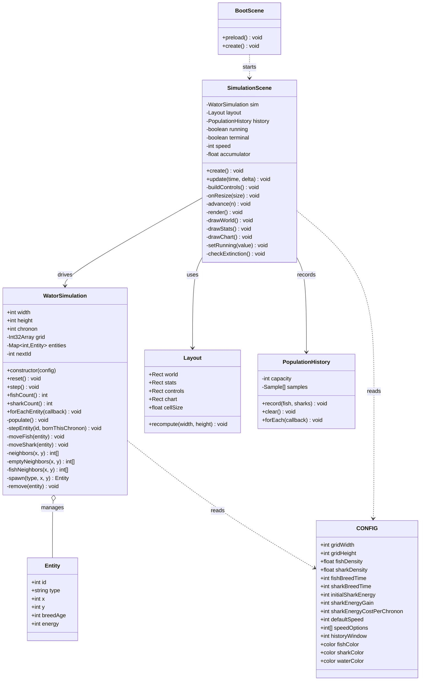
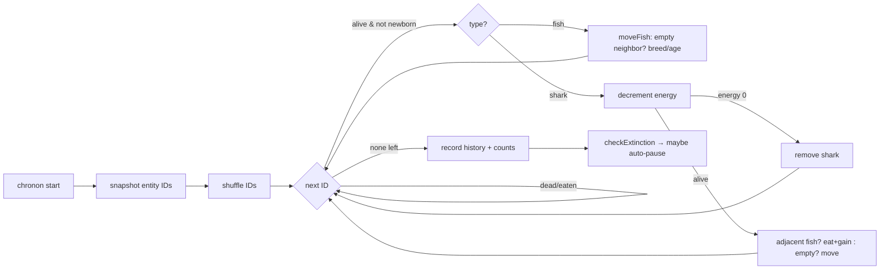

## Context

The repository has a complete specification (`spec-v001.md`, 57 acceptance criteria) for a browser-based Wa-Tor predator-prey simulation, but no implementation. This change builds the first version as a static, no-build, Phaser 4.x app loaded from a CDN.

Two sets of conventions govern the work and occasionally pull in different directions:

- **The spec** mandates a framework-free simulation engine and `Graphics`-based rendering with creatures stored as plain data records (not sprites or game objects).
- **The `phaser-game` skill** prefers an object-oriented entity pattern and a `src/game/` layout.

The spec is the more specific, deliberate choice for this domain, so it governs the simulation/rendering model; the skill governs the outer conventions (BootScene-first flow, no build step, relative URLs, small ES modules, PWA). This document records that resolution and the architecture that follows from it.

## Goals / Non-Goals

**Goals:**
- A hard wall between the Wa-Tor rules (`WatorSimulation`) and Phaser. The engine is testable and runnable without a renderer.
- Render the whole window — world, stats, controls, chart — natively in Phaser via `Graphics`.
- Centralize every tunable constant in `src/config.js`.
- Stay static-site and subpath deployable with best-effort PWA support.
- Keep the code small, readable, and JSDoc-documented per `AGENTS.md`.

**Non-Goals:**
- No build tooling, bundler, TypeScript, framework, or backend.
- No seeded RNG, no reproducible runs (uses `Math.random()`).
- No creature sprites, grid lines, movement animation, or chart labels.
- No user-facing controls for grid size, densities, breed values, or shark energy.
- No keyboard shortcuts, world editing, zoom, or debug hooks.

## Decisions

### D1: Engine as a plain class, creatures as data records
`WatorSimulation` owns a flat occupancy grid plus a map of entity records `{ id, type, x, y, breedAge, energy? }`. Creatures are **not** objects with behavior methods of their own; the engine's `step()` applies the rules.

- **Why:** Satisfies the spec's framework-independence (AC #4) and "flat grid array plus entity records" (AC #27) directly. A `Graphics` renderer (AC #50) iterates records once per frame, which is the natural fit for data, not sprites.
- **Alternative considered:** The skill's `Fish extends Mover` pattern. Rejected because behavior-on-objects tends to leak rendering/Phaser concerns into the entities and complicates the single-pass `Graphics` draw and the chronon ordering snapshot.

### D2: Chronon stepping via a randomized ID snapshot
At the start of each chronon the engine snapshots the current entity IDs, shuffles them, and processes each in turn. A per-chronon "born this chronon" guard prevents newborns from acting, and a liveness check skips entities removed before their turn.

- **Why:** Encodes AC #11–#13 precisely. Snapshotting IDs (not live array indices) is what makes "each surviving entity acts at most once" robust against mid-chronon births and deaths.
- **Alternative considered:** Iterating the live grid in scan order. Rejected — it biases movement directionally and double-processes entities that move into not-yet-scanned cells.

### D3: Speed as a chronon accumulator on Phaser's update loop
`SimulationScene.update(time, delta)` accumulates `delta * chrononsPerSecond / 1000` and runs whole chronons when the accumulator crosses `1`. No catch-up cap beyond what a single frame yields.

- **Why:** Matches AC #48–#49 (advance "as normally as the browser allows," no catch-up when throttled). A hidden tab simply produces large deltas the browser already coalesces; we intentionally do not compensate.
- **Alternative considered:** `setInterval`/timer-driven stepping. Rejected — it fights Phaser's loop and complicates pause/step/resize.

### D4: Layout computed from window size each resize
A layout helper partitions the canvas into stats (left), world (center, aspect-preserving), controls (right), and chart (bottom strip). Cell pixel size is derived from the world rectangle and the constant grid dimensions, then centered.

- **Why:** Satisfies AC #8–#9, #51–#52 and keeps grid dimensions a pure code constant. Recomputing on `resize` keeps the simulation dimensions fixed while only the rendering scale changes.

### D5: Phaser-native buttons
Buttons are `Graphics`/`Text` containers with interactive zones — no DOM. Disabled states (Step while running, Play while terminal) are driven by the scene's run-state.

- **Why:** AC #5 and the "no DOM overlay" non-goal require Phaser-native input.

### D6: PWA with relative URLs and a CDN caveat
`sw.js` caches the app shell and same-origin assets; registration and asset paths are relative for subpath hosting. Phaser itself loads from a CDN, so true offline depends on whether the browser has cached that script.

- **Why:** AC #56–#57 and the skill's PWA expectations; the CDN trade-off is explicitly accepted.

### Class structure

## Risks / Trade-offs

- **Phaser 4.x API drift** → Pin the CDN to `phaser@4.1.0` and verify each `Graphics`/`Scene`/input API against that version before use; prefer targeted code over speculative API usage.
- **CDN dependency breaks offline** → Accepted per spec; service worker caches the shell so repeat loads work once Phaser is cached, and we document the first-load network requirement.
- **No automated tests** (spec non-goal) → Rely on the engine's framework-independence to keep rules verifiable by inspection/manual stepping, and keep `step()` logic small and readable.
- **`Math.random()` ordering bias** → Mitigated by the ID-snapshot-and-shuffle approach (D2) rather than grid-scan order.
- **Large `60x` grids per frame** → A single `Graphics` clear+redraw of ~7000 cells per chronon is acceptable; if profiling shows cost, draw only occupied cells over a static water background.
- **Tablet reflow crowding controls** → Layout helper preserves world aspect ratio and reserves minimum control/chart strips; verified down to the iPad-mini viewport.

## Migration Plan

Greenfield — no existing code to migrate. Deliver the file set from the proposal, validate by loading `index.html` in a browser (running at `10x`, controls functional, chart populating, extinction auto-pause). Rollback is trivial: the change is additive and self-contained.

## Open Questions

- Exact pixel sizes, fonts, and spacing for the Phaser-native UI are left to implementation (the spec lists this as a known gap); pick readable defaults and keep them in `config.js` where reasonable.
