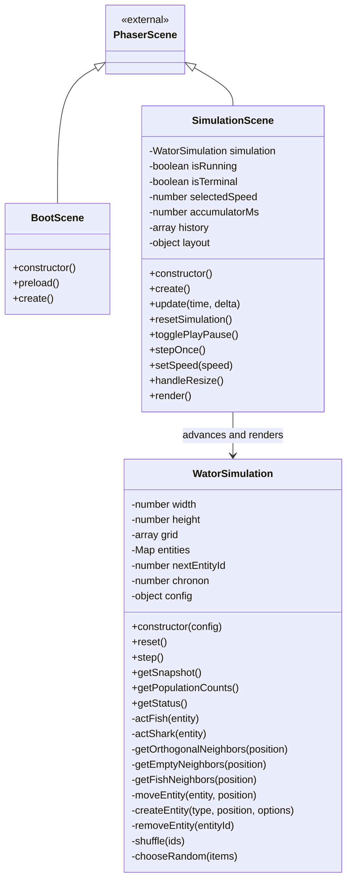

## Context

This change creates a static ES2020 Wa-Tor web app from the source specification in `spec-v001.md`. The current repository contains the source spec, README, and OpenSpec config, but no app implementation or OpenSpec change artifacts.

The app uses Phaser 4.x from a CDN script tag to own the full browser window. Phaser handles rendering, layout, controls, and input, while the Wa-Tor simulation engine remains framework-independent so the automaton rules can be reasoned about separately from scenes and graphics.

## Goals / Non-Goals

**Goals:**
- Start directly in a running Wa-Tor simulation with default `100 x 70` grid dimensions and `10x` speed.
- Implement correct fish and shark chronon behavior, including randomized turn order, toroidal orthogonal movement, breeding, eating, starvation, newborn turn deferral, and extinction status.
- Render the world, stats, controls, and rolling population history chart using Phaser-native graphics and input only.
- Keep grid dimensions, densities, breed times, shark energy values, colors, and speed choices centralized in programmer-editable constants.
- Ship as a static site with no build step and lightweight PWA files.

**Non-Goals:**
- User-facing controls for model constants, grid dimensions, or initial densities.
- Seeded random number support, automated tests, build tooling, TypeScript, React, backend services, or server-side code.
- HTML or DOM controls layered over Phaser.
- Keyboard shortcuts, world editing, dragging, zooming, cell inspection, debug hooks, sprite art, grid lines, movement interpolation, or chart labels.

## Decisions

### Separate Simulation Engine from Phaser Scenes

The Wa-Tor rules will live in `src/simulation/WatorSimulation.js` and expose state snapshots or query methods that Phaser scenes can render. The simulation engine will not import Phaser or reference scene objects.

Rationale: this keeps chronon rules deterministic in structure, easier to inspect, and insulated from rendering concerns. Phaser remains responsible for presentation and input only.

Alternative considered: implement movement and rendering directly in `SimulationScene`. That would be faster to start, but it would mix UI timing, graphics, and automaton state in one class and make rule correctness harder to maintain.

### Use Flat Grid Storage with Entity Records

Simulation state will use a flat grid array indexed by `y * width + x`, plus entity records keyed by stable IDs. Entity records will store ID, type, position, breed age, and shark energy when applicable.

Rationale: the flat grid gives constant-time occupancy checks, while entity records make randomized turn order, skip-on-death behavior, and newborn deferral straightforward.

Alternative considered: represent each cell as an object containing all creature state. That simplifies lookup but makes stable turn lists and eaten/dead entity handling more error-prone.

### Process Chronons from a Snapshot of Entity IDs

At the start of each chronon, the engine will collect current entity IDs, randomize their order, and process only surviving entities from that snapshot. Newborn IDs created during the chronon will not appear in the current turn list.

Rationale: this directly satisfies the requirement that each existing entity acts at most once, newborns wait until the next chronon, and dead or eaten entities are skipped.

Alternative considered: scan grid cells sequentially. That would introduce positional bias and makes it harder to avoid double-acting after movement.

### Render Immediate State with Phaser Graphics

The Phaser scene will draw water as the background and draw fish and sharks as abstract circles using `Graphics`, with no per-cell sprites, grid lines, or movement animation.

Rationale: graphics rendering matches the source spec, keeps asset needs low, and supports smooth resizing without a sprite pipeline.

Alternative considered: create a sprite per creature. That can work for richer art, but it adds lifecycle overhead and conflicts with the requested abstract circle presentation.

### Build Phaser-Native Controls and Layout

Stats, buttons, speed choices, and the population chart will be drawn and handled inside Phaser. Layout will recompute on resize, keeping the world aspect ratio and adapting from a wide three-column layout to a tablet/narrow layout.

Rationale: Phaser-native UI satisfies the no-DOM-controls constraint and keeps the app as one full-window scene.

Alternative considered: use HTML controls over the canvas. That would be faster for forms, but it violates the source spec and creates separate layout/input systems.

### Keep PWA Support Lightweight

The app will include `manifest.webmanifest`, `sw.js`, and an `assets/` directory for icons and shell assets. The service worker will cache same-origin app shell files and assets, while first-load Phaser CDN availability remains network-dependent unless the browser has already cached it.

Rationale: this gives static-site friendly install metadata and best-effort offline behavior without adding a build step or vendoring Phaser.

Alternative considered: vendor Phaser locally for stronger offline guarantees. The source spec requires Phaser loading from a CDN script tag, so local vendoring is out of scope.

## Class Diagrams

The v1 implementation introduces three classes: `BootScene`, `SimulationScene`, and `WatorSimulation`. Entity records, population history samples, button descriptors, layout rectangles, and app configuration are plain data objects rather than classes.

## Risks / Trade-offs

- Phaser CDN availability can block first load or first offline use -> keep the dependency explicit in `index.html` and document that only the app shell and same-origin assets are cached.
- High chronon speeds on large grids can stress slower devices -> advance according to browser frame timing as normally as possible without catch-up compensation.
- Phaser-native UI requires custom layout and button handling -> centralize layout calculations and reusable button drawing helpers in `SimulationScene`.
- No seeded randomness makes behavior non-reproducible -> keep random choice isolated so future seeded RNG support can be added without rewriting rules.
- No automated tests increases reliance on implementation review and manual browser verification -> structure the simulation engine cleanly and make tasks include a focused manual verification pass.
