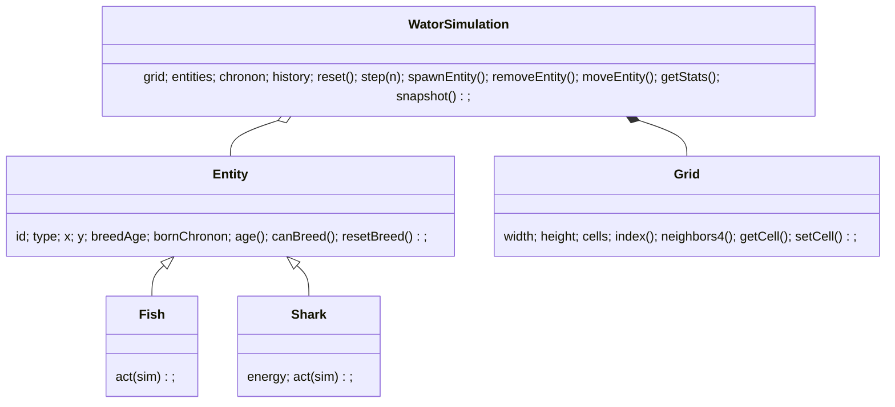

# Design: Wa-Tor Simulation Web App

## Overview
The system separates a pure simulation engine from Phaser-dependent rendering and UI. The engine implements Wa-Tor rules and exposes a minimal API for stepping, snapshotting, and entity manipulation. The renderer uses Phaser `Graphics` to draw the world and UI controls without DOM overlays.

## Modules & Files
- `src/config.js` — runtime constants (grid dimensions, densities, breed times, energy values, colors, history window)
- `src/simulation/` — engine modules
  - `Entity` (abstract), `Fish`, `Shark`
  - `Grid` — flat array + toroidal wrap helpers
  - `WatorSimulation` — main pure engine exposing `reset()`, `step(n)`, `spawnEntity()`, `removeEntity()`, `moveEntity()`, `getStats()`, `snapshot()`
- `src/scenes/BootScene.js` — minimal boot that creates Phaser and launches `SimulationScene`
- `src/scenes/SimulationScene.js` — main scene, contains `WorldRenderer`, `UIControls`, and `HistoryChart` instances and translates input to engine calls
- `src/render/WorldRenderer.js` — draws water, fish, sharks using Phaser `Graphics`
- `src/render/HistoryChart.js` — draws population lines across bottom; falls back to offscreen-canvas blit if needed for perf
- `src/ui/UIControls.js` — Phaser-native buttons for Play/Pause, Step, Reset, and speed row
- `src/main.js` — ES module that initializes Phaser by importing scenes

## Key Data Structures
- Grid: flat `Array(width*height)` where each entry is `entityId | null`.
- Entities: `Map<id, EntityRecord>` where `EntityRecord` includes `{ id, type, x, y, breedAge, bornChronon, energy? }`.
- History: ring buffer (array) with fixed length `HISTORY_WINDOW=500`, each entry stores `{chronon, fish, sharks}`.

## Class Diagram

## Important Runtime Invariants
- Newborn entities have `bornChronon = currentChronon` and must not act until the next chronon.
- Each chronon: collect current entity IDs, shuffle (Fisher–Yates), process each ID once unless removed.
- Sharks decrement energy at start of their action; they die immediately if energy ≤ 0.
- When breeding, parent resets `breedAge=0` and newborn `bornChronon=currentChronon`.

## UI & Layout
- Left column: stats (Chronon, Fish, Sharks, Status).
- Center: world display, scaled to maintain aspect ratio.
- Right column: controls (Play/Pause, Step, Reset each on its own row; speed buttons in a single horizontal row).
- Bottom: history chart spanning full width, no titles or labels, fish (green) and shark (blue) lines.

## PWA & Assets
- `manifest.webmanifest` with circular icon suggestion.
- `sw.js` caches `index.html`, `src/*.js`, and `assets/*` but does not attempt to cache the Phaser CDN script on first run.

## Decisions & Trade-offs
- Use `Math.random()` for simplicity (non-deterministic runs).
- Rendering with Phaser `Graphics` keeps DOM out of the picture but requires custom button drawing.
- Chart drawing first implemented with Phaser Graphics; if slow, switch to offscreen canvas + blit.
