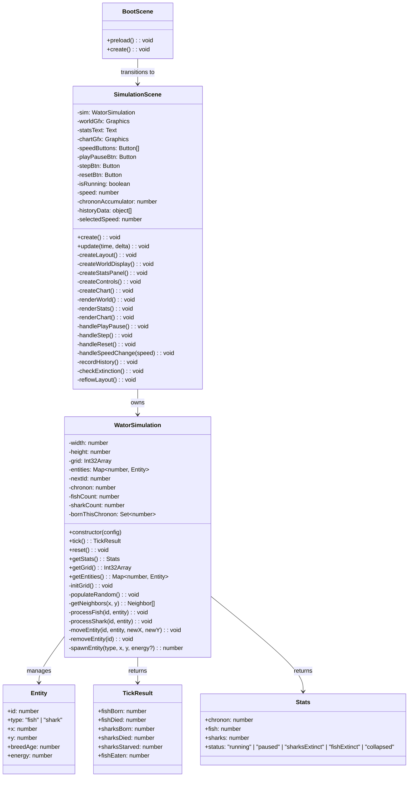

# Design: Full V1 Implementation

## Architecture Overview

```
┌─────────────────────────────────────────────────────────────────┐
│                        index.html                                │
│  <script src="phaser CDN">                                       │
│  <script type="module" src="src/main.js">                        │
└─────────────────────────────────────────────────────────────────┘
                              │
                              ▼
┌─────────────────────────────────────────────────────────────────┐
│                      src/main.js                                 │
│  Phaser.Game config: type AUTO, parent body, scale RESIZE        │
│  scenes: [BootScene, SimulationScene]                            │
└─────────────────────────────────────────────────────────────────┘
                              │
              ┌───────────────┼───────────────┐
              ▼                               ▼
┌──────────────────────┐         ┌──────────────────────┐
│    BootScene.js       │         │  SimulationScene.js   │
│    (Phaser.Scene)     │         │    (Phaser.Scene)     │
│                       │         │                       │
│  preload: nothing     │         │  create: layout       │
│  create: → scene.start│         │  update: tick loop    │
│    ("SimulationScene")│         │  owns: WatorSimulation│
└──────────────────────┘         │  owns: Graphics objs   │
                                 │  owns: chart data      │
                                 └───────────┬───────────┘
                                             │ calls tick()
                                             ▼
                                 ┌──────────────────────┐
                                 │  WatorSimulation.js   │
                                 │  (framework-agnostic) │
                                 │                       │
                                 │  + grid: Int32Array   │
                                 │  + entities: Map      │
                                 │  + chronon: number    │
                                 │  + tick(): void       │
                                 │  + reset(): void      │
                                 │  + getStats(): object │
                                 └──────────────────────┘
                                             │
                                    reads constants from
                                             │
                                             ▼
                                 ┌──────────────────────┐
                                 │    src/config.js      │
                                 │  GRID_W, GRID_H       │
                                 │  FISH_DENSITY, etc.   │
                                 │  COLORS, SPEEDS       │
                                 └──────────────────────┘
```

## Class Diagram



## Data Model

### Grid: `Int32Array(width * height)`
- Each cell holds an `entityId` (positive integer) or `0` (empty).
- Provides O(1) spatial lookup for neighbor checks.

### Entity Map: `Map<number, Entity>`
- Keyed by unique monotonically-increasing entity ID.
- Entity shape: `{ id, type: "fish"|"shark", x, y, breedAge, energy? }`
- Energy field present only on sharks.

### Chronon Tick Algorithm

```
tick():
  1. bornThisChronon = new Set()           // will be populated during processing
  2. tickResult = zeroed counters
  3. ids = [...entities.keys()]
  4. shuffle(ids)                           // Fischer-Yates
  5. for each id in ids:
       if !entities.has(id): continue       // dead/removed during this tick
       if bornThisChronon.has(id): continue // newborn should not act
       entity = entities.get(id)
       if entity.type == "fish":  processFish(id, entity)
       if entity.type == "shark": processShark(id, entity)
  6. chronon++
  7. check extinction status
  8. return tickResult
```

### Fish Action
```
processFish(id, entity):
  entity.breedAge++
  freeNeighbors = neighbors.filter(cell => grid[cell] == 0)
  if freeNeighbors.length == 0:
    return  // no move, breedAge already incremented
  canBreed = entity.breedAge >= fishBreedTime
  dest = randomChoice(freeNeighbors)
  moveEntity(id, entity, dest.x, dest.y)
  if canBreed:
    spawnEntity("fish", entity.x, entity.y)  // old position
  entity.breedAge = 0  // reset after move (with or without breeding)
```

Wait — re-reading the spec rules: AC #16 says "IF a fish is breeding-ready and cannot move, THEN reset breed timer to 0." AC #17 says "IF a fish is not breeding-ready and cannot move, THEN continue aging." So the breed-age reset on stuck is only for breeding-ready fish. Corrected:

```
processFish(id, entity):
  freeNeighbors = neighbors.filter(cell => grid[cell] == 0)
  canBreed = entity.breedAge >= fishBreedTime
  if freeNeighbors.length == 0:
    if canBreed: entity.breedAge = 0    // AC #16
    else: entity.breedAge++             // AC #17
    return
  dest = randomChoice(freeNeighbors)
  moveEntity(id, entity, dest.x, dest.y)
  if canBreed:
    spawnEntity("fish", oldX, oldY)     // AC #15
  entity.breedAge = 0                   // AC #15
```

### Shark Action
```
processShark(id, entity):
  entity.energy -= sharkEnergyCostPerChronon  // AC #18
  if entity.energy <= 0:
    removeEntity(id)                           // AC #19
    return
  canBreed = entity.breedAge >= sharkBreedTime
  fishNeighbors = neighbors.filter(cell => grid[cell] is fish)
  if fishNeighbors.length > 0:                 // AC #20
    dest = randomChoice(fishNeighbors)
    victimId = grid[dest.index]
    removeEntity(victimId)
    moveEntity(id, entity, dest.x, dest.y)
    entity.energy += sharkEnergyGain           // AC #21
  else:
    freeNeighbors = neighbors.filter(cell => grid[cell] == 0)
    if freeNeighbors.length > 0:               // AC #22
      dest = randomChoice(freeNeighbors)
      moveEntity(id, entity, dest.x, dest.y)
    else:
      if canBreed: entity.breedAge = 0         // AC #25
      else: entity.breedAge++                  // AC #26
      return
  if canBreed:                                 // AC #23
    spawnEntity("shark", oldX, oldY, initialSharkEnergy)  // AC #24
  entity.breedAge = 0
```

Note: breedAge increment for sharks when they can't move follows the same pattern as fish (AC #25, #26). When a shark does move (whether eating or not), breedAge resets regardless.

## Layout System

```
┌──────────────────────────────────────────────────────────────┐
│  WIDE LAYOUT (>= ~900px viewport width)                      │
│                                                               │
│  ┌──────────┐  ┌──────────────────────┐  ┌──────────────┐   │
│  │  Stats   │  │                      │  │  Controls     │   │
│  │  Panel   │  │    World Display     │  │  Speed: 1 5   │   │
│  │          │  │    (100x70 grid)     │  │   10 30 60    │   │
│  │ Chronon  │  │                      │  │               │   │
│  │ Fish     │  │   green/blue dots    │  │  Play/Pause   │   │
│  │ Sharks   │  │   on dark water      │  │  Step         │   │
│  │ Status   │  │                      │  │  Reset        │   │
│  │          │  │                      │  │               │   │
│  └──────────┘  └──────────────────────┘  └──────────────┘   │
│                                                               │
│  ┌──────────────────────────────────────────────────────────┐ │
│  │              Population History Chart                     │ │
│  │         green line (fish)  blue line (sharks)             │ │
│  │         rolling 500-chronon window                        │ │
│  └──────────────────────────────────────────────────────────┘ │
│                                                               │
└──────────────────────────────────────────────────────────────┘
```

On narrow screens, the layout reflows vertically: stats top, world middle, controls below world, chart bottom. World maintains aspect ratio.

## Rendering

All rendering uses Phaser `Graphics` via `this.add.graphics()`:

- **Water**: filled rectangle covering the grid area in dark background color
- **Fish**: filled green circles, radius computed from cell size
- **Sharks**: filled blue circles, slightly larger radius than fish
- **Chart**: `lineStyle` + `lineBetween` for fish (green) and shark (blue) population lines
- **Buttons**: filled rounded rectangles with text, pointerover/press tint changes

Cell size is computed as: `min(availableWorldWidth / GRID_W, availableWorldHeight / GRID_H)`.

## Control Behavior State Machine

```
                    ┌─────────────────────────────┐
                    │         RUNNING             │
                    │  Play/Pause visible          │
                    │  Step disabled               │
                    │  Speed buttons active        │
                    └──────────┬──────────────────┘
                               │ Pause clicked
                               ▼
                    ┌─────────────────────────────┐
                    │         PAUSED              │
                    │  Play/Pause visible          │
                    │  Step enabled                │
                    │  Speed buttons active        │
                    └────┬──────────────────┬─────┘
                         │                  │
              Step clicked             Play clicked
                         │                  │
                         ▼                  │
                    tick() once             │
                         │                  │
                         ▼                  │
                    ┌─────────────────────────────┐
                    │  (check extinction)         │
                    │  If extinct → TERMINAL       │
                    │  Else → stay PAUSED          │
                    └─────────────────────────────┘
                                                  │
                                                  ▼
                    ┌─────────────────────────────┐
                    │         TERMINAL            │
                    │  Play/Pause disabled         │
                    │  Step disabled               │
                    │  Speed buttons disabled      │
                    │  Reset enabled               │
                    └──────────┬──────────────────┘
                               │ Reset clicked
                               ▼
                    ┌─────────────────────────────┐
                    │    (new world, go RUNNING)  │
                    └─────────────────────────────┘
```

## Phaser 4 API Notes

- `Phaser.Scene` lifecycle: `preload()`, `create()`, `update(time, delta)`
- `this.add.graphics()` returns a `Phaser.GameObjects.Graphics` for drawing
- `this.add.text(x, y, text, style)` for stats text
- Interactive zones: `graphics.setInteractive(new Phaser.Geom.Rectangle(...), Phaser.Geom.Rectangle.Contains)`
- Scale manager: `scale: { mode: Phaser.Scale.RESIZE, autoCenter: Phaser.Scale.CENTER_BOTH }`
- Scene transition: `this.scene.start('SimulationScene')`
