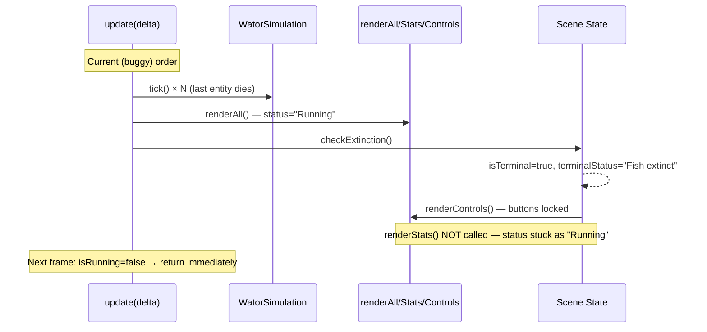
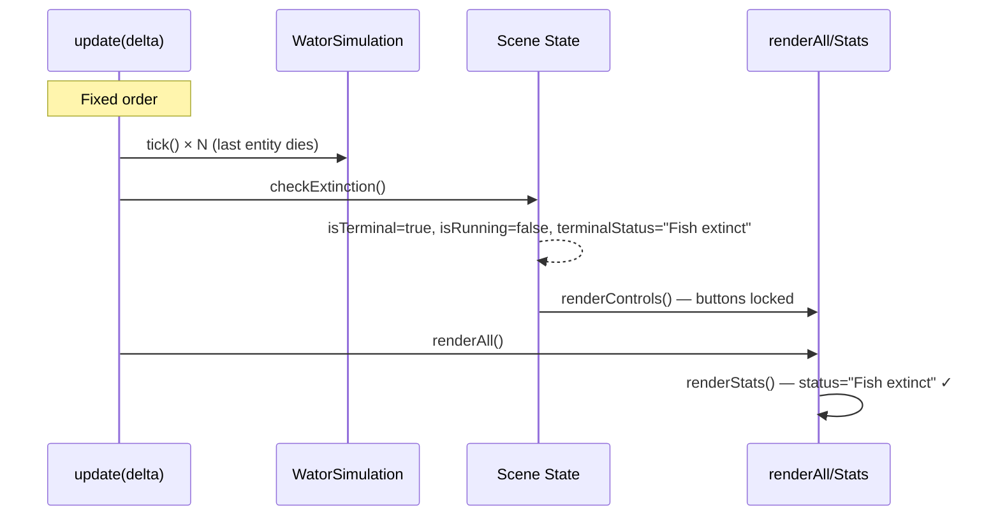

# Design: Fix Extinction Status Display

## Problem



## Fix

Swap lines 434–435 in `SimulationScene.js`:

```
// Before                                   // After
renderAll();         ← line 434             checkExtinction();     ← was 435
this.checkExtinction();  ← line 435         this.renderAll();     ← was 434
```



## Consistency

The Step button path already uses `checkExtinction()` then `renderAll()` (line 283→284). This fix aligns the natural-tick path with the step path.

## No Other Changes

- `checkExtinction()` calls `renderControls()` internally; `renderAll()` calls `renderUIBackground()`, `renderWorld()`, `renderStats()`, and `renderChart()`. These operate on different `Graphics` objects so there are no clear/redraw conflicts.
- `renderStats()` reads `this.isTerminal` and `this.terminalStatus` to determine the status string — by the time it runs, both are correctly set.
