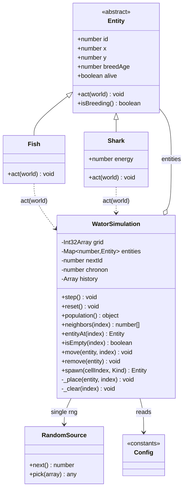
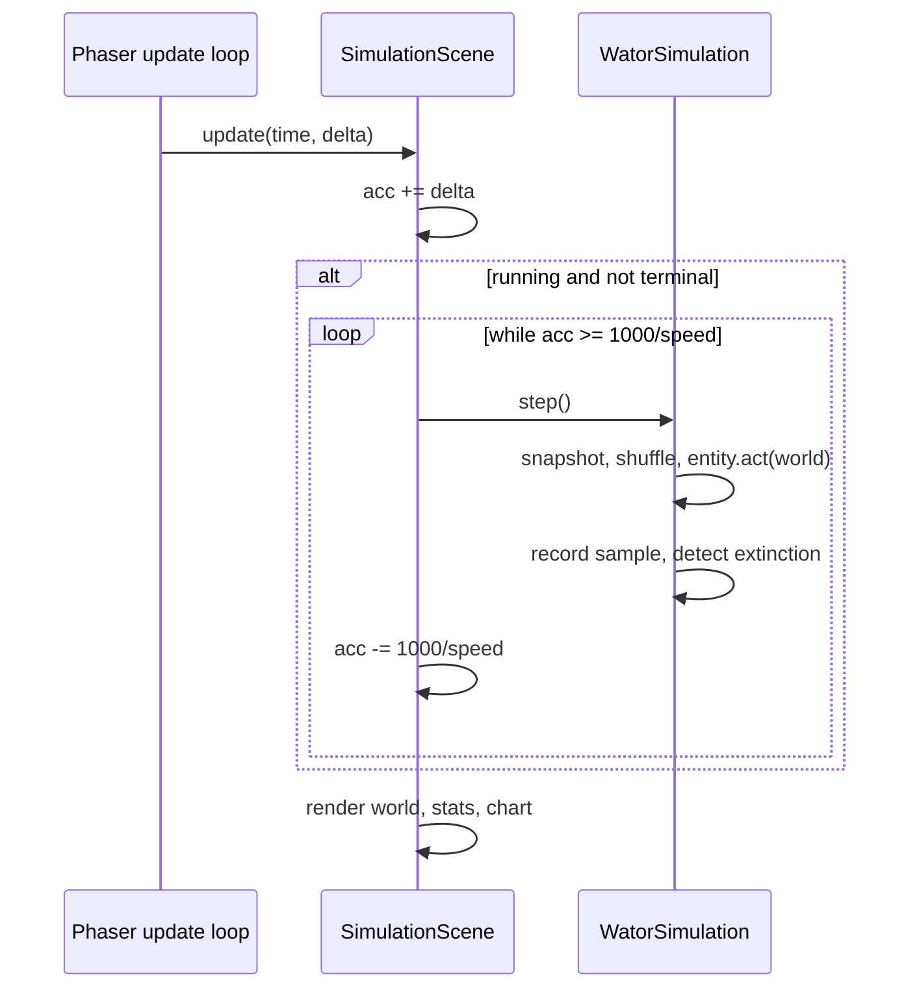

## Context

See `proposal.md` - Why. This is a greenfield static web app: `openspec/specs/` is empty, so every capability is new, and the only existing implementation file is `src/ui/PhaserButton.js`.

Constraints that shape the approach (from `prd-v001.md` and the confirmed exploration decisions):

- Phaser 4.1.0 loads from a CDN script tag; application code loads as ES2020 modules with **no build step**. There is no transpiler, bundler, or package install, so no TypeScript and no npm imports at runtime.
- The simulation engine must not depend on Phaser (`app-shell/static-hosting` §4.1), but the scene must drive it every frame.
- Exactly one random-number generator serves the whole simulation (`world-model` §2.3, `chronon-rules` §1.2).
- The display must work both wide and at a `744 x 1133` CSS-pixel tablet viewport (`simulation-ui/world-rendering` §5).
- The app is deployed from the `/sdd_openspec_wator/deepseek_v4.1_flash/` subpath, so every URL must be relative (`app-shell/static-hosting` §5.1, `app-shell/pwa-support` §1.4, §2.4).

## Goals / Non-Goals

**Goals:**

- A simulation engine whose rules are independently readable and free of rendering concerns, satisfying `wator-simulation/chronon-rules` in full.
- An object-oriented entity model where `Fish` and `Shark` each own their per-chronon behavior (`world-model` §4).
- A single, obviously-correct place where the grid array and entity objects are kept consistent (`world-model` §3).
- One layout description that reflows from wide to narrow without duplicating control construction (`simulation-ui/world-rendering` §5).

**Non-Goals:**

- No animation, interpolation, or per-cell sprites; rendering is immediate and `Graphics`-based (`simulation-ui/world-rendering` §1.5, §2).
- No user-facing model-parameter controls (`simulation-ui/playback-controls` §5).
- No seeded RNG, no automated test harness, no build tooling, no DOM overlays over Phaser.
- No offline guarantee for the CDN Phaser script (`app-shell/pwa-support` §2.5).

## Decisions

### D1: Separate the engine from the scene, and drive it from `update()`

`WatorSimulation` owns all state and exposes `step()`. `SimulationScene.update()` decides *whether* to step, then renders. This keeps every rule in `chronon-rules` testable in principle without a browser, and satisfies `app-shell/static-hosting` §4.1 because the engine module imports nothing from Phaser.

*Alternative considered:* letting entities extend `Phaser.GameObjects.Graphics`. Rejected - it would make every rule in `chronon-rules` depend on the render layer and violate §4.1.

### D2: `WatorSimulation` owns *when*, entities own *what*

`WatorSimulation.step()` performs the chronon skeleton: snapshot IDs, shuffle, skip the dead, advance breed ages, and detect extinction. Each `Entity.act(world)` decides what one creature does. This mapping is direct:

| Chronon step | Requirement |
|---|---|
| Snapshot IDs, shuffle, act at most once | `chronon-rules` §1.1, §1.2 |
| Newborn cannot act | `chronon-rules` §1.3 |
| Skip dead or eaten entities | `chronon-rules` §1.4 |
| Advance breed age | `chronon-rules` §1.5 |
| Detect and report extinction | `population-history` §2 |

Two of these fall out structurally rather than needing guards:

- **§1.3 (newborn cannot act)** holds automatically because IDs are monotonic and never reused (`world-model` §3.4). The snapshot taken at the start of a chronon can never contain an ID created later in that same chronon.
- **§1.4 (dead entity skipped)** holds because `act()` may set `alive = false`, and `step()` re-checks liveness when each ID's turn arrives.

### D3: `world` is a duck-typed seam, not a class reference

`Entity.act(world)` receives the simulation as a plain object of capabilities (`neighbors`, `entityAt`, `isEmpty`, `move`, `remove`, `spawn`, `rng`, `config`). Entities never `import` `WatorSimulation`. This avoids the circular import `Fish -> WatorSimulation -> Fish` that ES modules cannot resolve cleanly, and it lets a future test pass a stub world without touching entity code.

### D4: Keep the ID-valued grid array *and* an ID-keyed entity map

The flat array stores `EMPTY` or an entity ID (`world-model` §3, PRD req 27a); a `Map<id, Entity>` holds the objects. This matches the confirmed decision.

*Alternative considered:* storing `Entity` instances directly in the array, which would collapse the two structures into one and remove the §3.2/§3.3 consistency obligation entirely. Rejected because it was explicitly decided against; recorded here because it remains the simpler design if consistency bugs appear.

To make §3.2 and §3.3 hard to get wrong, **every** mutation of the pair (move, spawn, remove) goes through one private `_place(entity, index)` / `_clear(index)` pair. No other method writes to the array.



### D5: Movement is attempted in place, sequentially

Each entity mutates the shared grid during its own turn, in the randomized order. The first mover claims a contested cell. This is what the rules describe: a fish moves to "a randomly selected adjacent empty cell" *as it acts* (`chronon-rules` §2.1), and survivors later in the order see the updated world.

*Alternative considered:* a double-buffer that computes all intended moves and then applies them. Rejected - it would let two fish select the same destination and would break §1.4, since a fish eaten mid-chronon by an earlier actor must be gone when its own turn arrives.

### D6: Shark action order inside `act()`

Order matters and follows the requirement numbering exactly:

```
shark.act(world):
  1. energy -= cost;  if energy == 0 -> alive = false; return   (chronon-rules §3.1, §3.2)
  2. fishTargets = neighbors holding fish
     if any     -> move onto random target, remove that fish, energy += gain
                   (chronon-rules §4.1, §4.2)
     else       -> emptyTargets = neighbors that are empty
                   if any -> move onto random target            (chronon-rules §4.3)
                   else   -> did not move                       (chronon-rules §4.4)
  3. if isBreeding():
       if moved  -> spawn newborn at vacated cell, energy = initial,
                    parent breedAge = 0                          (chronon-rules §5.1, §5.2, §5.3)
       else      -> breedAge = 0                                 (chronon-rules §5.3)
     else if !moved -> breedAge keeps aging                       (chronon-rules §5.4)
```

The energy decrement must precede target selection (§3.1), and death at zero must return before movement or eating (§3.2). Eating is a move for reproduction purposes, so step 2 sets the same `moved` flag the breeding branch reads (§5.2). `Fish.act()` follows the same skeleton with the energy and predation steps removed (`chronon-rules` §2).

### D7: A millisecond accumulator paces chronons; no catch-up

`update(time, delta)` adds `delta` to an accumulator and discharges whole chronons while `accumulator >= 1000 / speed`. Leftover time is retained; surplus beyond one chronon's worth is discarded rather than banked, so a hidden or throttled tab does not burst on return (`app-shell` start behavior, `prd` req 49). The accumulator is cleared on pause, step, and reset.

*Alternative considered:* one step per frame. Rejected - on a 60 Hz display that makes every speed setting behave like `60x` and would contradict `simulation-ui/playback-controls` §1.4.



### D8: One layout description, two arrangements

A single `computeLayout(width, height)` returns a rectangle for each region, switching on a narrow/wide breakpoint sized from the `744 x 1133` tablet constraint (`world-rendering` §5.2). World scale is `min(fitW / gridW, fitH / gridH)` and is identical in both arrangements, which is what preserves the aspect ratio (§5.3). Controls are built once; reflow only repositions them via `PhaserButton.setSize()` / `setPosition()`, which the class already supports without rebuilding hit areas.

*Alternative considered:* uniformly scaling the whole wide layout down. Rejected - at 744 px wide the 16 px button labels become unreadable, so `§5.4` ("all controls usable") would fail.

### D9: Shared color constants, passed into `PhaserButton` as style overrides

The world, stats, and chart must share one green and one blue (`world-rendering` §4.2). Those are taken from the shipped icons - fish `#2ecc71`, shark `#3498db`, water `#0a2a4a` - and live in `src/config.js`. `SimulationScene` passes the green to `PhaserButton` as a `style` override for the selected speed, rather than editing `PhaserButton.DEFAULT_STYLE`. This keeps `src/ui/PhaserButton.js` reusable and unmodified.

Because §4.3 requires the chart lines to differ in more than color, the shark line is drawn with a thicker stroke than the fish line.

### D10: `BootScene` prepares, `SimulationScene` renders

`BootScene` verifies Phaser is available, sets up PWA/service-worker readiness, then starts `SimulationScene`. Simulation setup is not duplicated there. This satisfies the required file list in `app-shell/static-hosting` §2.1 without adding a second owner of simulation state.

### D11: Relative, subpath-safe URLs

`manifest.webmanifest` uses relative `start_url` and icon paths; the service worker is registered with `./sw.js` so its scope covers the deployed subpath; the cache pre-list uses relative URLs. Required by `app-shell/static-hosting` §5.1 and `app-shell/pwa-support` §1.4, §2.4. The CDN Phaser URL is the one intentional absolute reference.

## Risks / Trade-offs

- **Grid/map divergence corrupts the world** (`world-model` §3.2, §3.3) → confine all writes to `_place`/`_clear`; keep `move`, `spawn`, and `remove` as the only callers. *Note: this risk disappears entirely under D4's rejected alternative of storing entities directly in the array.*
- **Sequential in-place movement is order-dependent**, so runs differ even at equal populations → accepted; it is the behavior the rules specify (`chronon-rules` §2.1, §1.2) and the reason turn order is shuffled.
- **`Fixed to initial population` chart scale can compress the plot** if the population grows well past its initial value (`world-rendering` §4.6) → accepted as a deliberate decision; a small fixed headroom margin is added so the initial value is not flush against the top edge.
- **Accumulator drift at 60x** can produce more than one step per frame → capped to a no-catch-up discharge, so low frame rates simply run slower rather than bursting.
- **CDN dependency** means first load needs the network (`app-shell/pwa-support` §2.5) → accepted; the service worker caches everything same-origin, and the CDN copy is browser-cached on later loads.
- **No automated tests** increases reliance on manual verification → mitigated by keeping the engine free of Phaser so a programmer can exercise `step()` directly in a browser console.
- **No TypeScript or build step** means no compile-time checking of the `world` seam in D3 → mitigate with JSDoc typedefs for the world capabilities and the entity contract (required anyway by `prd` req 54, 55).

## Migration Plan

This is additive; there is no existing behavior to migrate.

1. Add `src/config.js` (constants and shared colors) and the `src/simulation/` engine modules. The app is not yet reachable from the browser.
2. Add `src/scenes/`, `src/main.js`, and `index.html`. At this point the simulation is viewable.
3. Add `manifest.webmanifest`, `sw.js`, and the manifest link. PWA support becomes active.
4. Verify by serving the repository root as a static site and opening the app from the deployed subpath, since absolute paths would otherwise pass locally and fail in deployment.

Rollback: the change creates only new files plus small additions to `index.html`, so reverting is deleting the added files; `src/ui/PhaserButton.js` is not modified.

## Open Questions

None that affect the specs, approach, or task breakdown. Exact pixel sizes, fonts, and spacing are intentionally undefined by the PRD; they are treated as layout constants in D8 and can be tuned during implementation without changing any requirement.
