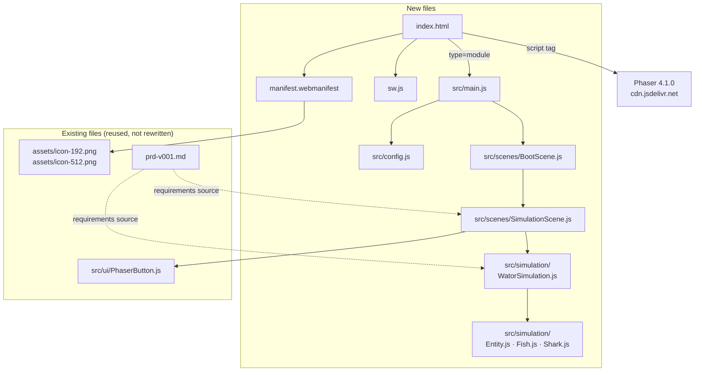

## Why

The repository contains a complete requirements document (`prd-v001.md`, 61 acceptance criteria) and one finished UI helper (`src/ui/PhaserButton.js`), but no runnable application. There is no `index.html`, no Phaser bootstrap, no simulation engine, and no PWA shell, so the project cannot be viewed in a browser at all. This change builds the Wa-Tor predator-prey simulation described by the PRD so the project becomes a deployable static web app.

## What Changes

- Add a framework-independent Wa-Tor simulation engine implementing the PRD's chronon rules: toroidal `100 x 70` grid, orthogonal movement, fish and shark reproduction, shark energy and starvation, and randomized turn order.
- Model entities as object-oriented JavaScript classes: a shared `Entity` base class with `Fish` and `Shark` subclasses that each implement their own per-chronon action.
- Store simulation state as a flat grid array plus entity objects, keeping the array and objects consistent.
- Draw every random choice from a single random-number generator.
- Add a Phaser 4 scene layer that renders the world with `Graphics` circles, positions stats, controls, and the population history chart, and reflows for tablet/narrow viewports using stacked regions.
- Add `PhaserButton`-based controls: a `1x`/`5x`/`10x`/`30x`/`60x` speed row plus row-per-action Play/Pause, Step, and Reset buttons, with a millisecond accumulator paced by the selected chronons-per-second speed.
- Add PWA support: `manifest.webmanifest` referencing the existing `assets/icon-192.png` and `assets/icon-512.png`, plus a `sw.js` that caches the app shell and same-origin assets.
- Add the static entry points `index.html` (Phaser 4.1.0 from CDN) and `src/main.js` (ES2020 module bootstrap) with no build step.

## Capabilities

### New Capabilities
- `wator-simulation/world-model`: Grid construction, toroidal neighbor addressing, randomized population seeding, and the flat-array-plus-entity storage contract.
- `wator-simulation/chronon-rules`: Chronon execution order, per-entity turn semantics, fish movement and reproduction, shark energy, starvation, predation, and reproduction.
- `wator-simulation/population-history`: Recording one population sample per chronon in a rolling 500-chronon window and detecting terminal extinction states.
- `simulation-ui/world-rendering`: Phaser scene bootstrap, world drawing, live stats, the population history chart, and wide/narrow responsive layout.
- `simulation-ui/playback-controls`: Play/Pause, Step, Reset, and speed selection, including their enabled/disabled and terminal-state rules.
- `app-shell/static-hosting`: `index.html`, ES2020 module loading, Phaser CDN usage, and static-site deployment under a repository subpath.
- `app-shell/pwa-support`: Web app manifest and service worker caching the app shell and same-origin assets.

### Modified Capabilities
<!-- No existing capabilities: openspec/specs/ is empty, so every capability here is new. -->

## Impact

- **Code**: introduces `src/simulation/` and `src/scenes/`; adds root static assets. `src/ui/PhaserButton.js` is **reused unchanged** unless the shared-color decision below requires passing a `style` override at construction, which its existing API already supports.
- **APIs/dependencies**: one external runtime dependency, Phaser 4.1.0 from the sanctioned jsDelivr CDN. No Node.js dependency at runtime, no build step, no backend.
- **Deployment**: must work when served from the `/sdd_openspec_wator/deepseek_v4.1_flash/` subpath, so the service worker scope and all asset URLs must be relative.
- **Resolved design decisions carried from exploration** (folded in rather than left open):
  - Eating a fish counts as a successful move for shark reproduction (PRD req 23).
  - Exactly one random-number generator serves the whole simulation (PRD req 61).
  - The flat grid array and the entity objects are separate structures kept consistent (PRD req 27, 27a, 27b, 27c).
  - Entities are class instances extending a common `Entity` base (PRD req 58, 59, 60).
  - Tablet/narrow layout reflows into stacked regions rather than uniformly shrinking (PRD req 52).
  - The world, stats, and chart share one green (`#2ecc71`, fish), one blue (`#3498db`, shark), and water `#0a2a4a`, taken from the shipped PWA icons (PRD req 46); `PhaserButton` receives these as style overrides.
  - The population chart's vertical axis is fixed to the initial population (PRD req 44-47).
  - Chronons advance via a millisecond accumulator paced by the selected speed (PRD req 48, 49).
- **Assumptions recorded for minor gaps** (the PRD leaves these undefined and they do not change externally observable behavior):
  - `BootScene` is minimal: it prepares Phaser/PWA readiness and starts `SimulationScene` rather than duplicating simulation setup.
  - UI geometry is expressed as named layout constants so the reflow breakpoint is adjustable in code.
- **Out of scope**: no user-facing grid/density/breeding/energy controls, no seeded RNG, no automated tests, no build tooling, no TypeScript/React, no DOM overlays, no keyboard shortcuts, no world editing, no debug console API, and no sprite art or movement animation.
