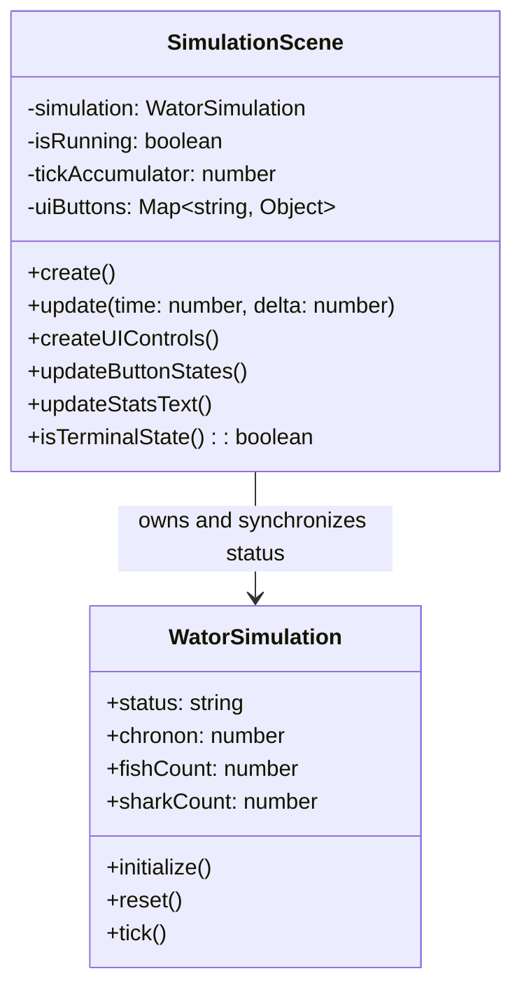

## Context

The current `SimulationScene` keeps `isRunning` as a scene-level control flag while `WatorSimulation.status` stores the status string shown to the user. Pause and manual-step actions currently mutate only the scene flag or redraw-only status text, so the simulation model can remain `Running` while the UI displays `Paused`, and controls can remain visually stale after a terminal manual step.

This change is intentionally narrow: it keeps Wa-Tor rules inside `WatorSimulation`, keeps Phaser-specific control handling inside `SimulationScene`, and fixes synchronization at the scene/model boundary.

## Goals / Non-Goals

**Goals:**
- Satisfy R1 by making `WatorSimulation.status` the authoritative non-terminal status source shown in statistics text.
- Satisfy R2 by refreshing Play/Pause and Step visual state immediately after user interactions.
- Preserve terminal statuses (`Fish extinct`, `Sharks extinct`, `Ecosystem collapsed`) once the simulation reaches an extinction or collapse condition.

**Non-Goals:**
- Change predator-prey movement, breeding, energy, extinction, or history rules.
- Add new UI widgets, dependencies, persistence, or DOM overlays.
- Move Phaser control code into the framework-independent simulation engine.

## Class Diagrams

## Decisions

### 1. Keep `WatorSimulation.status` authoritative for displayed status
- **Decision**: Play/Pause and Step handlers will update `simulation.status` for non-terminal `Running` and `Paused` states, and `updateStatsText()` will read `simulation.status` directly.
- **Rationale**: This satisfies R1 by preventing hidden divergence between the model state and text rendered to the user.
- **Alternatives Considered**: Continue deriving `Paused` only inside `updateStatsText()`. Rejected because callers inspecting `simulation.status` still see stale `Running` after Pause.

### 2. Preserve terminal statuses over control status writes
- **Decision**: Status writes from Play/Pause and Step will be guarded by `isTerminalState()` checks so terminal statuses produced by `tick()` are not overwritten.
- **Rationale**: This preserves existing extinction behavior while satisfying R1 and R2.
- **Alternatives Considered**: Store terminal state separately from display status. Rejected as unnecessary for this small repair.

### 3. Refresh affected UI immediately after interactions
- **Decision**: The Play/Pause handler will refresh both buttons and statistics, and the Step handler will refresh buttons after ticking and redrawing.
- **Rationale**: This satisfies R2 by removing the frame/update dependency that caused stale statistics and enabled-looking controls after pause or terminal step.
- **Alternatives Considered**: Wait for the next Phaser `update()` call to refresh UI. Rejected because paused scenes skip the existing update branch and terminal steps may not receive another refresh.

## Risks / Trade-offs

- **Risk: Duplicating status transition logic in UI handlers** → Mitigation: Keep the logic small and central to the only code path that toggles `isRunning`.
- **Risk: Accidentally overwriting terminal statuses** → Mitigation: Use `isTerminalState()` before setting `Running` or `Paused` after user interactions.
- **Risk: Future controls introduce more status divergence** → Mitigation: Add focused tasks to cover Play/Pause, Step, and stats rendering paths together.
