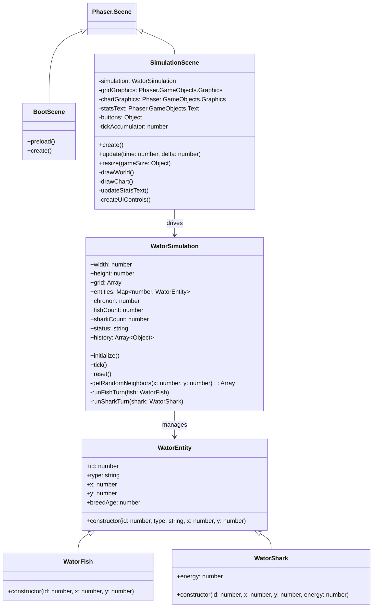

## Context

This project implements a browser-based Wa-Tor simulation. The application is a static site with no backend dependencies and must run offline via Progressive Web App (PWA) technologies. Phaser 4.x is loaded from a CDN. The simulation engine must remain framework-independent, while Phaser handles all input, rendering, and UI controls.

## Goals / Non-Goals

**Goals:**
- Implement the Wa-Tor predator-prey cellular automaton logic in a framework-independent JavaScript module.
- Render the 100x70 simulation grid using Phaser Graphics (no Phaser Sprites) for optimal performance.
- Support responsive viewport reflow between landscape (three-column) and portrait (stacked) layouts.
- Enable full offline execution by caching the application shell and the external Phaser CDN script.
- Provide a rolling population history chart showing the last 500 chronons.

**Non-Goals:**
- HTML/DOM overlays for UI controls (all controls must be Phaser-native).
- Smooth frame-by-frame cell movement animations (state updates are immediate).
- Local storage persistence for simulation state across reloads.
- Seeded random number generator support.

## Class Diagrams

## Decisions

### 1. Framework-Independent Simulation Engine
- **Decision**: Put all Wa-Tor rules, grid state, and entity records inside `WatorSimulation.js`, exposing simple APIs to Phaser.
- **Rationale**: Complies with the spec requirement to decouple the cellular automaton logic from Phaser. This also simplifies isolated testing of the rules.
- **Alternatives Considered**: Direct implementation inside Phaser scene. Rejected because it violates specification rule 4.

### 2. Flat Grid Array for Cell Storage
- **Decision**: Store cell occupancies in a 1D flat array of size `width * height`, mapping coordinate `(x, y)` to index `y * width + x`.
- **Rationale**: Provides $O(1)$ coordinate lookup and memory efficiency. Each entry contains either `null` or a reference to a `WatorEntity` record.
- **Alternatives Considered**: 2D nested arrays (`grid[y][x]`). Flat arrays are slightly faster, avoid nested allocation, and are easier to flat-copy or clear.

### 3. Rendering via Phaser Graphics Only (Zero Sprites)
- **Decision**: Draw the entire grid and the history chart using `Phaser.GameObjects.Graphics` rather than creating individual `Phaser.GameObjects.Sprite` or `Phaser.GameObjects.Shape` objects.
- **Rationale**: Eliminates the overhead of managing 7,000 active Phaser game objects, ensuring smooth performance on mobile browsers.
- **Alternatives Considered**: Phaser Sprites/Shapes per cell. Rejected due to performance bottlenecks on larger grids.

### 4. Phaser-Native Text and Rectangles for UI Controls
- **Decision**: Build UI buttons by placing Phaser `Text` objects inside `Rectangle` containers, and marking them as interactive using `.setInteractive()`.
- **Rationale**: Complies with the constraint to avoid DOM overlay layers while keeping controls simple and styled.
- **Alternatives Considered**: Phaser buttons plugins or HTML DOM buttons. Rejected due to compatibility risk and spec rules against HTML overlays.

### 5. Service Worker Caching of CDN Resource
- **Decision**: Include the jsDelivr CDN link for Phaser 4.x directly in the Service Worker's list of pre-cached URLs.
- **Rationale**: Guarantees that the app can launch offline after its first load, even though Phaser is loaded from a CDN.

## Risks / Trade-offs

- **Aspect Ratio Distortions** → *Mitigation*: The grid rendering size is dynamically restricted inside a bounding box that preserves the 100:70 ratio of the grid, leaving padding/margins as needed.
- **Phaser 4.x API Compatibility** → *Mitigation*: Use standard, well-tested Phaser Graphics APIs.
- **Service Worker CORS Caching** → *Mitigation*: Ensure the CDN request supports CORS so the Service Worker can cache it successfully.
