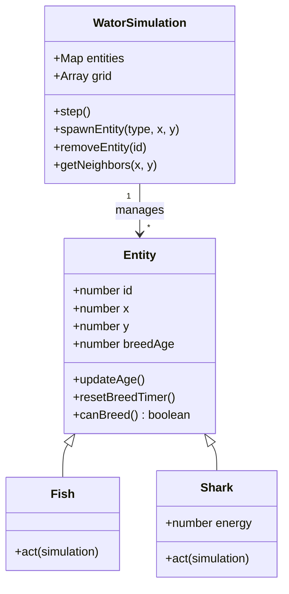

## Context

The goal is to implement a browser-based Wa-Tor simulation using Phaser 4. The simulation must be a pure JavaScript engine, independent of the rendering framework, following a predator-prey cellular automaton model on a toroidal grid.

## Goals / Non-Goals

**Goals:**
- Strict separation between simulation logic (`WatorSimulation`) and rendering (`SimulationScene`).
- Object-oriented entity system using a common `Entity` base class.
- Efficient toroidal grid management.
- Responsive rendering that scales the $100 \times 70$ grid to fit the browser window.
- Manual drawing of UI and population charts using Phaser Graphics.

**Non-Goals:**
- No HTML/DOM elements for UI.
- No movement interpolation or sprite animations.
- No backend or build tools.

## Decisions

### 1. Entity-Based Architecture
**Decision**: Use a class hierarchy (`Entity` $\rightarrow$ `Fish`, `Shark`) where each entity manages its own state (breed age, energy) and defines its own `act()` behavior.

**Rationale**: This encapsulates the specific rules for each creature type, making the simulation engine a coordinator rather than a complex set of conditional blocks.
**Alternatives**: A data-driven approach using plain objects and a central logic loop. This was rejected because it's less extensible and harder to maintain as rules grow.

### 2. Grid-to-Entity Mapping
**Decision**: The grid will store `EntityID`s, and a separate `Map` will store the `Entity` instances.
**Rationale**: This allows for $O(1)$ lookup of entities at specific coordinates while maintaining a clean registry of all active creatures.
**Alternatives**: Storing the `Entity` instance directly in the grid. This was rejected to avoid potential issues with grid serialization or complex state management.

### 3. Toroidal Wrapping Logic
**Decision**: Implement wrapping logic within the `WatorSimulation` class (e.g., `getWrappedX(x)` and `getWrappedY(y)`).
**Rationale**: Centralizing the wrapping logic prevents duplication across `Fish` and `Shark` classes and ensures consistency.
**Alternatives**: Handling wrapping inside each entity's movement logic. This was rejected as it violates DRY (Don't Repeat Yourself).

### 4. Phaser 4 Rendering Strategy
**Decision**: Use `Phaser.GameObjects.Graphics` for all rendering, including the world, entities, and UI.
**Rationale**: The PRD explicitly forbids sprites and DOM elements. Graphics objects provide the necessary control for drawing circles and lines.
**Alternatives**: Using Phaser Sprites with simple textures. This was rejected to adhere to the PRD's "abstract circles" requirement.

### 5. Population History Buffer
**Decision**: Maintain a fixed-size array (buffer) of population counts for the last $N$ chronons.
** uma-line graph drawn by iterating through this buffer.
**Rationale**: Simple and efficient for a rolling chart.
**Alternatives**: Using a dedicated charting library. This was rejected to keep the app static-site friendly with no external dependencies.

## Risks / Trade-offs

- **[Performance]** $\rightarrow$ With a $100 \times 70$ grid and high densities, the number of entities can grow. Using a `Map` and `Graphics` drawing every frame is generally efficient enough for this scale, but we will monitor for lag at $60\text{x}$ speed.
- **[UI Complexity]** $\rightarrow$ Drawing a full UI with buttons and a chart using only Phaser Graphics is more tedious than using HTML. This is a mitigation of the "no DOM" constraint.
- **[Simulation Correctness]** $\rightarrow$ The randomized action order is critical. We will ensure a fresh shuffle of entity IDs every chronon to avoid directional bias.

## Open Questions

- None.
