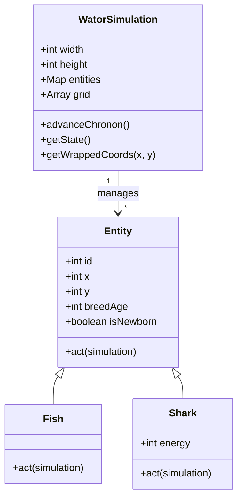

## Context

The goal is to implement a browser-based Wa-Tor simulation using Phaser 4. The simulation must be framework-independent, following a strict predator-prey cellular automaton model on a toroidal grid. The project requires a strong object-oriented approach using JavaScript classes.

## Goals / Non-Goals

**Goals:**
- Complete separation between the simulation engine (logic) and the rendering layer (Phaser).
- Use of a common `Entity` base class for Fish and Sharks.
- Implementation of a "Pull" architecture for state updates.
- Responsive UI layout (Wide vs. Narrow) using Phaser `Graphics`.
- Lightweight PWA support for static deployment.

**Non-Goals:**
- No movement animations or interpolation.
- No DOM-based UI elements; all UI must be Phaser-native.
- No backend services or build steps.

## Decisions

### 1. Entity Hierarchy and State Management
**Decision**: Use a class hierarchy where `Fish` and `Shark` extend a base `Entity` class. The `WatorSimulation` class will maintain a `Map` of entities and a flat grid array for spatial lookups.
**Rationale**: This satisfies the OO requirement and allows for clean polymorphism when calling `entity.act(simulation)`.
**Alternatives**: A purely data-driven approach (arrays of properties). Rejected because it doesn't meet the user's request for "good use of Javascript classes."

### 2. Toroidal Coordinate System
**Decision**: Implement a helper method `getWrappedCoords(x, y)` within the `WatorSimulation` class that uses the modulo operator based on grid dimensions.
**Rationale**: Centralizes the wrapping logic, preventing duplication in entity movement code.

### 3. Simulation-Renderer Communication (The "Pull" Pattern)
**Decision**: The `WatorSimulation` will expose a `getState()` method that returns a snapshot of the current entities, population stats, and history. The `SimulationScene` will call this method every frame (or every chronon) to update the visuals.
**Rationale**: Ensures the simulation engine remains framework-independent and easily testable without Phaser.

### 4. UI Layout and Reflow
**Decision**: Use a relative coordinate system for UI zones (Left: Stats, Center: World, Right: Controls, Bottom: Chart). Implement a `layoutUpdate()` method that checks `this.scale.width` and switches between "Wide" and "Narrow" layout modes.
**Rationale**: Satisfies Requirement 51 and 52 while maintaining the world's aspect ratio.

### 5. Population History Chart
**Decision**: Implement the chart as a `Phaser.GameObjects.Graphics` object. The X-axis will map to the index of the last 500 samples in the simulation's history array, and the Y-axis will be scaled based on the maximum population observed in that window.
**Rationale**: Avoids external charting libraries and keeps the app lightweight and static-site friendly.

## Risks / Trade-offs

- **[Risk]** Performance degradation with very high entity counts. $\rightarrow$ **Mitigation**: Use a flat array for the grid and a Map for entities to keep lookups $O(1)$.
- **[Risk]** Phaser 4 CDN availability. $\rightarrow$ **Mitigation**: Use a reliable CDN (jsdelivr) and implement a service worker to cache the script once loaded.
- **[Risk]** UI precision in Phaser Graphics. $\rightarrow$ **Mitigation**: Use a consistent padding/margin system for UI zones to ensure a clean look across different resolutions.
