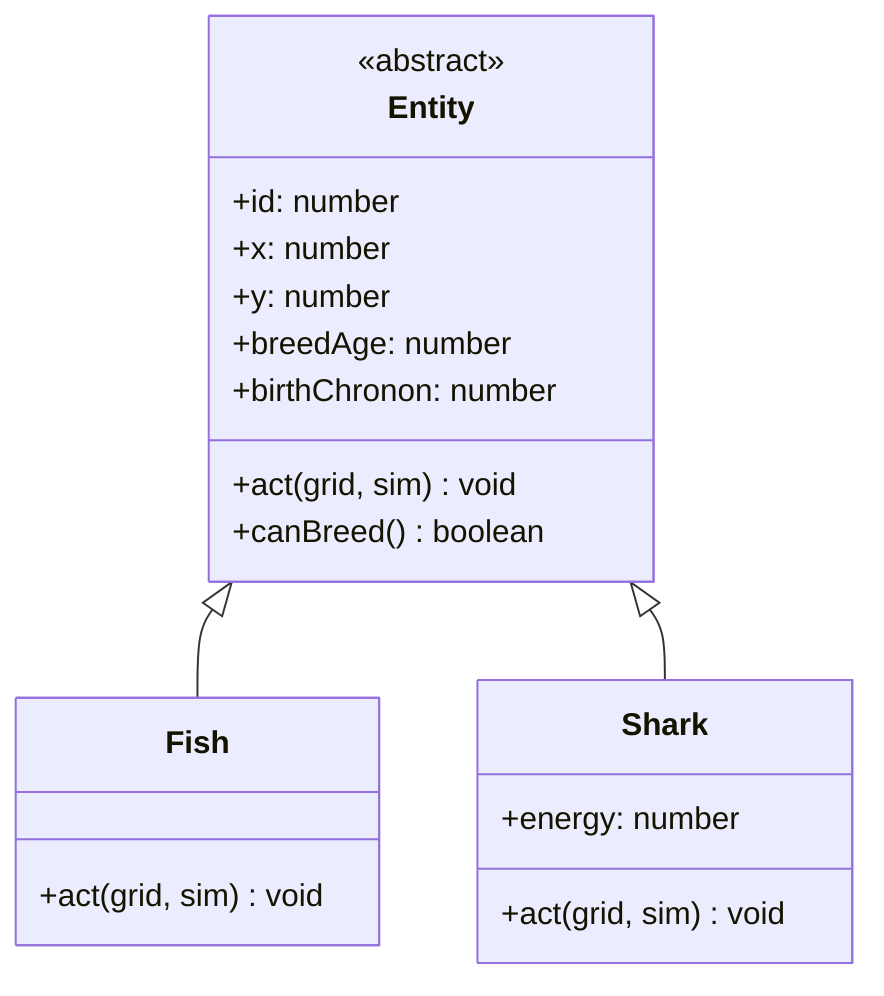
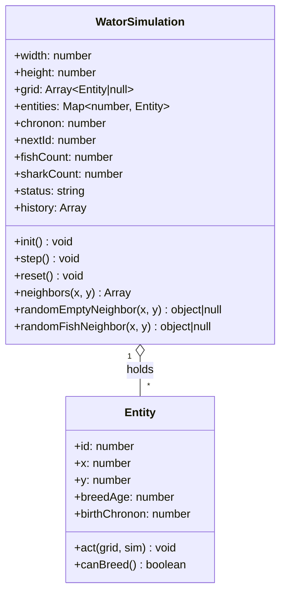
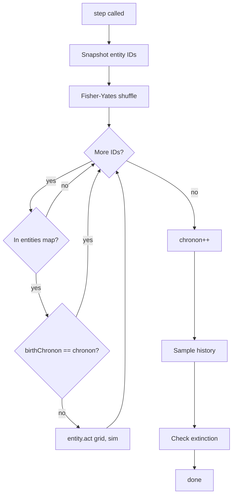
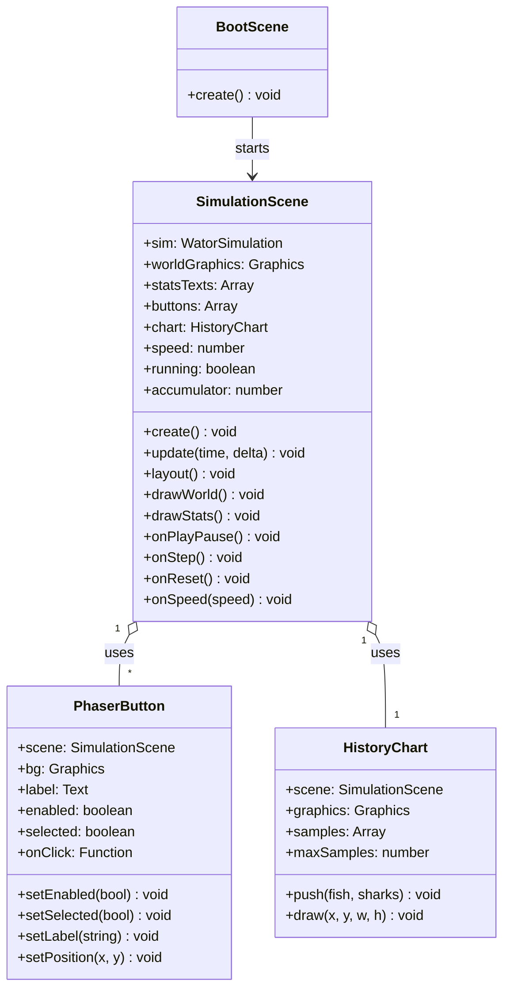

## Context

This is a greenfield implementation of a browser-based Wa-Tor predator-prey simulation, driven by the requirements in `prd-v001.md`. The app is a static ES2020 JavaScript site with no build step, loading Phaser 4.x from a CDN. The defining architectural constraint is **requirement 4 of the PRD**: the simulation engine must not depend on Phaser APIs or scene objects. Phaser is a viewer of engine state, nothing more.

The project is object-oriented: fish and sharks are instances of classes extending a common `Entity` base class. Entities have stable integer IDs so the randomized per-chronon turn list survives entities being added (births) or removed (deaths/eating) mid-loop.

## Goals / Non-Goals

**Goals:**
- A clean seam between the framework-independent simulation engine and the Phaser rendering/UI layer.
- Correct Wa-Tor cellular automaton behavior per the PRD rules, including toroidal edges, randomized turn order, no newborn-acts-this-chronon, and skip-dead-before-turn.
- A single `SimulationScene` that delegates rendering work to helper classes (`HistoryChart`, `PhaserButton`) so the scene stays readable.
- Responsive layout: stats left, world center (preserving 100:70 aspect), controls right, chart bottom; reflows on tablet/narrow viewports.
- All classes JSDoc-documented; static methods and public methods over 8 lines JSDoc-documented.

**Non-Goals:**
- No build tooling, TypeScript, bundler, or npm runtime dependency.
- No automated tests (per PRD), though the engine seam keeps it testable in principle.
- No user-facing controls for grid dimensions, densities, or model constants.
- No seeded RNG, no movement animation, no sprite art, no grid lines, no chart labels.
- No DOM/HTML controls layered over Phaser.
- No keyboard shortcuts, world editing, zooming, or cell inspection.

## Decisions

### Decision 1: Entity model — class hierarchy with a common base

**Choice:** `Entity` abstract base class, with `Fish` and `Shark` subclasses extending it. "Entity records" (PRD req 27) are instances of these classes.

**Alternatives considered:**
- *One `Entity` class with a `type` field and a type-switching `act()`*: simpler, but `energy` would be a shark-only field on fish, and `act()` becomes a switch statement. Violates the OO lean and muddies the data model.
- *Plain data records + stateless behavior functions*: matches req 27 most literally, but the user explicitly wants OO classes. Rejected.

**Rationale:** The user directed that entity records are instances of classes extending a common base. Polymorphic `act()` keeps shark-only state (`energy`) on sharks and fish behavior on fish.

### Decision 2: Stable integer IDs + `birthChronon` for newborn skipping

**Choice:** `WatorSimulation` holds a monotonic `nextId` counter. Each entity gets a stable integer `id` at construction. The per-chronon turn list is an array of IDs; alive-checks use a `Map<id, Entity>`. Newborns get a `birthChronon` field set to the current chronon; an entity is skipped if `birthChronon === currentChronon` (PRD req 12).

**Alternatives considered:**
- *Boolean `isNew` flag cleared at end of chronon*: simpler, but a counter survives future save/load and is self-describing.
- *Object references in the turn list*: breaks when an entity is eaten mid-chronon — the ref still points to a stale object. IDs + map lookup is robust.

**Rationale:** PRD req 11 says "collect current entity IDs." Stable IDs let the shuffled list survive add/remove during the loop. The `birthChronon` counter is cleaner than a flag.

### Decision 3: Grid of Entity references + `Map<id, Entity>`

**Choice:** The grid is a flat `Array<Entity|null>` of length `width * height`, indexed `y * width + x`. A separate `Map<id, Entity>` holds all live entities for O(1) alive-checks during the turn loop and for population counting.

**Alternatives considered:**
- *Grid of IDs + separate record store*: grid is tiny integers, but every neighbor check costs two lookups (grid → id → record). For 7000 cells the difference is negligible; refs are simpler.
- *Grid of records only, no map*: alive-check during the turn loop would require scanning the grid or storing a separate alive-set anyway. The map is the canonical alive-set.

**Rationale:** O(1) neighbor lookup, O(1) alive-check, O(1) population count. Two structures to keep in sync, but the sync points are few (move, birth, death) and localized.

### Decision 4: Chronon loop — snapshot IDs, shuffle, guard each turn

**Choice:** Each `step()`:
1. Snapshot all current entity IDs into an array.
2. Fisher-Yates shuffle the array.
3. For each ID: if not in `entities` map → skip (eaten/died, req 13). If `birthChronon === chronon` → skip (newborn, req 12). Otherwise call `entity.act(grid, this)`.
4. After the loop, increment `chronon`, sample populations into history, check extinction.

**Rationale:** Directly implements PRD reqs 11–13. The snapshot-then-shuffle pattern means births during the loop don't get a turn this chronon (they're not in the snapshot) and deaths are caught by the map check.

### Decision 5: Fish.act and Shark.act — per PRD rules

**Choice:** `Fish.act`: find random empty orthogonal neighbor (toroidal); if found, move; if `canBreed()` and moved, leave a new `Fish` in the old cell with a fresh ID and `birthChronon = chronon`, reset parent `breedAge = 0`; if `canBreed()` and could not move, reset `breedAge = 0` (req 16); if not breeding-ready and could not move, increment `breedAge` (req 17).

**Choice:** `Shark.act`: decrement `energy` by `sharkEnergyCostPerChronon` (req 18); if `energy <= 0`, remove shark (req 19) and return; else find random fish neighbor; if found, move there, remove eaten fish, `energy += sharkEnergyGain` (reqs 20–21); else find random empty neighbor and move (req 22); breeding logic mirrors fish (reqs 23–26), newborn shark gets `energy = initialSharkEnergy` (req 24).

**Rationale:** Direct mapping of PRD rules 14–26 into polymorphic `act()` methods. The engine owns all rule logic; Phaser never touches it.

### Decision 6: One SimulationScene delegating to UI helpers

**Choice:** A single `SimulationScene` (matching the PRD's two-scene list: `BootScene` + `SimulationScene`) owns the world `Graphics`, stats `Text` objects, `PhaserButton` instances, and a `HistoryChart` helper. `SimulationScene.update(time, delta)` runs an accumulator (`stepMs = 1000 / speed`) and calls `sim.step()` when enough time elapses, then redraws.

**Alternatives considered:**
- *Split chart and buttons into separate Phaser scenes*: more scenes than the PRD lists, and Phaser scene-to-scene coordination adds complexity for no gain.
- *Inline all UI drawing in SimulationScene*: the scene file balloons past 500 lines and becomes hard to maintain.

**Rationale:** Keeps the scene count aligned with the PRD while preventing `SimulationScene` from becoming a monolith. Helpers are plain classes, not scenes.

### Decision 7: PhaserButton — familiar OS-style affordance

**Choice:** `PhaserButton` renders a rounded-rectangle `Graphics` background plus a `Text` label, with four visual states: normal (flat fill, subtle border), hover (lighter fill, pointer cursor), active/pressed (darker fill), disabled (50% alpha, no pointer). Speed buttons form a segmented control — the active speed gets a "selected" state (accent border + stronger fill). Action buttons (Play/Pause, Step, Reset) are standalone, each on its own row.

**Rationale:** The user asked for a button mechanism that "looks good and is familiar to users." Rounded corners, hover/press feedback, and a segmented speed control match what users expect from every desktop/mobile OS.

### Decision 8: Layout — fixed side panels, centered world, bottom chart

**Choice:** `layout()` computes regions on resize:
- Stats panel: fixed width on the left.
- Controls panel: fixed width on the right.
- World: fills the middle, centered, preserving the 100:70 aspect ratio (letterboxed if needed).
- Chart: fixed height across the bottom, spanning the full window width.

On tablet/narrow viewports (below ~744px wide), panels reflow: stats and controls stack or shrink, world keeps aspect ratio, chart stays at the bottom. The world aspect ratio is always preserved (PRD reqs 8, 52).

**Rationale:** PRD req 51 specifies the wide layout; req 52 requires reflow on narrow. Fixed panel widths with a flexible centered world is the simplest scheme that satisfies both.

### Decision 9: History chart — auto-scaled rolling window

**Choice:** `HistoryChart` stores one `{fish, sharks}` sample per chronon, capped at 500 samples (PRD req 45). On draw, it auto-scales the vertical axis to the max population value in the current window and draws two polylines (green fish, blue sharks) using `Graphics`. No titles, no labels, no axis ticks (PRD req 47).

**Alternatives considered:**
- *Fixed scale 0..(width*height)*: stable but the lines hug the bottom early and flatten later. Less informative.
- *Fixed scale 0..initialPopulation*: breaks if population grows beyond initial.

**Rationale:** Auto-scale to window max keeps the chart readable across population swings. PRD is silent on scale; auto-scale is the most useful default.

### Decision 10: Speed timing — accumulator in update()

**Choice:** `SimulationScene.update(time, delta)` accumulates `delta` ms and steps the engine when `accumulator >= stepMs` where `stepMs = 1000 / speed`. At 60x, `stepMs ≈ 16.7ms` (≈ one chronon per frame). No catch-up compensation for hidden tabs (PRD req 49).

**Rationale:** Standard game-loop accumulator. Decouples simulation rate from frame rate. PRD req 48 says "advance according to selected chronons-per-second as normally as the browser allows."

### Decision 11: Extinction handling — auto-pause + status text

**Choice:** After each `step()`, the engine checks `fishCount` and `sharkCount`:
- Both zero → status `"Ecosystem collapsed"` (req 40).
- Sharks zero, fish remain → `"Sharks extinct"` (req 38).
- Fish zero, sharks remain → `"Fish extinct"` (req 39).
- Otherwise → `"Running"` or `"Paused"` depending on `running` (reqs 41–42).

On any terminal status, the scene auto-pauses and disables Play; Reset is required to start another run (reqs 37, 43).

**Rationale:** Direct implementation of PRD reqs 37–43. The engine computes status; the scene reflects it in the stats panel and button enabled-state.

## Risks / Trade-offs

- **[Phaser 4.x CDN dependency]** → First load and offline use depend on network availability for the Phaser script. Mitigation: service worker caches Phaser after first successful load (PRD req 56); accept best-effort offline (PRD req 57).
- **[No automated tests]** → Correctness relies on careful implementation and manual browser verification. Mitigation: the engine/Phaser seam keeps the engine independently testable in principle; chronon-loop edge cases (newborn skip, dead-before-turn) are explicitly specified in specs.
- **[Fixed UI constants]** → No user-facing controls for grid/densities/breed/energy. Mitigation: all constants centralized in `src/config.js` for easy programmer edits (PRD req 53).
- **[Phaser-native UI]** → Custom buttons/chart require hand-rolled hit-testing and layout. Mitigation: `PhaserButton` and `HistoryChart` helpers encapsulate this; `layout()` centralizes resize math.
- **[Math.random() non-reproducibility]** → No seeded RNG. Mitigation: accepted per PRD non-goals.
- **[Browser tab throttling]** → No catch-up compensation. Mitigation: accepted per PRD req 49; simulation simply advances when the tab is active.
- **[Two-structure sync (grid + map)]]** → Move/birth/death must update both grid and map. Mitigation: all mutations go through `WatorSimulation` methods, not direct grid writes, keeping sync localized.
