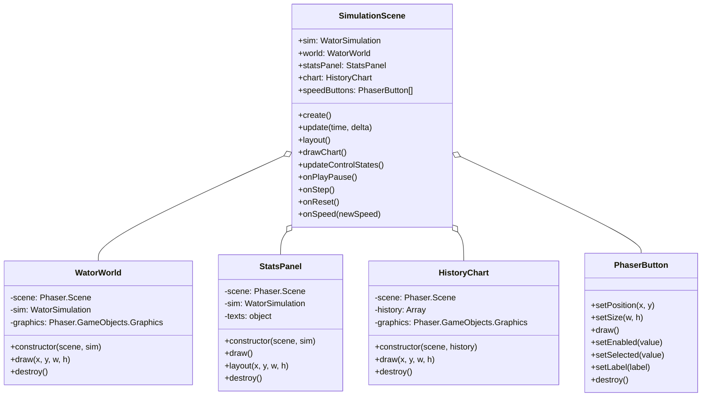
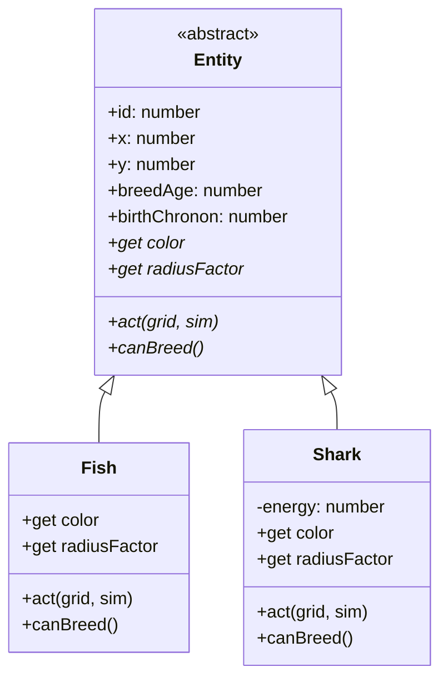

## Context

`SimulationScene` (`src/scenes/SimulationScene.js`, ~430 lines) currently owns six responsibilities: engine driving (accumulator + `update()`), world rendering (`drawWorld` + `worldGraphics`), stats text (`drawStats` + 4 `Text` objects), button creation and event handlers, layout (`layout`/`_layoutWide`/`_layoutNarrow`/`_layoutStats`/`_layoutControls`), and chart delegation. The existing `src/ui/` directory already establishes a UI component pattern via `HistoryChart` and `PhaserButton`: each class takes the scene at construction, owns its Phaser objects, exposes a `draw(x, y, w, h)` method, and has a `destroy()` method. The scene does not follow this pattern for world rendering or stats display — that logic is inlined.

The `Entity` hierarchy (`Entity` → `Fish`, `Shark`) already uses polymorphism for behavior (`act()`, `canBreed()` are abstract methods that throw). However, render-time appearance (color, radius) is not polymorphic: `drawWorld()` distinguishes sharks from fish via duck-typing (`'energy' in entity`), which couples the renderer to entity internals and is fragile if `Fish` ever gains an `energy` field.

## Goals / Non-Goals

**Goals:**
- Encapsulate per-chronon world rendering in a `WatorWorld` UI class following the established `HistoryChart` pattern.
- Encapsulate per-chronon stats text updates in a `StatsPanel` UI class.
- Make `Entity` render-time appearance polymorphic (`color`, `radiusFactor` getters) so renderers need no type inspection.
- Reduce `SimulationScene` to a thin orchestrator: engine driver + button ownership + layout + delegation.
- Preserve all existing visual output, button behavior, layout regions, and simulation rules exactly.

**Non-Goals:**
- Extracting a `LayoutManager` class or layout functions module — layout stays in the scene.
- Extracting buttons or event handlers into a `ControlsPanel` — buttons are not redrawn per-chronon and stay in the scene.
- Decoupling renderers from the `WatorSimulation` instance (e.g., snapshot-based drawing) — components take the `sim` directly, consistent with `HistoryChart`.
- Adding unit tests, theming, or new visual features.
- Changing `config.js`, `index.html`, `sw.js`, or `manifest.webmanifest`.

## Decisions

### Decision 1: Extract only per-chronon drawing into UI classes

**Choice:** Only `drawWorld` and `drawStats` (methods invoked every chronon in `update()`) are extracted. Buttons, handlers, and layout remain in the scene.

**Rationale:** The user's guiding rule is "factor out only what has a `draw` method." Buttons are constructed once and updated only on user input, not per-chronon. Layout is geometry math that the scene computes and distributes. Extracting these would add classes without reducing per-frame work.

**Alternatives considered:**
- Extract a `ControlsPanel` for buttons + handlers: rejected — buttons don't redraw per-chronon, and extracting handlers would either leak scene concerns (accumulator reset, redraw triggers) into the panel or require awkward callback wiring.
- Extract a `LayoutManager`: rejected — layout is the scene's composition responsibility and is already pure geometry; a separate class would be a thin wrapper with no state.

### Decision 2: Name the world renderer `WatorWorld`

**Choice:** The class is named `WatorWorld` (not `WorldRenderer`).

**Rationale:** User-specified naming. It reads naturally as a domain object ("the Wa-Tor world") and is consistent with `WatorSimulation` naming.

### Decision 3: `WatorWorld` and `StatsPanel` take the `sim` instance

**Choice:** `new WatorWorld(scene, sim)` and `new StatsPanel(scene, sim)`. The components hold a reference to `sim` and read from it on each `draw()`.

**Rationale:** Consistent with `HistoryChart`, which takes `sim.history` directly. The `sim` is a stable reference for the life of the scene. Passing a snapshot per frame would add allocation cost and indirection without benefit in this single-scene app.

**Alternatives considered:**
- Pass a snapshot (`{width, height, entities}`) to `draw()` each frame: rejected — more functional and testable, but inconsistent with the established `HistoryChart` pattern and adds per-frame allocation. The renderer is already trivially testable by constructing a real `WatorSimulation`.

### Decision 4: Polymorphic `color` and `radiusFactor` on `Entity`

**Choice:** Add abstract getters `color` and `radiusFactor` to `Entity` (throwing, like `act()` and `canBreed()`). Override in `Fish` (`COLORS.fish`, `FISH_RADIUS_FACTOR`) and `Shark` (`COLORS.shark`, `SHARK_RADIUS_FACTOR`). `WatorWorld.draw()` reads `entity.color` and `entity.radiusFactor` with no branching.

**Rationale:** Eliminates the `'energy' in entity` duck-typing, which is fragile (breaks silently if `Fish` gains an `energy` field). Aligns with the existing polymorphism pattern (`act()`, `canBreed()`). The renderer becomes entity-agnostic — adding a third entity type would require zero renderer changes.

**Alternatives considered:**
- Use `instanceof Shark` in the renderer: rejected — still couples the renderer to entity subtypes and requires importing `Shark` into a UI module.
- Keep duck-typing: rejected — fragile and already flagged in code review.
- Put colors in a separate `entityAppearance` map keyed by type: rejected — reintroduces type-checking at the lookup site and loses the polymorphism.

**Trade-off noted:** Color is arguably presentation, not simulation. However, `Fish` and `Shark` already import config values (`FISH_BREED_TIME`, etc.), so importing `COLORS` is not a new kind of coupling. The radius is a geometric property of the entity. The simplicity win outweighs the theoretical theming concern, which is YAGNI for this app.

### Decision 5: `StatsPanel` has both `draw()` and `layout()`

**Choice:** `StatsPanel` exposes `draw()` (update the four text strings, called per-chronon) and `layout(x, y, w, h)` (position the four `Text` objects, called on resize). The scene's `_layoutStats(x, y, w, h)` becomes a one-line delegation to `statsPanel.layout(x, y, w, h)`.

**Rationale:** `StatsPanel` owns its `Text` objects (to be self-contained), so the scene can no longer position them directly. The split mirrors `PhaserButton`, which has both `draw()` (internal state rendering) and `setPosition`/`setSize` (external positioning). `draw()` and `layout()` happen at different times (per-frame vs. on-resize), so separating them is honest.

**Alternatives considered:**
- Expose the `Text` objects for the scene to position: rejected — breaks encapsulation and defeats the purpose of extracting the class.
- Fold positioning into `draw(x, y, w, h)`: rejected — would re-position text every frame, which is wasteful and conflates content updates with layout.

### Decision 6: Rename `_drawChart` → `drawChart` and `_updateControlStates` → `updateControlStates`

**Choice:** Drop the underscore prefix on these two scene methods.

**Rationale:** After the refactor, the scene is an orchestrator whose methods are composition points (it calls `this.world.draw(...)`, `this.statsPanel.draw()`, `this.chart.draw(...)`). `drawChart` and `updateControlStates` sit at the same level as `drawWorld` and `drawStats` (which are already unprefixed). The underscore prefix implied "private implementation detail," but these are stable methods on the scene's surface.

## Risks / Trade-offs

- **[Color/radius on entities couples simulation to presentation]** → Mitigated: `Fish`/`Shark` already import config; colors are fixed for this app; the coupling is no worse than the existing breed-time/energy imports. Documented as a deliberate decision.
- **[Two new classes increase file count]** → Mitigated: each is small (~40-60 lines), self-contained, and follows the established pattern. The scene shrinks by more than the new files add.
- **[Refactor could introduce subtle visual regressions]** → Mitigated: the drawing logic is moved verbatim (modulo the polymorphism swap). Visual diff before/after should be identical. No new test infrastructure is added in this change.
- **[`StatsPanel.layout` adds a method that isn't strictly a `draw` method]** → Accepted: the user explicitly approved adding `layout` methods to new components. It mirrors `PhaserButton.setPosition`/`setSize`.

## Class Diagrams

### UI component hierarchy (after refactor)



### Entity hierarchy (after adding polymorphic appearance)



### Dependency direction

```mermaid
graph TD
    Scene[SimulationScene]
    World[WatorWorld]
    Stats[StatsPanel]
    Chart[HistoryChart]
    Sim[WatorSimulation]
    Entity[Entity]
    Fish[Fish]
    Shark[Shark]

    Scene --> World
    Scene --> Stats
    Scene --> Chart
    Scene --> Sim
    World --> Sim
    World --> Entity
    Stats --> Sim
    Sim --> Entity
    Entity <|-- Fish
    Entity <|-- Shark
```

All dependencies flow downward. UI components depend on the simulation interface, never on the scene. No cycles.
