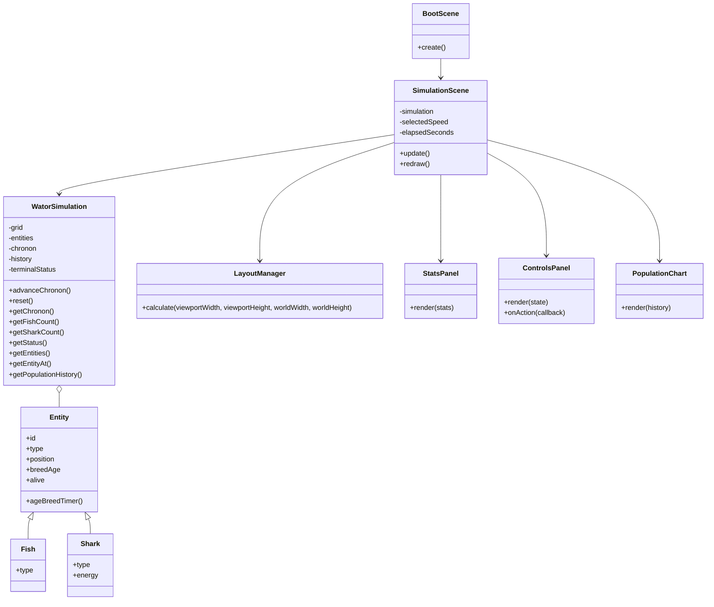
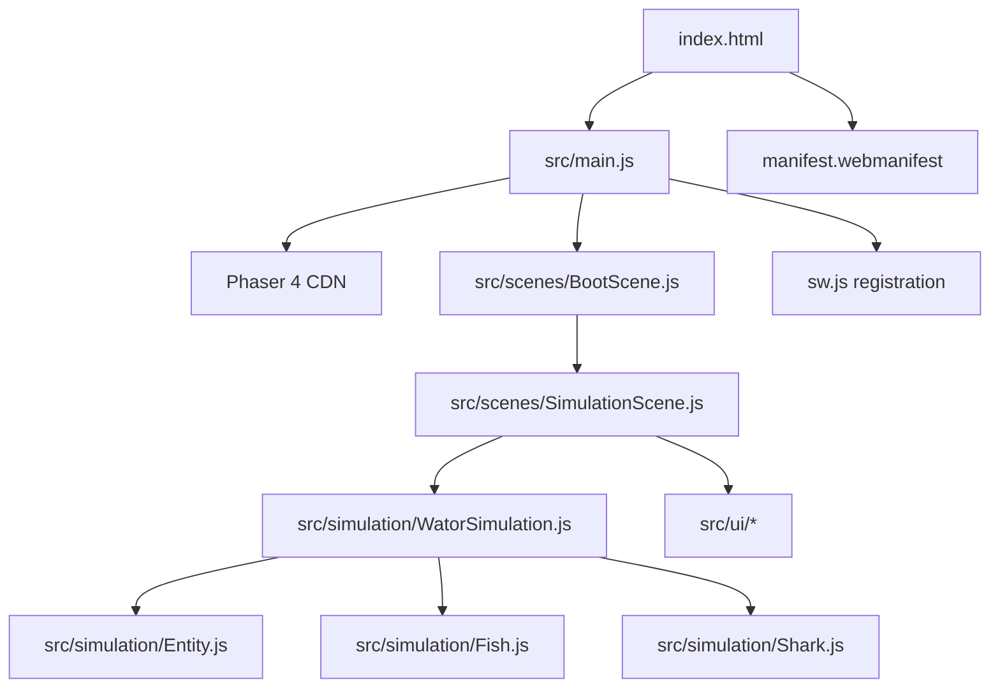

## Context

The repository contains the Wa-Tor product requirements but no implementation. The change introduces a static ES2020 browser application using Phaser 4.x from a CDN. The system has two strongly separated concerns: a framework-independent predator-prey simulation and a Phaser-native presentation layer. The app must remain static-site deployable, including under a repository subpath, and must avoid DOM overlays, build tooling, backend services, sprites, and automated tests as specified by the PRD.

## Goals / Non-Goals

**Goals:**

- Implement the PRD's Wa-Tor rules with explicit, class-based entity records.
- Keep simulation state and rules independent from Phaser.
- Expose simulation state through query methods.
- Provide Phaser-native responsive rendering, controls, statistics, and charting.
- Make model constants, colors, dimensions, and speed options easy to modify.
- Provide best-effort PWA shell support for static hosting.

**Non-Goals:**

- User-configurable model parameters or world editing.
- Seeded randomness, keyboard shortcuts, debug hooks, DOM controls, sprites, animation, zooming, or cell inspection.
- Build tooling, TypeScript, React, backend services, or automated tests.
- Catch-up compensation for hidden or throttled browser tabs.

## Decisions

### 1. Separate simulation and presentation layers
`WatorSimulation` owns the flat grid, entity registry, ID allocation, chronon processing, population history, status, and all mutations. `Entity`, `Fish`, and `Shark` contain model records and no Phaser imports. `SimulationScene` owns the playback accumulator, selected speed, input wiring, layout refresh, and redraw scheduling. This directly supports the framework-independence and query requirements in `wator-simulation` Requirements 1 and 3.

Alternative considered: letting entities call Phaser scenes or graphics during `act()`. Rejected because it couples correctness to frame rendering and makes model behavior difficult to inspect.

### 2. Centralized chronon orchestration with entity subclasses as records
The engine will collect living IDs and shuffle them at chronon start. It will resolve each ID against the registry before acting, so newborns are excluded and removed entities are skipped. Type-specific methods in the engine will apply fish and shark rules while subclasses hold state. This makes the ordering in `wator-simulation` Requirements 4–7 explicit and auditable.

Alternative considered: distributing all movement and reproduction logic into polymorphic `act()` methods. Rejected because global turn-order rules, newborn exclusion, and registry mutation remain easier to enforce centrally.

### 3. Query methods instead of mutable snapshots
The public simulation API will provide narrow queries such as `getChronon()`, `getFishCount()`, `getSharkCount()`, `getStatus()`, `isTerminal()`, `getEntities()`, `getEntityAt()`, and `getPopulationHistory()`. Collection-returning queries will provide read-only copies or immutable views so UI code cannot mutate the engine accidentally. Mutation entry points will be limited to operations such as `advanceChronon()` and `reset()`.

Alternative considered: exposing a complete mutable world object. Rejected because it weakens the model boundary and allows renderer code to bypass rules.

### 4. Phaser-native UI helper classes
`src/ui/LayoutManager.js` will calculate geometry as a pure helper. `StatsPanel.js`, `ControlsPanel.js`, and `PopulationChart.js` will own Phaser display objects and drawing behavior. `SimulationScene.js` will coordinate them and pass query results rather than entity internals. The world renderer can remain a scene-level graphics component because it is tightly coupled to the simulation viewport.

Alternative considered: DOM controls over the canvas. Rejected by the PRD and less suitable for a Phaser-owned full-window application.

### 5. Time-based speed accumulator
The scene will interpret speed values as chronons per second: 1, 5, 10, 30, and 60. Phaser's update delta will accumulate only while running and will trigger whole chronon advances as intervals are reached. Terminal or paused state will stop progression. The accumulator will not preserve elapsed time while hidden or throttled, satisfying `wator-web-app` Requirements 5 and 6 without catch-up complexity.

Alternative considered: one simulation advance per rendered frame with speed-dependent frame skipping. Rejected because behavior becomes device-refresh-rate dependent.

### 6. Relative static URLs and best-effort service worker
The HTML module, manifest link, service-worker registration, and app-shell cache entries will use relative paths or derive their base from the current document location. The service worker will cache same-origin application files and assets; Phaser CDN availability remains a first-load/offline constraint. This addresses `wator-web-app` Requirement 7.

### Class diagram

### Module layout

## Risks / Trade-offs

- **[CDN availability]** → First load and guaranteed offline behavior depend on Phaser network availability; keep the CDN URL explicit and cache same-origin files only.
- **[No automated tests]** → Keep simulation methods small, query-oriented, and manually verify edge wrapping, breeding, starvation, extinction, and control states in the browser.
- **[Large default grid]** → Use one `Graphics` object for batched world redraws rather than one display object per cell.
- **[Responsive Phaser UI complexity]** → Centralize geometry in `LayoutManager` and redraw panels on resize instead of scattering viewport calculations.
- **[Random non-reproducibility]** → Use `Math.random()` as required and expose enough live statistics to make manual behavior observable.
- **[Browser throttling]** → Do not add hidden-tab catch-up; accept normal browser scheduling as specified.

## Migration Plan

1. Add the static shell, configuration, simulation modules, scenes, UI helpers, PWA files, and assets.
2. Open the app from the repository root and from its hosted repository subpath.
3. Manually verify startup, speed controls, pause/step/reset behavior, resize reflow, rendering, chart history, and extinction statuses.
4. If a deployment issue is found, revert the static file additions as a unit; no persisted data or backend migration is required.

## Open Questions

- Exact typography, spacing, and decorative styling remain implementation choices because the PRD does not prescribe pixel values.
- Phaser 4's exact pointer-event and resize API details should be confirmed during implementation against the CDN version `4.1.0`.
- The narrow-layout region order can be selected by `LayoutManager` as long as the world aspect ratio and control usability requirements remain satisfied.
