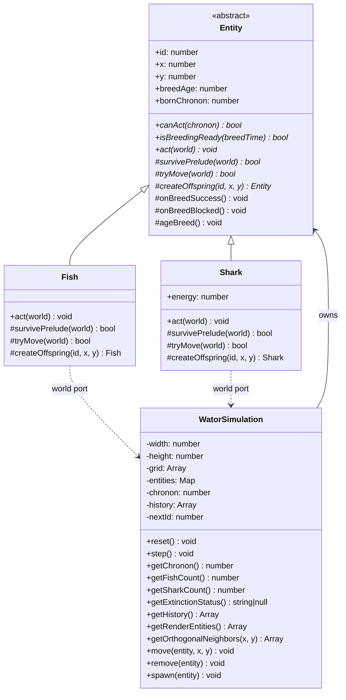
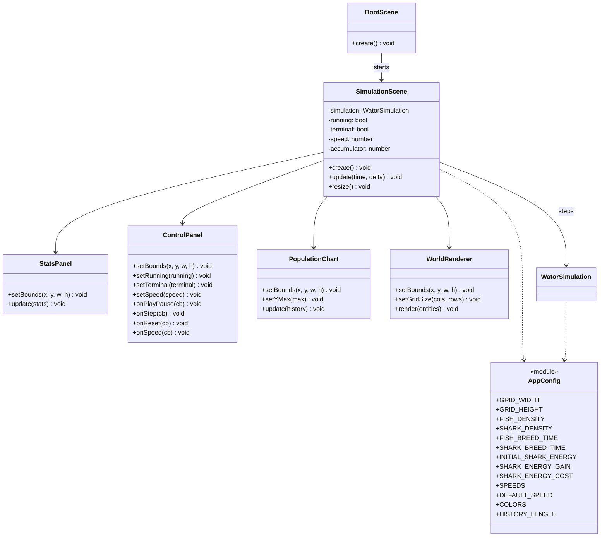
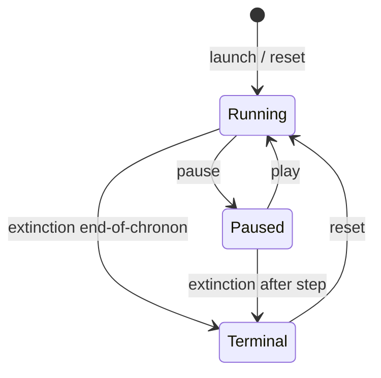

## Context

Greenfield browser Wa-Tor app defined by `prd-v001.md` and exploration decisions. The app must emphasize correct predator-prey chronon behavior, render entirely through Phaser 4, keep the simulation engine free of Phaser APIs, and ship as a static site with lightweight PWA support.

Stakeholders: browser users observing/controlling a run; programmers changing constants in code.

Constraints:
- ES2020 modules, no build step, no backend
- Phaser 4.x from CDN (`phaser@4.1.0` acceptable)
- Default grid `100×70`, fish density `30%`, shark density `5%`
- Speeds: `1x`, `5x`, `10x`, `30x`, `60x` (default `10x`)
- Graphics drawing only (no sprites)
- Deployable from a repository subpath

## Goals / Non-Goals

**Goals:**
- Correct Wa-Tor rules with explicit chronon edge-case behavior
- OO entity model (`Entity`, `Fish`, `Shark`) with simulation-owned grid
- Full first-iteration vertical slice: engine + Phaser UI + PWA shell
- Wide-window layout: stats left, world center, controls right, chart bottom
- Programmer-tunable constants in `config.js`

**Non-Goals:**
- Tablet/narrow reflow layouts
- User-facing editors for grid/densities/breed/energy
- Seeded RNG, automated tests, TypeScript, React, DOM overlays
- Keyboard shortcuts, world editing, zoom, cell inspection
- Chart titles/labels; dual Y-axis scaling
- Guaranteed offline when CDN Phaser is uncached

## Decisions

### D1: Split engine from presentation
- **Choice:** `WatorSimulation` and entity classes never import Phaser; `SimulationScene` and `src/ui/*` own rendering/input.
- **Why:** Protects rule correctness and keeps the engine a deep module with a small interface (`reset`, `step`, state getters).
- **Alternatives:** Scene-embedded rules (harder to reason about); worker-thread engine (unnecessary complexity for v1).
- **Spec refs:** `wator-simulation` R1–R2; `simulation-ui` R1; `app-shell` R2.

### D2: OO entities with abstract `Entity`
- **Choice:** `Fish` and `Shark` extend abstract `Entity`. Shared identity, position, breed age, readiness, and breed bookkeeping live on `Entity`. Species-specific movement, energy, and offspring creation live on subclasses.
- **Why:** Localizes breed state machine; matches product request for clear domain types.
- **Alternatives:** Anemic records + procedural switch (more duplication); single `Creature` with type flags (weaker locality).
- **Spec refs:** `wator-simulation` R3–R8.

### D3: Simulation owns the grid (world port)
- **Choice:** `WatorSimulation` owns flat grid, entity registry, IDs, chronon, history, turn loop, and extinction. Entities act through a world port (`neighbors`, occupancy queries, `move`, `remove`, `spawn`).
- **Why:** Single owner of toroidal wrapping and occupancy invariants; entities stay rule-focused.
- **Alternatives:** Entities hold grid back-refs (tighter coupling); separate `Grid` type with entities mutating cells (easy to desync registry).
- **Spec refs:** `wator-simulation` R2, R4, R9.

### D4: Template-method chronon action on `Entity`
- **Choice:** Shared act flow: species prelude → try move → breed handling.
  - Breeding ready when `breedAge >= breedTime`.
  - Ready + moved → spawn offspring in old cell, parent `breedAge = 0` (no +1 same chronon).
  - Ready + blocked → `breedAge = 0`.
  - Not ready → `breedAge += 1` whether moved or blocked.
  - Shark energy decrements first; death at 0 removes shark with **no** breed-age increment.
- **Why:** Locks exploration decisions into one place; prevents divergent fish/shark breed bugs.
- **Alternatives:** Fully procedural pipeline in `WatorSimulation` (entities become data bags).
- **Spec refs:** `wator-simulation` R5–R8, R10–R12.

### D5: Turn scheduling
- **Choice:** At chronon start, snapshot living entity IDs, Fisher–Yates shuffle with `Math.random()`, each ID acts at most once if still alive and not born this chronon. End-of-chronon: increment chronon, sample history, evaluate extinction.
- **Why:** Matches classic Wa-Tor fairness and PRD acceptance criteria.
- **Alternatives:** Scan grid in fixed order (bias); act newborns immediately (incorrect).
- **Spec refs:** `wator-simulation` R9–R10, R13–R14.

### D6: UI component factoring
- **Choice:** `src/ui/` holds `StatsPanel`, `ControlPanel`, `PopulationChart`, `WorldRenderer`. `SimulationScene` orchestrates layout, timing, and wiring.
- **Why:** Keeps scene from becoming a god object; maps cleanly to PRD regions.
- **Alternatives:** All drawing in `SimulationScene` (acceptable for tiny apps, poorer navigation).
- **Spec refs:** `simulation-ui` R1–R8; `app-shell` R2.

### D7: Fixed chart Y-axis
- **Choice:** Population chart Y max is always `gridWidth * gridHeight`. Never rescale during a run.
- **Why:** Stable absolute density reading; simple implementation. Shark line may sit low when fish dominate—accepted.
- **Alternatives:** Window peak, run peak, dual scale (rejected for breathing/misleading unlabeled chart).
- **Spec refs:** `simulation-ui` R8.

### D8: Wide layout only
- **Choice:** Implement stats | world | controls + bottom chart. On resize, recompute scale/center for the world; do not build a stacked tablet layout.
- **Why:** Explicit exploration decision to reduce v1 scope.
- **Alternatives:** Full responsive reflow (deferred).
- **Spec refs:** `simulation-ui` R1, R9.

### D9: Speed and run-state ownership
- **Choice:** Scene owns play/pause/terminal UI state and chronons-per-second pacing via frame delta. Engine exposes `step()` and extinction/population queries. Multiple steps per frame allowed; stop further steps when terminal.
- **Why:** Engine stays pure; browser throttling needs no catch-up logic.
- **Alternatives:** Engine wall-clock scheduler (couples to browser timing).
- **Spec refs:** `simulation-ui` R4–R7; `wator-simulation` R13–R14.

### D10: Static shell + best-effort PWA
- **Choice:** `index.html` loads Phaser CDN + `src/main.js` module. Service worker caches app shell and same-origin assets; first offline load may fail if Phaser CDN uncached.
- **Why:** Matches static deploy and PRD offline honesty.
- **Alternatives:** Vendoring Phaser (larger repo, better offline—optional later).
- **Spec refs:** `app-shell` R1, R3–R4.

### D11: File layout
```
index.html
sw.js
manifest.webmanifest
assets/
src/
  main.js
  config.js
  simulation/
    WatorSimulation.js
    Entity.js
    Fish.js
    Shark.js
  scenes/
    BootScene.js
    SimulationScene.js
  ui/
    StatsPanel.js
    ControlPanel.js
    PopulationChart.js
    WorldRenderer.js
```

## Class Diagrams







## Risks / Trade-offs

- [Rule bugs without automated tests] → Encode chronon contract in design/specs; manual browser verification checklist during apply.
- [Phaser 4 API mismatches] → Pin CDN `4.1.0`; prefer Graphics/text/input APIs known stable; verify before broad rewrites.
- [Full redraw cost at 60x] → 100×70 circles is fine; avoid unnecessary chart path rebuild thrash if profiling shows issues.
- [CDN offline gap] → Document best-effort PWA; cache shell/assets only.
- [Fixed chart scale hides sharks] → Accepted tradeoff for never-rescale absolute Y.
- [Wide-only layout on phones] → Explicit non-goal; world still scales on resize.

## Migration Plan

1. Add shell files and empty modules.
2. Implement engine + entities.
3. Implement scenes/UI and wire controls.
4. Add PWA assets/manifest/SW.
5. Manual verify against specs in a browser (including subpath-style relative URLs).
6. Deploy static files as-is; rollback = revert deploy commit/files.

## Open Questions

- Exact pixel padding, fonts, and button sizes (left to implementation taste within usability).
- Whether render snapshot is a DTO list or live entity references (prefer DTO-like plain objects from `getRenderEntities()`).
