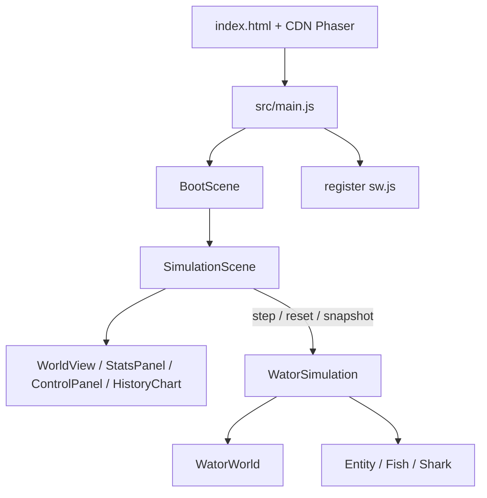
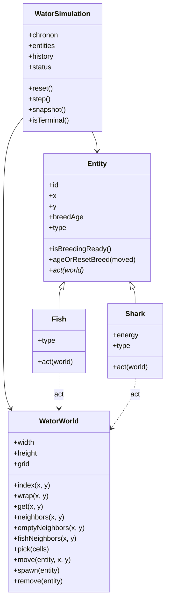
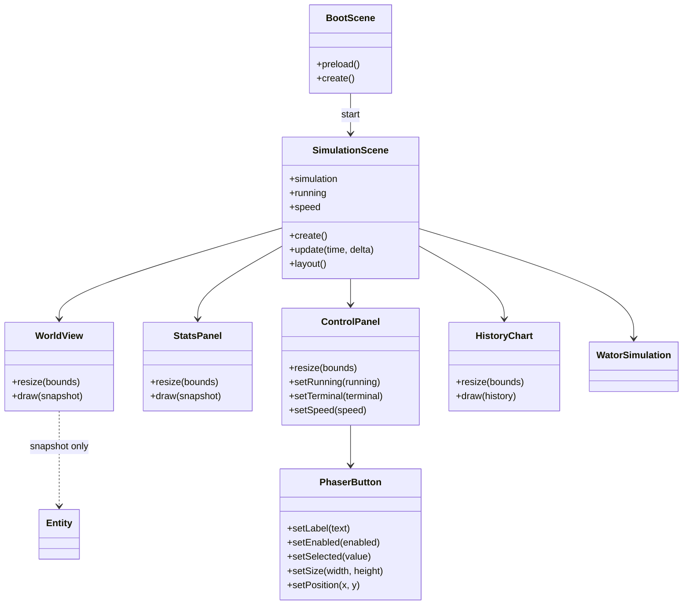

## Context

The repository is an empty OpenSpec project plus `prd-v001.md`. There is no application code. See `proposal.md` for motivation. Behavior contracts are in `specs/wator-simulation/spec.md` and `specs/wator-app/spec.md`.

Constraints that shape the approach:

- Static ES2020 modules, Phaser 4.1.0 from CDN, no bundler, no backend (`wator-app` requirements 2 and 14).
- The engine must not import Phaser (`wator-simulation` requirement 14).
- Entity records are class instances: `Fish` and `Shark` extend a shared `Entity` (`wator-simulation` requirement 10).
- Phaser owns the whole window; UI is drawn, not DOM (`wator-app` requirement 3).
- GitHub Pages may serve the app from a repository subpath.

## Goals / Non-Goals

**Goals:**

- Keep a hard seam between a headless object-oriented engine and a Phaser viewer.
- Give species classes ownership of chronon behavior while the simulation owns turn order, history, and extinction.
- Make layout, timing, and PWA pathing explicit enough to implement without inventing product behavior.

**Non-Goals:**

- No automated tests, seeded RNG, replay, or immutable boards.
- No extra inheritance (`Prey` / `Predator`) and no `Water` entity class.
- No Phaser version abstraction layer beyond pinning `4.1.0` in `index.html`.

## Decisions

### 1. Two-module architecture

`src/simulation/` is a Phaser-free package. `src/scenes/` and `src/ui/` may import the engine and Phaser, never the reverse. This satisfies `wator-simulation` requirement 14 and `wator-app` requirement 2.

Alternative considered: put stepping inside `SimulationScene`. Rejected because the PRD and specs require a headless engine and because scene files would absorb the rules.



### 2. Rich actors plus a small world façade

`WatorSimulation.step()` implements `wator-simulation` requirement 4: snapshot living IDs, shuffle, skip missing IDs, then `entity.act(world)`.

`Fish.act` implements requirements 5 and 6. `Shark.act` implements requirements 7, 8, and 9. Shared breed-age bookkeeping lives on `Entity`.

`WatorWorld` is the only object species methods use to inspect or mutate occupancy: wrapped neighbors, random pick, move, spawn, remove. Random choice is `Math.random()` inside `WatorWorld.pick()`, not scattered through species classes (`wator-simulation` requirement 2).

Alternative considered: anemic `Fish` / `Shark` structs with all rules in `step()`. Rejected; it meets the class names without putting behavior on the types.

### 3. Dual index: flat grid and ID map

State is a `width * height` array of `Entity | null` plus `Map<id, Entity>` pointing at the same objects (`wator-simulation` requirements 1 and 10). Empty water is `null`. Removing a shark or eaten fish clears the cell and deletes the map entry so a later turn ID misses naturally (requirement 4.3). Newborns are inserted after the ID snapshot, so they sit out the birth chronon (requirement 4.2).

### 4. Initial fill is shuffled cells, not independent coin flips

To honor default densities without overlapping occupants (`wator-simulation` requirement 2):

1. Build an array of every cell index and shuffle it.
2. Place `floor(cellCount * fishDensity)` fish on the first slice.
3. Place `floor(cellCount * sharkDensity)` sharks on the next slice.
4. Leave the rest empty.

This yields exact counts for the default `100 x 70` world: `2100` fish and `350` sharks.

### 5. Playback and extinction live in different layers

The engine is imperative: `reset()` and `step()`. It records history (requirement 11) and a terminal reason (requirement 12). It does not have a run loop.

`SimulationScene` owns `running`, selected speed, and the chronon accumulator (`wator-app` requirements 8–10 and 12). After each `step()`, if the engine is terminal, the scene sets `running = false` and disables Play. Reset asks the engine to rebuild, then sets `running = true` at the already-selected speed.

### 6. Frame clock without catch-up

Each `update(time, delta)`:

- If not running, return.
- Add `min(delta, 1000 / 30)` to an accumulator. The cap discards hidden-tab backlog instead of replaying it (`wator-app` requirement 12).
- While the accumulator is at least `1000 / speed` and a safety bound of `4` steps per frame has not been hit, call `step()` and subtract the interval.
- Leftover accumulator is kept only for the current visible session.

`1x` is 1 chronon/sec; `60x` is 60. The per-frame bound prevents a single long frame from applying a visible burst even if `delta` is large.

### 7. Graphics world view, full redraw

`WorldView` clears a Phaser `Graphics` object and draws water as a filled rect, then a circle per occupied cell (`wator-app` requirement 4). No sprites, no grid lines, no tweening. Fish radius is a fraction of cell size; shark radius is larger (about `1.25×`).

Full redraw is simpler than dirty-rect tracking and is acceptable at `100 x 70`. If 60 chronons/sec hitch, the first mitigation is still Graphics batching, not sprites.

### 8. Layout: wide four-region, stacked narrow

Wide layout (`wator-app` requirement 6) uses reserved strips:

- Left stats column `~160px`
- Right controls column `~200px`
- Bottom chart `~120px`
- Remaining center is the world, scale-to-fit, aspect locked, centered (`wator-app` requirement 5)

Narrow / tablet (`wator-app` requirement 7), when the remaining center cannot fit a readable world (breakpoint near `900px` CSS width, including `744 x 1133`):

```
┌─────────────────────────────┐
│ Chronon  Fish  Sharks  Status│
├─────────────────────────────┤
│         world (centered)    │
├─────────────────────────────┤
│ 1x 5x 10x 30x 60x           │
│ Play/Pause                  │
│ Step                        │
│ Reset                       │
├─────────────────────────────┤
│ chart                       │
└─────────────────────────────┘
```

Hit targets stay at least `44px` tall. `SimulationScene` recomputes this on `scale.resize`.

### 9. Reuse existing `PhaserButton`

On-screen controls SHALL use the already-present `src/ui/PhaserButton.js`. Do not add `TextButton` or another button class. Speed buttons use `setSelected` for the active rate. Play/Pause uses `setLabel`. Step and Play use `setEnabled` for running and terminal lockout. `ControlPanel` repositions and resizes these instances on layout instead of recreating them.

Alternative considered: a thinner `TextButton`. Rejected because `PhaserButton` already covers hover, press, disabled, selected, resize, and move.

### 10. Unlabeled chart with a shared autoscale

`HistoryChart` plots the rolling 500-sample buffer (`wator-simulation` requirement 11, `wator-app` requirement 11). Y max is `max(1, max fish or shark count in the visible window)`. Both series share that scale so relative height stays meaningful. No titles, ticks, or legends. X maps sample index to chart width.

### 11. File map and BootScene

Required paths from `wator-app` requirement 2, plus UI classes:

| Path | Role |
|---|---|
| `index.html` | CDN Phaser 4.1.0, module entry, manifest link |
| `src/main.js` | `new Phaser.Game`, relative SW register |
| `src/config.js` | All model and presentation constants |
| `src/simulation/Entity.js` | Shared identity, position, breed age |
| `src/simulation/Fish.js` | Fish `act` |
| `src/simulation/Shark.js` | Shark `act` and energy |
| `src/simulation/WatorWorld.js` | Grid, wrap, pick, occupy |
| `src/simulation/WatorSimulation.js` | Init, step, reset, snapshot, history |
| `src/scenes/BootScene.js` | Load same-origin icons if needed, start sim scene |
| `src/scenes/SimulationScene.js` | Clock, layout, wiring |
| `src/ui/WorldView.js` | Occupancy drawing |
| `src/ui/StatsPanel.js` | Chronon, Fish, Sharks, Status |
| `src/ui/ControlPanel.js` | Speed row and action stack |
| `src/ui/HistoryChart.js` | Unlabeled series |
| `src/ui/PhaserButton.js` | Existing Phaser hit target; reuse, do not replace |
| `sw.js`, `manifest.webmanifest` | PWA shell |
| `assets/icon-192.png`, `assets/icon-512.png` | Existing PWA icons |

`BootScene` exists to satisfy the project Phaser convention. It does not show a landing page (`wator-app` requirement 1). Its last `create()` action starts `SimulationScene`, which immediately `reset()`s a running world at `10x`.

### 12. Subpath-safe PWA

All app URLs are relative. Service worker registration uses `new URL('../sw.js', import.meta.url)` from `src/main.js`. The manifest `start_url` and `scope` are relative (`./`). The worker caches the app shell and same-origin assets only. Phaser remains a CDN resource; offline start is best-effort (`wator-app` requirement 14). Do not create new icon artwork. The manifest MUST use the existing `assets/icon-192.png` and `assets/icon-512.png` files.

### 13. Documentation comments

Every class gets a JSDoc class comment. Every static method and every public method longer than 8 lines gets JSDoc. Where a method implements a spec rule, the comment cites the requirement number from `wator-simulation` or `wator-app`.

## Class Diagrams

### Simulation engine



`Entity.act` is abstract. `type` is a getter (`fish` / `shark`) so the viewer never needs `instanceof` (`wator-simulation` requirement 10).

### Phaser application



`WatorSimulation` appears here only as a dependency of `SimulationScene`. Fish and sharks never subclass Phaser objects.

## Risks / Trade-offs

- [Default ecology collapses quickly] → Treat extinction as correct. Do not retune PRD constants unless a later change says so.
- [60 chronons/sec × 2450 circles hitch] → Full `Graphics` redraw first; cap steps per frame at 4; do not introduce sprites.
- [Hidden-tab `delta` spikes look like catch-up] → Clamp added `delta` and bound steps per frame (Decision 6).
- [Phaser CDN uncached offline] → Document as accepted (`wator-app` requirement 14). Cache only same-origin files.
- [No tests] → Manual browser pass: launch running, pause/step/reset, all five speeds, resize, extinction lockout, GitHub Pages subpath.
- [Phaser-native UI spacing unspecified] → Use the reserved strips and `44px` targets in Decision 8; tweak visually without changing specs.

## Migration Plan

Greenfield. Deploy by committing the static files and serving the directory, including from `.../grok_4.6/`. Rollback is revert of that commit. No data migration.

After first load, an old service worker may cache a previous shell. `sw.js` should prefer network-or-cache for HTML during development enough that a refresh picks up new files, while still caching the shell for repeat visits.
