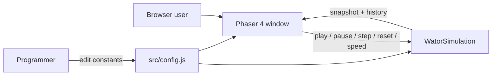

## Why

This repository has a complete Wa-Tor product definition in `prd-v001.md` but no application yet. The change introduces a static, Phaser 4 web app that runs a correct predator-prey simulation and lets a browser user watch and control it without a build step or backend.

## What Changes

- Add a framework-independent Wa-Tor simulation engine with object-oriented `Entity`, `Fish`, and `Shark` classes.
- Add a Phaser 4 full-window app that boots directly into a running `100 x 70` world at `10x` speed.
- Render water, fish, and sharks with Phaser `Graphics` only, plus live stats, playback controls, and a rolling population history chart.
- Add lightweight PWA support (`manifest.webmanifest`, `sw.js`) that uses the existing `assets/icon-192.png` and `assets/icon-512.png` files so the app shell can be cached on GitHub Pages, including a repository subpath.
- Reuse the existing `src/ui/PhaserButton.js` helper for every on-screen control. Do not add a second button class.
- Keep all model knobs in code constants. Do not add user-facing parameter editors, DOM overlays, keyboard shortcuts, seeded RNG, tests, or a build toolchain.

## Capabilities

### New Capabilities

- `wator-simulation`: Chronon stepping, toroidal movement, fish and shark life rules, object-oriented entity records, population counts, extinction status, and a 500-chronon history buffer.
- `wator-app`: Static ES2020 Phaser shell, world rendering, stats and controls layout, playback and speed behavior, history chart, resize/reflow, and best-effort PWA caching.

### Modified Capabilities

- None. `openspec/specs/` is empty.

## Impact

- Greenfield application files: `index.html`, `src/main.js`, `src/config.js`, `src/simulation/`, `src/scenes/`, `src/ui/` helpers, `sw.js`, and `manifest.webmanifest`.
- Reuse existing `src/ui/PhaserButton.js` and existing `assets/icon-192.png` plus `assets/icon-512.png`.
- Runtime dependency: Phaser 4.1.0 from the jsDelivr CDN. No Node.js runtime dependency.
- Deployable as a static site from this repository subpath.
- No main specs are modified.
