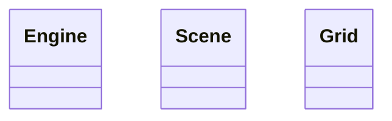

# Design
- Engine: framework-independent JS module (chronons, toroidal grid, rules).
- UI: Phaser 4 owns window; panels via Phaser containers.
- Layout: left stats, right controls, bottom chart, center responsive grid.
- Colors: fish green circles, sharks blue circles.

## Design Decisions
- Engine separate (req 4).
- Phaser owns window (req 5).

