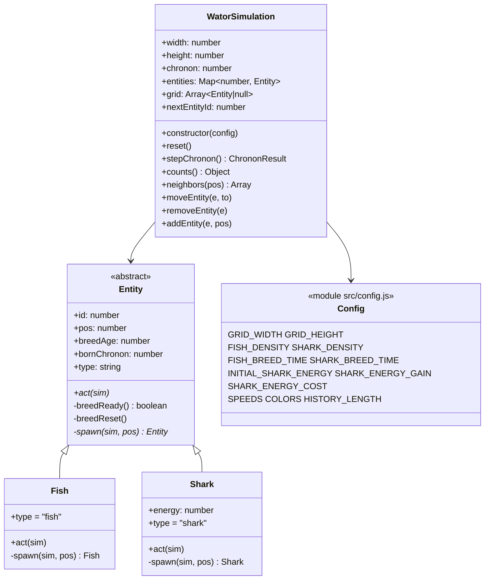
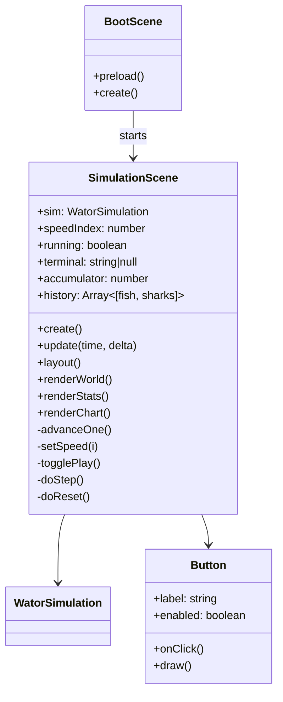

# Design: Wa-Tor Simulation Web App

## Context

Greenfield static web app implementing the Wa-Tor predator-prey cellular automaton per `prd-v001.md`. No existing code. Phaser 4.1.0 loads from a CDN script tag; app code is ES2020 modules with no build step. Requirements referenced below as (AC n) from the PRD, and as spec requirement numbers from `specs/<capability>/spec.md` (e.g., SE-R3).

## Goals / Non-Goals

**Goals:**
- Correct Wa-Tor rules in a framework-independent engine (AC 4).
- Phaser-native rendering and input for the entire window (AC 5) using `Graphics` only (AC 50).
- Two-mode responsive layout with aspect-preserving world (AC 51–52).
- Programmer-tweakable constants in one config module (AC 53).

**Non-Goals:**
- No tests, TypeScript, build tooling, seeded RNG, keyboard shortcuts, world editing, DOM overlays, or sprite art (PRD Non-Goals).

## Decisions

### D1. Module structure (supports SE-R1…R9, AS-R1…R5)

The engine imports nothing from Phaser (AC 4). `grid` is a flat `width*height` array of **direct entity references or `null`**; `entities` (Map by id) is the canonical registry. Positions are integer indices; toroidal wrapping is computed in `WatorSimulation.neighbors()` (AC 10, 27).

Behavior is delegated to the entity classes: `WatorSimulation.stepChronon()` handles turn-order mechanics (snapshot, shuffle, skip rules) and calls `entity.act(sim)`; `Fish.act()` and `Shark.act()` implement their species-specific rules using shared helpers (`moveEntity`, `neighbors`, `addEntity`, `removeEntity`) exposed by the simulation. Shared movement/breeding plumbing lives in the `Entity` base class; species differences (eating, energy, breed thresholds, spawn type) live in the subclasses.

*Alternative considered:* behavior as switch-on-type functions inside `WatorSimulation` — rejected: an `Entity` class hierarchy keeps species rules cohesive and matches the OO direction for the codebase.

*Alternative considered:* grid of IDs with map lookups on every neighbor access — rejected: extra indirection on the hot path with no benefit since entity objects are already unique.

### D2. Chronon lifecycle (SE-R4…R9; AC 11–26)

`stepChronon()`:
1. Snapshot current entity IDs; shuffle (Fisher–Yates with `Math.random`).
2. For each id: skip if entity no longer exists (died/eaten) or `bornChronon === currentChronon` (newborn, AC 12); otherwise call `entity.act(sim)`.
3. `Fish.act()`: pick random adjacent empty cell; move. If breeding-ready, leave a newborn fish in the old cell and reset `breedAge = 0`; if breeding-ready but blocked, reset `breedAge = 0` anyway (AC 16); otherwise age.
4. `Shark.act()` order (fixed, AC 18–26): decrement energy by cost → if energy ≤ 0, remove without moving → else prefer random adjacent fish cell (move, eat, `energy += gain`) else random adjacent empty cell → breeding handled identically to fish; newborn shark gets `initialSharkEnergy`.
5. Increment chronon; return `{ chronon, fish, sharks, terminal }` where terminal is `fish-extinct | sharks-extinct | collapsed | null` (AC 37–40).

*Alternative considered:* processing sharks before fish (classic Wa-Tor variants) — rejected; PRD mandates randomized interleaved order (AC 11).

### D3. Scene structure (AS-R2; AC 1–3, 5)

`BootScene` loads PWA icon assets and starts `SimulationScene`, which owns everything else (single-scene app; the world, UI, and chart all live in one scene's `Graphics` objects). App launches straight into running at `10x` (AC 1).

### D4. Time model (CS-R4; AC 34–35, 48–49)

In `update(time, delta)`: if running and not terminal, `accumulator += delta`; while `accumulator >= msPerChronon` (1000/speed), call `advanceOne()` and subtract. Excess beyond one frame's worth is simply consumed by the loop — no wall-clock correction, matching AC 49. Speed changes take effect on subsequent updates (AC 34). Step while paused calls `advanceOne()` exactly once, which also records a chart sample (decision from exploration; AC 35).

### D5. Rendering & layout (RE-R1…R6, PC-R1…R4, AS-R6; AC 8–9, 28–33, 44–47, 50–52)

- One `Graphics` object for the world (redrawn fully each render — 7000 cells of filled circles is well within `Graphics` budget), one for UI, one for the chart. Fish = green circles, sharks = slightly larger blue circles, water = background fill, no grid lines (AC 28, 50).
- Cell size = floor of available world rect / grid dims; world centered (AC 8). Resize recomputes scale, never grid dims (AC 9).
- **Layout modes**: compute `statsColW` and `controlsColW` from content; if `width - statsColW - controlsColW >= MIN_WORLD_WIDTH (600px)`, use wide mode — stats left, world center, controls right, chart across bottom. Otherwise narrow mode: world full-width on top, stats left / controls right below it, chart full-width at bottom (Option B, decided in exploration; AC 52). Chart is full-width in both modes (AC 44).
- Buttons are a small Phaser-native helper class (rectangle + text + pointer events) — no DOM (AC 5).

### D6. PWA (AS-R7…R8; AC 56–57)

`manifest.webmanifest` with circle-motif icons in `assets/`; `sw.js` cache-first for same-origin shell (`index.html`, `src/**`, manifest, icons), network fall-through for the CDN. Registration is best-effort; first load without prior cache depends on network (AC 57).

### D7. Documentation style (AC 54–55)

JSDoc on every class, on every static method, and on every public method longer than 8 lines, with traceability comments referencing PRD AC numbers.

## Risks / Trade-offs

- [Full `Graphics` redraw each frame at 60x speed could churn] → redraw only after chronon advancement, not every `update`; 7000 circles per redraw is cheap.
- [CDN Phaser unavailable offline] → accepted per AC 57; documented in README.
- [Narrow-mode breakpoint heuristic may misfire on exotic windows] → single deterministic threshold (600px min world width), easy to tune in `config.js`.
- [No tests → rule regressions] → chronon order pinned explicitly in D2; manual browser verification checklist in `tasks.md`.
- [`Math.random()` prevents reproducibility] → accepted per PRD.

## Migration Plan

None — initial implementation. Deploy by pushing the static tree to GitHub Pages.

## Open Questions

None blocking. Exact pixel sizes, fonts, and spacing for Phaser-native UI remain free implementation choices (noted in PRD Known Gaps).
