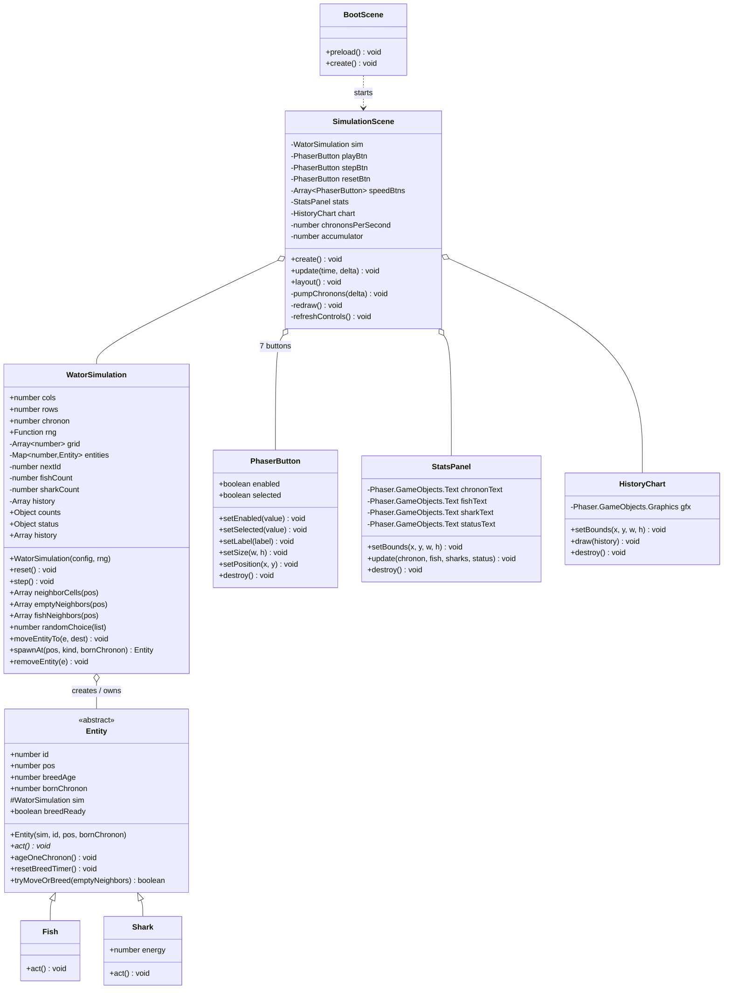
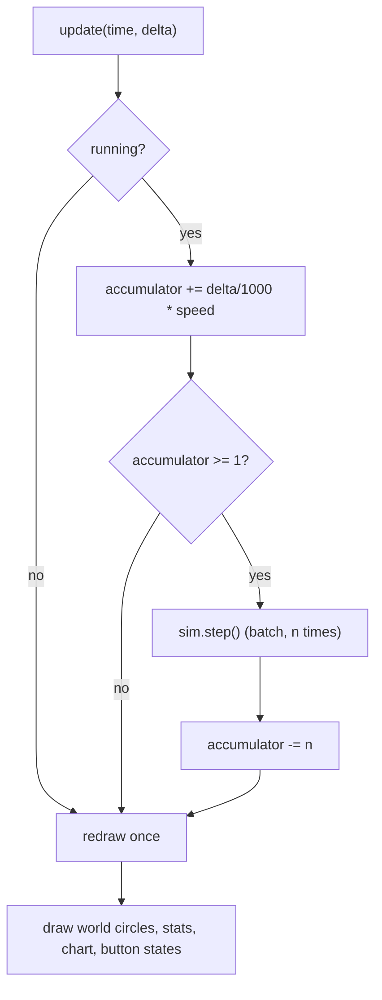

# Design: add-wator-simulation

## Context

The repository contains `prd-v001.md` (full requirements), `src/ui/PhaserButton.js` (a self-contained Phaser-native button with normal/hover/pressed/disabled/selected states), and `assets/icon-192.png` / `assets/icon-512.png` (PWA icons). There is no other code. See proposal.md — Why for motivation. Constraints that shape the design: strict engine/UI separation (spec Req 2), object-oriented entities on a common `Entity` base class (spec Req 18), a flat grid array kept consistent with entity objects (spec Req 19), exactly one random-number source (spec Req 7), no build step, and static deployment from a repository subpath (GitHub Pages).

## Goals / Non-Goals

**Goals:**
- A chronon-accurate Wa-Tor engine whose rules are auditable against the spec scenarios (Req 8–17).
- One mutation seam that makes the grid↔entity consistency invariant hold by construction (Req 19).
- A single-frame redraw strategy that stays smooth at `60x` with ~2,450 entities.
- Layout that degrades gracefully from wide desktop to `744 x 1133` CSS pixels (Req 29).

**Non-Goals:**
- Engine unit-test harness or any automated testing (PRD non-goal; the engine/UI split keeps the option open for later).
- Pixel-perfect design system; exact fonts/spacing are intentionally left to implementation taste (PRD Known Gap).
- Time-accurate catch-up when throttled (explicitly excluded by Req 28.2).

## Class Diagrams

All classes involved in this change. `PhaserButton` already exists and is reused unchanged.

## Chronon Pump

How one frame turns into zero or more chronons and exactly one redraw (Req 21, 28):

## Decisions

**D1 — Two-layer architecture: Phaser-free engine under a Phaser shell.**
`src/simulation/` (WatorSimulation, Entity, Fish, Shark) never imports or references Phaser; `src/scenes/` and `src/ui/` own all rendering and input. *Rationale:* hard requirement (spec Req 2, 2.2) and it keeps the rule logic auditable. *Alternative:* scene-held state with helper functions — rejected: violates Req 18's class model and scatters rules across UI code.

**D2 — `Entity` abstract base with polymorphic `act()`, plus one shared breeding helper.**
`Fish.act()` and `Shark.act()` decide their own chronon behavior (Req 18.2); movement-plus-breeding mechanics are identical for both, so `Entity.tryMoveOrBreed(emptyNeighbors)` is shared: on a successful move, a breeding-ready parent spawns an instance of its own kind in the old cell and resets its timer (Req 12.1, 17.1). *Rationale:* DRY without inheritance traps — the base class holds exactly what Req 18 says entities share (position, breed age, readiness). *Alternative:* separate move/breed code in each subclass — rejected: duplicates the subtle timer rules where they can drift apart.

**D3 — Breed-timer lifecycle (pins down Req 12, 17 precisely).**
`breedAge` increments by 1 at the start of each `act()` (the entity survived one more chronon); `breedReady = breedAge >= breedTime`. Then:

| State at action time | Successful move (or eat) | Blocked (no move) |
|---|---|---|
| breed-ready | spawn in old cell, `breedAge = 0` | `breedAge = 0` (no spawn) |
| not breed-ready | keep aged value | keep aged value |

The ready-but-blocked reset without spawning (Req 12.2, 17.2) is counter-intuitive but stated twice in the PRD and spec; implement it literally. *Alternative considered:* only reset on an actual spawn — rejected: contradicts Req 12.2/17.2.

**D4 — Shark `act()` ordering: age → pay energy → starve-check → hunt/roam → breed.**
Energy decrements before movement/eating (Req 13.1); at `0` the shark is removed immediately and its turn ends with no move, eat, or spawn (Req 14.1). Eating grants `sharkEnergyGain` (Req 15.1) and counts as a successful move for breeding (Req 17.1). *Rationale:* ordering is observable in the spec scenarios 14.1 and 15.1; getting it wrong changes population dynamics.

**D5 — State model: flat `grid` array + `entities` Map, mutated only through three seam methods.**
`grid` holds one slot per cell: an entity ID or an `EMPTY` marker (Req 19.1); `entities` maps ID → entity object; `pos` is the flat index (Req 19.2). `moveEntityTo`, `spawnAt`, and `removeEntity` are the only code touching both structures, so the consistency invariant (Req 19.3) holds by construction. Live `fishCount`/`sharkCount` are maintained in these methods for O(1) stats and extinction checks. *Alternative:* grid cells storing entity object references directly — rejected: the spec mandates ID slots plus an explicit consistency invariant.

**D6 — Turn order: snapshot IDs, Fisher–Yates shuffle, skip missing and newborn.**
Each `step()` snapshots current IDs, shuffles with the shared RNG (Req 8.1), and for each ID skips entities removed earlier this chronon (eaten or starved — the Map lookup simply misses, Req 10.1/10.2) and entities whose `bornChronon` equals the current chronon (Req 9.1). *Rationale:* snapshotting IDs and validating at execution time is the simplest correct handling of mid-chronon removal.

**D7 — One random source as an injected function.**
`WatorSimulation` receives a single `rng` function defaulting to `Math.random`; every randomized decision (population, shuffle, choice among neighbors) goes through it (Req 7.1). No other code calls `Math.random`. *Bonus:* a future seeded RNG drops in without touching rules — though seeding itself is a non-goal.

**D8 — Frame pacing with an accumulator; batch steps, single redraw.**
`update()` accumulates `delta/1000 * speed` chronons and runs `sim.step()` `floor` times per frame (Req 28.1), then redraws exactly once (Req 21.1). No catch-up compensation when throttled (Req 28.2) — the accumulator naturally clamps because we never track wall-clock deficits. *Alternative:* one `step()` per frame with frame skipping — rejected: `60x` on high-refresh displays and `1x` on slow ones both misbehave.

**D9 — Rendering via pooled `Graphics`, circles only.**
One `Graphics` for the world: clear, fill background water, `fillCircle` per entity — green for fish, slightly larger radius and blue for sharks, no grid lines (Req 20.1). No sprites, no tweens (Req 20.1, 21.1). Phaser 4 `Graphics` batch fills comfortably handle the ~2,450 circles of a default world in one draw pass per frame.

**D10 — UI composition reuses `PhaserButton` as-is.**
Play/Pause (label swap via `setLabel`), Step (`setEnabled(false)` while running, Req 24.1), Reset — each on its own row (Req 23.1). The five speed buttons form a segmented row using `setSelected(true)` on the active one; while paused a speed change must not resume (Req 24.3), which falls out naturally since the buttons only set `chrononsPerSecond`. Play stays disabled in terminal state (Req 26.5). `StatsPanel` (four `Text` objects, left column, Req 22.1) and `HistoryChart` (one `Graphics` polyline pair, bottom strip, Req 27.1) are new small classes in `src/ui/`. Chart lines auto-scale vertically to the population maximum within the rolling 500-chronon window (floor of 10 to keep single spikes visible without degenerate scaling); the PRD leaves chart scaling unspecified. *Alternative:* fixed scale at grid capacity — rejected: population oscillations of 1–2 orders of magnitude flatline at the bottom.

**D11 — Layout: computed rectangles with a wide/compact reflow.**
`SimulationScene.layout()` computes panel rectangles each resize (Req 5.1): wide mode is the three-column layout of Req 29.1 (stats left, world center, controls right, chart bottom); below a width breakpoint it switches to compact mode: stats and controls share a top bar, the world takes the middle preserving its aspect ratio, and the chart stays across the bottom (Req 29.2). The world rectangle scales by whole-cell sizing (`cellSize = min(availW/cols, availH/rows)`) and centers, so arbitrary grid constants degrade gracefully (Req 4.1). Buttons are repositioned/resized via `setPosition`/`setSize` rather than recreated. *Alternative:* horizontal scroll or cell cropping — rejected: Req 29.2 requires the world aspect ratio preserved.

**D12 — PWA with all-relative URLs for subpath deployment.**
`manifest.webmanifest` uses `"start_url": "."`, `"scope": "."`, and relative `assets/icon-192.png` / `assets/icon-512.png` paths; `sw.js` registers with a relative scope and caches the app shell plus same-origin assets using relative URLs, cache-first with a simple versioned cache name. The CDN Phaser script is excluded from guaranteed caching; first-load/offline behavior may depend on the network (Req 31.1, 31.2). *Rationale:* the app is deployed under `https://keithrieck.github.io/sdd_openspec_wator/mimo_v2.6/` — absolute paths would break there.

**D13 — All tunables live in `src/config.js` (Req 30.1).**
Grid dimensions (`100 x 70`), fish/shark densities (`30%` / `5%`), breed times (`3` / `25`), shark energy values (initial `5`, gain `3`, cost `1`), colors (green fish, blue sharks, water background), speed options (`1x, 5x, 10x, 30x, 60x`), default speed (`10x`), history length (`500`), and the layout breakpoint are exported constants consumed by both layers. Classes and long methods carry JSDoc (Req 30.2).

## Risks / Trade-offs

- [Breed-timer rule 12.2/17.2 misread as "reset only on spawn"] → The decision table in D3 is normative; tasks include a manual check of each scenario in Req 12/17.
- [Grid↔entity drift from a missed mutation path] → Mitigated by D5: `moveEntityTo`/`spawnAt`/`removeEntity` are the only seam; entity code never touches `grid` or `entities` directly.
- [Per-frame redraw cost at `60x` with ~2,450 circles] → Single `Graphics` draw pass per frame (D9); batch multiple chronons between redraws (D8). If profiling shows strain, cull off-screen circles — expected unnecessary at default size.
- [Chart auto-scaling makes historical magnitudes hard to compare across resets] → Accepted: the PRD gives no scaling rule; window-max scaling keeps the lines readable within a run (D10).
- [Phaser 4.x API drift (it is new)] → Pin the CDN URL to `phaser@4.1.0` as the PRD specifies; stick to core Graphics/Text/input APIs used already by `PhaserButton`.
- [Compact-mode reflow could crowd controls at `744` px wide] → Buttons resize to a minimum touch target (~44 px tall) in `layout()`; manual verification on the iPad mini viewport is in the tasks.
- [No automated tests] → Engine/UI split (D1) keeps rules in one auditable place; tasks end with a manual verification checklist walking the spec scenarios.

## Migration Plan

Greenfield — no migration. Ship as a static bundle (`index.html`, `src/`, `sw.js`, `manifest.webmanifest`, `assets/`) to the GitHub Pages subpath; rollback is removing the deployed files. Service worker cache version string should be bumped when shipping updates so returning clients pick up new assets.

## Open Questions

- Exact pixel sizes, fonts, and spacing for the Phaser-native UI are left to implementation taste (PRD Known Gap); they do not affect specs, approach, or task breakdown.
