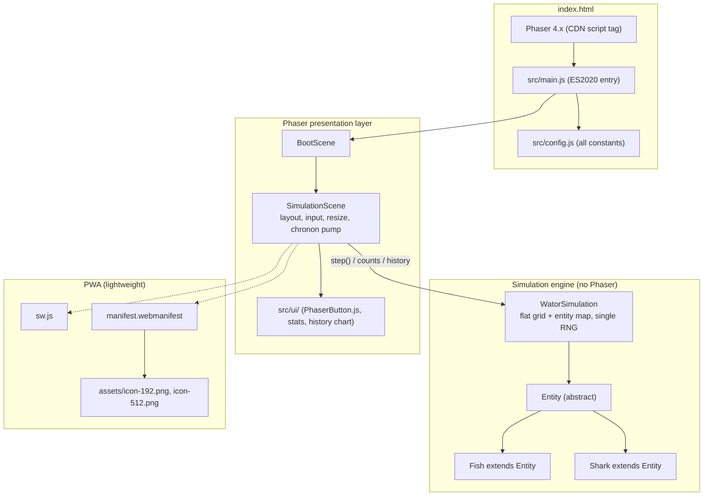

# Proposal: add-wator-simulation

## Why

This repository holds a complete product requirements document (`prd-v001.md`) for a browser-based Wa-Tor predator-prey simulation, but no implementation exists yet. This change turns that PRD into a working static ES2020 web app: a Phaser 4 full-window UI over an object-oriented, framework-independent Wa-Tor simulation engine, with live statistics, a rolling population history chart, transport and speed controls, and lightweight PWA support.

## What Changes

- Add a static web app entry: `index.html` loading Phaser 4.x from a CDN and booting the app via ES2020 modules, with `src/main.js` and all tunables centralized in `src/config.js`.
- Add an object-oriented, Phaser-free simulation engine: an `Entity` base class with `Fish` and `Shark` subclasses, driven by `WatorSimulation` over a flat grid array plus entity objects, using exactly one random-number source.
- Add Phaser presentation: `src/scenes/BootScene.js` and `src/scenes/SimulationScene.js` rendering the world as abstract circles (fish green, sharks blue and larger), plus `src/ui/` helpers (stats display, history chart) with all buttons implemented via the existing `src/ui/PhaserButton.js`.
- Add simulation controls: Play/Pause, Step, Reset, and speed selection (`1x`, `5x`, `10x`, `30x`, `60x`) on the right side; Chronon/Fish/Sharks/Status stats on the left; a rolling 500-chronon population history chart across the bottom.
- Add lifecycle behavior: auto-pause with terminal status on extinction (`Sharks extinct`, `Fish extinct`, `Ecosystem collapsed`) and a Reset that generates a fresh random world.
- Add lightweight PWA support: `manifest.webmanifest` (using the existing `assets/icon-192.png` and `assets/icon-512.png`) and `sw.js` caching the app shell and same-origin assets, safe for deployment from a repository subpath.

## Capabilities

### New Capabilities

- `wator-simulation`: The complete Wa-Tor web application — correct predator-prey chronon rules on a toroidal grid with object-oriented entities, Phaser-native rendering, controls and responsive layout, live population statistics and history chart, and lightweight PWA support.

### Modified Capabilities

(none — no existing specs)

## Impact

- **New code**: `index.html`, `src/main.js`, `src/config.js`, `src/simulation/WatorSimulation.js`, `src/simulation/Entity.js`, `src/simulation/Fish.js`, `src/simulation/Shark.js`, `src/scenes/BootScene.js`, `src/scenes/SimulationScene.js`, `src/ui/` helper classes (stats, history chart), `sw.js`, `manifest.webmanifest`.
- **Reused unchanged**: `src/ui/PhaserButton.js` (already provides normal/hover/pressed/disabled/selected states needed for the action and speed buttons).
- **Existing assets**: `assets/icon-192.png` and `assets/icon-512.png` become the PWA manifest icons.
- **Dependencies**: Phaser 4.1.0 loaded from CDN at runtime; no build step, no backend, no Node.js runtime requirement.
- **Deployment**: static site deployable from a repository subpath (e.g. GitHub Pages), so all manifest and service-worker URLs stay relative.

