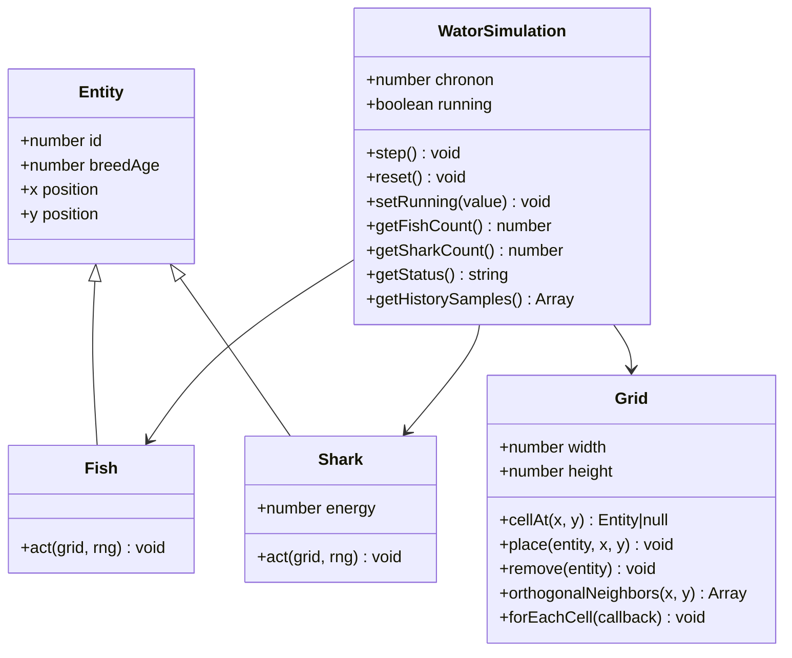
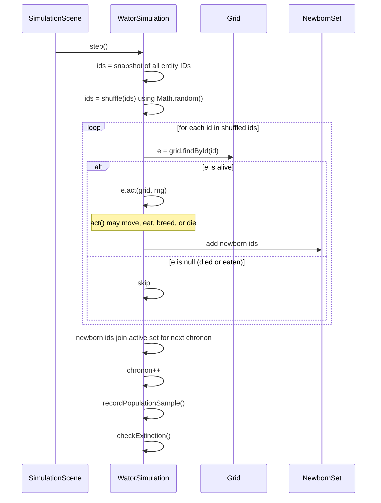
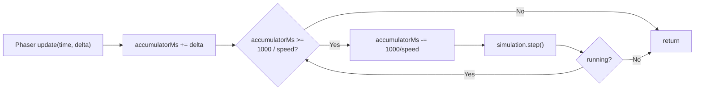
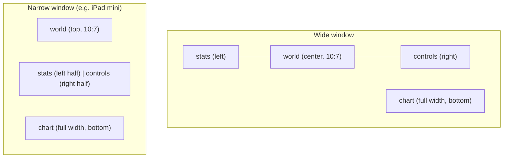

## Context

The repository currently contains only the PRD (`prd-v001.md`), an OpenSpec scaffold, the existing `src/ui/PhaserButton.js` helper, and two PWA icon PNGs under `assets/`. There is no running application yet. The constraints that shape the approach are:

- The simulation engine must be independent of Phaser (Requirement: Simulation engine is independent of Phaser).
- The app must be a static site deployable from the GitHub Pages subpath `https://keithrieck.github.io/sdd_openspec_wator/minimax_m3/index.html`, which constrains the service worker `scope` and manifest `start_url`.
- Phaser 4.x loads from a CDN script tag (`https://cdn.jsdelivr.net/npm/phaser@4.1.0/dist/phaser.min.js`) and stays network-only; the service worker must not precache it.
- JavaScript uses ES2020 modules with no build step, so all imports are static relative paths or full URLs.
- The existing `PhaserButton` class already supports the four button states the PRD requires (normal, hover, active, disabled, selected) and exposes `setEnabled`, `setSelected`, `setLabel`, `setSize`, and `setPosition`. The scene will use it as-is.

See `proposal.md` for motivation and `specs/wa-tor/spec.md` for the full behavioral contract.

## Goals / Non-Goals

**Goals:**
- Establish a clean hexagonal boundary: a framework-free engine that the Phaser scene drives from `update()`.
- Make the engine trivially inspectable from the scene by exposing a small, read-mostly state API (`getFishCount`, `getSharkCount`, `getChronon`, `getStatus`, `getHistorySamples`).
- Keep the scene file focused on Phaser concerns (layout, input, drawing, timing) by delegating rule logic to the engine.
- Provide a deterministic, testable chronon algorithm that satisfies the iteration-order, newborn-deferral, and skip-dead requirements.
- Deliver a responsive Phaser-native layout that preserves the world's 10:7 aspect ratio and reflows for narrow viewports.
- Cache the app shell with a service worker so the app loads offline once Phaser has been fetched at least once.

**Non-Goals:**
- No build tooling, TypeScript, React, or server-side code (per PRD Non-Goals).
- No automated tests, no seeded RNG, no movement interpolation, no per-cell sprites (per PRD Non-Goals).
- No programmer-facing UI for tuning grid dimensions, densities, breeding values, or shark energy (per PRD Non-Goals).
- No catch-up compensation for hidden or throttled tabs (per Requirement: Chronon-per-second timing).
- No design-level work for behaviors outside this change's scope.

## Decisions

### Decision: Framework-free engine composed of `WatorSimulation`, `Grid`, `Fish`, `Shark`

The engine lives under `src/simulation/` and consists of four cooperating classes:

**Rationale:** A single monolithic `WatorSimulation` would conflate grid bookkeeping with rule logic. Splitting `Grid` out keeps toroidal neighbor lookup reusable and testable in isolation. Splitting `Fish` and `Shark` out (rather than using tagged records) matches the PRD's domain language and makes the per-type `act()` implementations self-documenting — JSDoc lives on the class, not on a `switch (type)` branch.

**Alternatives considered:**
- *Tagged records (`{type: 'fish', ...}`)*: simpler data shape but pushes type-specific behavior into conditional branches scattered across `WatorSimulation`. Rejected because it scatters the rule logic and makes per-type documentation awkward.
- *Single `Entity` base class with a virtual `act()`*: equivalent to the chosen approach; the difference is cosmetic. The chosen approach uses JSDoc class-level docs for `Fish` and `Shark` to satisfy Requirement: JSDoc documentation for classes.

### Decision: Chronon algorithm uses a snapshot-then-shuffle approach with deferred newborns

**Rationale:** Criterion "Chronon iteration order and acting rules" requires three guarantees: randomized order, each surviving entity acts at most once, and newborns from this chronon do not act until the next. A snapshot at chronon start, shuffled once, and a separate "newborns join next chronon" set satisfies all three with a single iteration. Skipping dead entities is a null-check on the snapshot lookup.

**Alternatives considered:**
- *Iterate the live entity set in place, removing dying entities as we go*: simpler code but risks an entity acting twice if a previous act() somehow re-added it. The snapshot approach is immune.
- *Maintain a per-entity `actedThisChronon` flag*: more memory, more state, no advantage over the snapshot.

### Decision: Accumulator-based timing in the scene's `update()` loop

**Rationale:** Requirement: Chronon-per-second timing requires the simulation to advance at the selected speed without catch-up compensation. An accumulator driven by Phaser's `delta` parameter naturally handles variable frame rates and the no-catch-up rule: if the tab was hidden, `delta` will be large but the loop will simply run as many chronons as the accumulator permits on the next visible frame, with no wall-clock compensation.

**Alternatives considered:**
- *Fixed-timestep loop calling `setTimeout`*: doesn't respect Phaser's frame loop and complicates pause/resume.
- *Phaser's clock with a custom event*: adds machinery without changing behavior; the accumulator is simpler.

### Decision: Phaser-native UI built on the existing `PhaserButton`

The scene owns one `PhaserButton` per UI element. Speed buttons are a segmented row sharing `selected` state; the active speed button calls `setSelected(true)` while others call `setSelected(false)`. Play/Pause toggles its label with `setLabel('Pause' | 'Play')`. Step and Reset manage `setEnabled` based on simulation state.

**Rationale:** The PRD constraint "Use the `src/ui/PhaserButton.js` for the buttons on the ui" plus the existing class's full state coverage (`enabled`, `selected`, `hovered`, `pressed`, plus `setSize` and `setPosition`) mean no custom button code is needed in the scene. The scene only needs a `_syncButtonStates()` method called after every chronon and on user input.

**Alternatives considered:**
- *Custom inline Phaser buttons*: would duplicate `PhaserButton`'s state machine. Rejected.
- *DOM buttons layered over Phaser*: violates Requirement: Phaser owns the entire app window.

### Decision: Layout helper computes pixel rectangles on resize

A `Layout` helper inside `SimulationScene` (or a small standalone module) computes four rectangles — `stats`, `world`, `controls`, `chart` — given the scene's current width and height. On window resize, the scene listens for Phaser's `resize` event and recomputes. The world rectangle preserves the 10:7 aspect ratio by letterboxing within the available space.

**Rationale:** Requirement: Responsive layout requires reflow with aspect-ratio preservation. A pure-function layout helper is straightforward to reason about and keeps the scene's `resize` handler small. The 10:7 ratio comes from the default 100×70 grid; for non-default grids, the helper derives the ratio from `config.GRID_WIDTH / config.GRID_HEIGHT`.

**Alternatives considered:**
- *Phaser scale manager with `FIT` mode*: handles window scaling but not the three-column / two-row reflow logic. Used in conjunction: scale manager handles canvas sizing; the layout helper handles internal rectangles.
- *DOM-based layout with CSS Grid*: violates Requirement: Phaser owns the entire app window.

### Decision: Rolling 500-chronon population history as a ring buffer in the engine

`WatorSimulation` owns a ring buffer of `{chronon, fish, sharks}` samples. After each `step()` (and on `reset()`, which clears it), one sample is appended; when length exceeds 500, the oldest is dropped. The scene reads `getHistorySamples()` and redraws the chart only after a chronon, never every frame.

**Rationale:** The PRD requires one sample per chronon and a rolling window of 500. A ring buffer is the canonical data structure and keeps memory bounded. Owning it in the engine — not the scene — keeps the chart renderer stateless and reusable, and the same buffer could feed alternative visualisations later without engine changes.

**Alternatives considered:**
- *Store full history and slice in the scene*: works but grows unbounded if reset is forgotten; the ring buffer is safer.
- *Per-frame sampling*: would violate Requirement: Population history sampling (one sample per chronon).

### Decision: Service worker scope and manifest pinned to the GitHub Pages subpath

The service worker is registered from `index.html` with scope `/sdd_openspec_wator/minimax_m3/`. The manifest's `start_url` is `/sdd_openspec_wator/minimax_m3/index.html` (absolute, not relative, so installed PWAs launch correctly). The precache list includes the app shell, JS modules, manifest, and icons — but explicitly excludes the Phaser CDN script.

**Rationale:** GitHub Pages serves from a subpath, and service worker scope is path-scoped. A relative `start_url` would resolve relative to the manifest's location, which can vary; an absolute path anchored at the repo's GitHub Pages subpath is robust. Excluding Phaser from precache honors Requirement: PWA manifest and service worker ("first-load or offline behavior to depend on network availability").

**Alternatives considered:**
- *Cache-first for everything including Phaser*: would fail on first load before Phaser has been fetched, breaking the "depend on network availability" clause.
- *Network-first for the app shell*: would degrade offline experience once the shell is known-good; cache-first for same-origin assets is the standard PWA pattern.

### Decision: Boot scene only configures Phaser; simulation scene owns everything visible

`BootScene` runs first, calls `this.scene.start('SimulationScene')`, and is otherwise empty. `SimulationScene` does all layout, input, drawing, and engine driving. This keeps the boot scene trivial and avoids a double-`create` cycle.

**Rationale:** Requirement: App launches directly into a running simulation means no intro screen, no asset preload list beyond Phaser itself (which loads synchronously via the CDN script tag). A two-scene structure satisfies Phaser's convention while keeping the boot scene minimal.

**Alternatives considered:**
- *Single scene*: works in Phaser 4 but loses the boot/main separation that Phaser tutorials and examples assume. Two scenes with one empty boot is the conventional pattern.

## Risks / Trade-offs

- **[Risk]** Phaser CDN availability — *Mitigation*: PWA shell is cached so repeat visits work offline once Phaser has been fetched at least once; first-load and offline-before-Phaser-cached are explicitly network-dependent per the requirement.
- **[Risk]** Browser tab throttling could cause large `delta` values that burst-step the simulation — *Mitigation*: This is the documented behavior per Requirement: Chronon-per-second timing; no catch-up compensation is intentional.
- **[Risk]** Manual verification only, no automated tests — *Mitigation*: Engine classes are small and pure (no Phaser, no DOM), making manual reasoning tractable. The chronon algorithm is the highest-risk area and deserves careful step-through during implementation.
- **[Risk]** Ring-buffer history overwrites early samples — *Mitigation*: This is the documented behavior; a rolling 500-chronon window is the requirement, not a bug.
- **[Risk]** Service worker scope mismatch if the page is ever moved off the GitHub Pages subpath — *Mitigation*: The scope and `start_url` are derived from the README's hosted URL; if the deployment path changes, both values must be updated together.
- **[Risk]** Aspect-ratio preservation may produce small world rectangles on very narrow viewports — *Mitigation*: This is the documented reflow behavior; the PRD accepts letterboxing and only requires controls remain usable.

## Migration Plan

This change introduces a new application from a near-empty state, so there is no migration of existing data or behavior. The rollout steps are:

1. Implement the engine classes (`Grid`, `Fish`, `Shark`, `WatorSimulation`).
2. Implement `config.js` with all tunables from the PRD's Assumptions section.
3. Implement `main.js` and the two scenes.
4. Implement `index.html` with the Phaser CDN script tag and ES module entry point.
5. Implement `manifest.webmanifest` and `sw.js`.
6. Manual verification in a browser: launch, observe running simulation, exercise Play/Pause, Step, Reset, all five speed buttons, and window resize from desktop to iPad-mini viewport (744×1133).
7. Manual verification of PWA: install from the browser, confirm offline launch works after first online load.

Rollback: delete the new files; the repository returns to its pre-change state with only `PhaserButton`, icons, PRD, README, and OpenSpec scaffold remaining.

## Open Questions

None. All material decisions are resolved above; remaining unknowns (exact pixel sizes, fonts, spacing) are explicitly out of scope per the PRD's "Known Gaps" section and can be tuned during implementation without changing the design.
