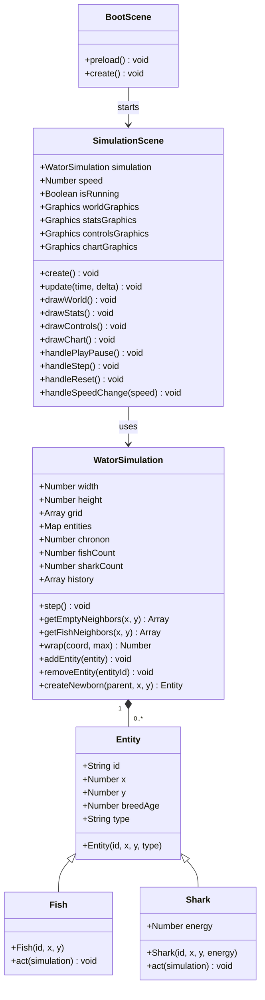

## Context

This design implements a browser-based Wa-Tor predator-prey cellular automaton simulation. The simulation follows the classic Wa-Tor rules where fish and sharks move on a toroidal grid, fish reproduce, sharks eat fish and manage energy, and both can go extinct. The implementation uses Phaser 4.x for rendering but keeps the simulation engine framework-independent.

Current state: No existing implementation. This is a greenfield project.

Constraints:
- Static ES2020 JavaScript web app, no build step
- Phaser 4.x loaded from CDN
- No backend, no TypeScript, no React, no automated tests
- Deployable as static site from repository subpath
- Must work on tablet viewport (744 x 1133 CSS pixels minimum)

## Goals / Non-Goals

**Goals:**
- Correct implementation of Wa-Tor cellular automaton rules
- Framework-independent simulation engine (no Phaser dependencies in core logic)
- Phaser-native rendering for entire app window
- Immediate visual updates per chronon with no movement animation
- Responsive layout for desktop and tablet
- Lightweight PWA support

**Non-Goals:**
- User-facing controls for grid dimensions, densities, or breed values
- Seeded random number support or reproducible runs
- Automated tests or build tooling
- Keyboard shortcuts
- World editing, painting, dragging, zooming, or cell inspection
- Debug console API or hidden runtime debug hooks
- Creature sprite art, grid lines, or movement interpolation

## Class Diagram

## Decisions

### Entity Class Hierarchy
**Decision**: Entity, Fish, and Shark as separate classes with Fish and Shark extending Entity.

**Rationale**: 
- Entity serves as the base class with common properties (id, x, y, breedAge, type)
- Fish and Shark extend Entity with type-specific behavior
- Shark does NOT extend Fish because sharks have unique energy management that doesn't apply to fish
- This structure keeps the inheritance clean and avoids confusing "is-a" relationships

**Alternatives considered**:
- Single Entity class with type flags: Rejected because Fish and Shark have different behaviors (energy for Shark)
- Shark extends Fish: Rejected because it creates an incorrect inheritance hierarchy (a shark is not a fish)

### Immediate Entity Removal on Death
**Decision**: When a shark eats a fish, the fish is removed from the grid and entities map immediately.

**Rationale**:
- Ensures correct behavior where a shark can eat a fish that hasn't had its turn yet
- The fish's turn will be skipped when reached in the processing order (via deadSet check)
- Matches the PRD requirement that dead entities are skipped when their turn is reached

**Alternatives considered**:
- Mark as dead but leave in grid until end of chronon: Rejected because it could allow incorrect neighbor detection for subsequent entities

### Chronon Processing Order
**Decision**: Collect all entity IDs at start of chronon, shuffle randomly, process in that order.

**Rationale**:
- Ensures each surviving entity acts at most once per chronon (PRD requirement 11)
- Random order prevents bias in processing
- Newborns added to newbornSet are skipped during processing (PRD requirement 12)
- Dead entities added to deadSet are skipped during processing (PRD requirement 13)

### Breed Timer Reset Behavior
**Decision**: Both Fish and Shark reset breed timer to 0 when breeding-ready, regardless of whether they successfully moved.

**Rationale**:
- PRD explicitly states this for both fish (requirements 15-16) and sharks (requirements 23, 25)
- If breeding-ready and moves: create newborn, reset timer to 0
- If breeding-ready and cannot move: reset timer to 0
- If not breeding-ready and cannot move: continue aging timer

### Grid Storage Strategy
**Decision**: Flat array for grid (index = y * width + x) storing entity IDs, with separate Map for entity objects.

**Rationale**:
- Flat array provides O(1) access to any cell
- Storing entity IDs (not references) allows easy serialization and avoids reference issues
- Separate entities Map provides O(1) lookup by ID
- deadSet and newbornSet use Sets for O(1) membership testing

**Alternatives considered**:
- 2D array: Rejected because flat array is more cache-friendly and easier to work with
- Storing entity references directly: Rejected because it complicates removal and can cause reference issues

### Toroidal Wrapping
**Decision**: Use modulo arithmetic with positive offset: `(x + width) % width` and `(y + height) % height`

**Rationale**:
- Handles negative coordinates correctly (e.g., x = -1 wraps to width - 1)
- Simple and efficient
- Standard approach for toroidal grids

### Speed Implementation
**Decision**: Chronons-per-second using accumulator pattern in Phaser update loop.

**Rationale**:
- PRD specifies "chronons-per-second speed"
- Supported speeds: 1x, 5x, 10x, 30x, 60x
- Accumulator pattern: track elapsed time, advance simulation when accumulator >= chrononInterval
- chrononInterval = 1000 / (speed * baseFPS) where baseFPS is the target frame rate

**Alternatives considered**:
- Frames per chronon: Rejected because it doesn't map cleanly to "speed" concept
- Fixed time steps: Rejected because browser throttling makes this unreliable

### Phaser Scene Structure
**Decision**: Two scenes - BootScene (preload) and SimulationScene (main app).

**Rationale**:
- BootScene handles Phaser preloading (minimal, since Phaser loads from CDN)
- SimulationScene contains all game logic, rendering, and UI
- Clean separation of concerns

### UI Layout Strategy
**Decision**: Stats on left, world in center, controls on right, history chart across bottom.

**Rationale**:
- Matches PRD requirements 30-33 for control placement
- Responsive: on narrow screens, stats and controls can stack vertically while maintaining world aspect ratio
- Chart always at bottom (PRD requirement 44)

### Population History Storage
**Decision**: Store in WatorSimulation class, rolling window of 500 chronons.

**Rationale**:
- PRD requirement 45: "store one sample per chronon for a rolling window of 500 chronons"
- Simulation owns the data, scene handles rendering
- Each sample: { chronon, fishCount, sharkCount }

### PWA Implementation
**Decision**: Minimal PWA with service worker caching app shell and same-origin assets.

**Rationale**:
- PRD requirement 56-57: lightweight, best-effort PWA support
- Phaser loads from CDN, so offline behavior depends on CDN caching
- Service worker caches index.html, main.js, config.js, and assets/

## Risks / Trade-offs

[Performance with many entities] → Use efficient data structures (Sets, Maps, flat arrays) and minimize allocations per chronon

[Complex chronon logic with edge cases] → Thoroughly test scenarios like shark eating fish before its turn, simultaneous extinctions, breed timer edge cases

[Phaser CDN dependency] → First load requires network; offline behavior depends on CDN caching. Acceptable per PRD requirement 57.

[No automated tests] → Rely on careful implementation and manual browser verification. Mitigated by clear spec requirements and scenarios.

[Browser throttling when tab is hidden] → PRD explicitly states no special catch-up behavior needed (requirement 49). Accept as-is.

[Fixed UI constants] → Programmer must edit code to change parameters. Acceptable per PRD non-goals.

[Using Math.random()] → Prevents reproducible runs. Acceptable per PRD non-goals.

## Migration Plan

N/A - This is a greenfield project with no existing implementation to migrate from.

## Open Questions

None - all major design decisions have been resolved based on PRD requirements and user clarifications.
