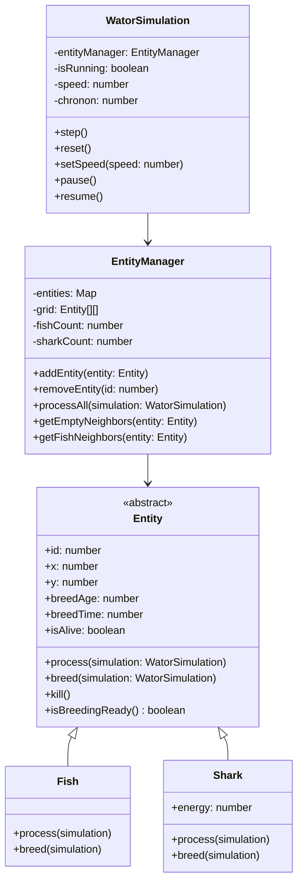

# Wa-Tor Web App Design Document

## Overview

This document details the architectural and design decisions for the Wa-Tor Phaser web app implementation. The design emphasizes object-oriented principles, separation of concerns, and performance while adhering to the PRD requirements.

## Architecture Decisions

### 1. Object-Oriented Design

**Decision**: Use Entity base class with Fish and Shark subclasses

**Rationale**:
- PRD explicitly requires object-oriented design with common base class
- Encapsulation improves code organization and maintainability
- Polymorphism simplifies simulation engine logic
- Easy to extend with new entity types in future

**Implementation**:
```javascript
class Entity { /* base class */ }
class Fish extends Entity { /* fish-specific logic */ }
class Shark extends Entity { /* shark-specific logic */ }
```

**Trade-offs**:
- ✅ Better code organization
- ✅ Easier to maintain and extend
- ✅ Clear separation of concerns
- ❌ Slightly more boilerplate code
- ❌ Minimal performance overhead (negligible)

### 2. Separation of Concerns

**Decision**: Strict separation between simulation engine and Phaser rendering

**Components**:
- **Simulation Engine** (`WatorSimulation.js`, `EntityManager.js`, `Entity.js`, `Fish.js`, `Shark.js`): Pure JavaScript, no Phaser dependencies
- **Phaser Integration** (`SimulationScene.js`, `BootScene.js`): Handles rendering and user input
- **Configuration** (`config.js`): Centralized constants

**Benefits**:
- Simulation logic testable without Phaser
- Clear boundaries between components
- Easier to maintain and debug
- Phaser version can change without affecting simulation

### 3. Entity Representation

**Decision**: Use 2D array for grid + Map for entity lookups

**Grid Structure**:
```javascript
this.grid = Array.from({ length: GRID_HEIGHT }, () =>
  Array.from({ length: GRID_WIDTH }, () => null)
);
```

**Entity Storage**:
```javascript
this.entities = new Map(); // id → Entity
```

**Population Tracking**:
```javascript
this.fishCount = 0;
this.sharkCount = 0;
```

**Rationale**:
- 2D array enables efficient neighbor calculations
- Map provides O(1) entity lookup by ID
- Separate counts avoid iterating entities for statistics
- Clean separation between spatial and entity data

**Alternatives Considered**:
- Flat array with 2D mapping: Similar performance, less readable
- Entity list only: Harder to find entities by position
- 2D array only: O(n) entity lookup by ID

### 4. Entity Processing Order

**Decision**: Randomize entity order each chronon using Fisher-Yates shuffle

**Algorithm**:
```javascript
shuffleArray(array) {
  for (let i = array.length - 1; i > 0; i--) {
    const j = Math.floor(Math.random() * (i + 1));
    [array[i], array[j]] = [array[j], array[i]];
  }
}
```

**Processing Flow**:
```
1. Collect all entity IDs
2. Shuffle IDs randomly
3. Process each entity in shuffled order
4. Skip entities that died before their turn
5. Skip newborns (born this chronon)
6. Process entity based on type (Fish.process() or Shark.process())
```

**Rationale**:
- Prevents simulation bias from fixed processing order
- Ensures fair random movement
- Handles edge cases (death during processing, newborns)
- Simple and efficient implementation

### 5. Toroidal Grid Wrapping

**Decision**: Use modulo arithmetic for neighbor calculations

**Implementation**:
```javascript
getNeighbors(x, y) {
  return [
    { x, y: (y - 1 + GRID_HEIGHT) % GRID_HEIGHT }, // North
    { x: (x + 1) % GRID_WIDTH, y },                // East
    { x, y: (y + 1) % GRID_HEIGHT },               // South
    { x: (x - 1 + GRID_WIDTH) % GRID_WIDTH, y }     // West
  ];
}
```

**Rationale**:
- Simple and efficient (O(1) per neighbor)
- No special boundary handling needed
- Mathematically correct for toroidal grid
- Easy to understand and maintain

### 6. Wa-Tor Rules Implementation

#### Fish Rules

**Movement**:
```javascript
processFish(fish) {
  fish.breedAge++;
  
  const emptyNeighbors = simulation.getEmptyNeighbors(fish);
  
  if (emptyNeighbors.length > 0) {
    // Move to random empty cell
    const newPos = randomChoice(emptyNeighbors);
    
    // Update grid and position
    simulation.clearCell(fish.x, fish.y);
    fish.x = newPos.x;
    fish.y = newPos.y;
    simulation.setCell(fish.x, fish.y, fish);
    
    // Check breeding
    if (fish.isBreedingReady()) {
      const newborn = fish.breed(simulation);
      if (newborn) simulation.addEntity(newborn);
    }
  }
}
```

**Breeding**:
```javascript
breed(fish) {
  const emptyNeighbors = simulation.getEmptyNeighbors(fish);
  
  if (emptyNeighbors.length > 0) {
    const newPos = randomChoice(emptyNeighbors);
    const newborn = new Fish({ x: newPos.x, y: newPos.y });
    fish.resetBreedTimer();
    return newborn;
  }
  
  fish.resetBreedTimer();
  return null;
}
```

#### Shark Rules

**Energy Management**:
```javascript
processShark(shark) {
  // CRITICAL: Decrement energy FIRST (PRD requirement)
  shark.energy -= SHARK_ENERGY_COST_PER_CHRONON;
  
  // Check for death
  if (shark.energy <= 0) {
    simulation.killEntity(shark);
    return;
  }
  
  // Rest of processing...
}
```

**Hunting Logic**:
```javascript
// Try to eat fish first
const fishNeighbors = simulation.getFishNeighbors(shark);

if (fishNeighbors.length > 0) {
  // Eat random fish
  const fish = randomChoice(fishNeighbors).entity;
  
  // Remove fish and gain energy
  simulation.removeEntity(fish.id);
  shark.energy += SHARK_ENERGY_GAIN;
  
  // Move to fish position
  simulation.clearCell(shark.x, shark.y);
  shark.x = fish.x;
  shark.y = fish.y;
  simulation.setCell(shark.x, shark.y, shark);
  
  // Check breeding
  if (shark.isBreedingReady()) {
    const newborn = shark.breed(simulation);
    if (newborn) simulation.addEntity(newborn);
  }
} else {
  // No fish available, move to empty cell
  // ... similar to fish movement
}
```

**Breeding**:
```javascript
breed(shark) {
  const emptyNeighbors = simulation.getEmptyNeighbors(shark);
  
  if (emptyNeighbors.length > 0) {
    const newPos = randomChoice(emptyNeighbors);
    const newborn = new Shark({ 
      x: newPos.x, 
      y: newPos.y 
    });
    shark.resetBreedTimer();
    return newborn;
  }
  
  shark.resetBreedTimer();
  return null;
}
```

### 7. Population History Chart

**Decision**: Rolling array of last 100 chronons with automatic scaling

**Data Structure**:
```javascript
this.populationHistory = []; // Array of { chronon, fish, sharks }
```

**Chart Rendering**:
```javascript
renderPopulationChart() {
  // Find max values for scaling
  const maxFish = Math.max(...history.map(h => h.fish), 1);
  const maxSharks = Math.max(...history.map(h => h.sharks), 1);
  
  // Draw fish line (green)
  this.chartGraphics.lineStyle(2, 0x00ff00);
  // Draw line segments...
  
  // Draw shark line (blue)
  this.chartGraphics.lineStyle(2, 0x0000ff);
  // Draw line segments...
}
```

**Rationale**:
- Simple array structure for rolling history
- Automatic scaling based on current max values
- Phaser Graphics for rendering (no external libraries)
- Fixed length prevents memory bloat

### 8. UI Layout

**Three-Column Layout**:

```
┌──────────────────────────────────────────────────────────────────────────┐
│                     Wa-Tor Simulation                                    │
│                                                                          │
│  ┌─────────────┐    ┌───────────────────────────────┐  ┌─────────────┐   │
│  │ Statistics  │    │         Simulation Canvas     │  │ Controls    │   │
│  │  (Left)     │    │                               │  │  (Right)    │   │
│  ├─────────────┤    │  [Grid of Fish and Sharks]    │  ├─────────────┤   │
│  │             │    │                               │  │ Speed: 10x  │   │
│  │ Fish: 125   │    │                               │  │ Pause       │   │
│  │ Sharks: 25  │    │                               │  │ Step        │   │
│  │ Chronon: 42 │    │                               │  │ Reset       │   │
│  └─────────────┘    └───────────────────────────────┘  └─────────────┘   │
│                                                                          │
│   ┌─────────────────────────────────────────────────────────────────┐    │
│   │         Population Chart                                        │    │
│   │                                                                 │    │
│   │  [Line chart: Fish (green) and                                  │    │
│   │   Sharks (blue) over time]                                      │    │
│   └─────────────────────────────────────────────────────────────────┘    │
└──────────────────────────────────────────────────────────────────────────┘
```

**Column Widths**:
- Left (stats): 200px
- Middle (canvas): window.innerWidth - 400px
- Right (controls+chart): 200px

**Control Layout (Right Column - Top)**:
```
Controls: (y=20)
Speed: 10x (y=50)
Pause (y=80)
Step (y=110)
Reset (y=140)
1x  5x  10x  30x  60x (horizontal row at y=170)
```

**Chart Layout (Right Column - Bottom)**:
```
Chart area: 200px wide × 100px tall
Position: bottom of screen
Chart shows: Fish (green line) and Sharks (blue line) over last 100 chronons
```

**Rationale**:
- Clear separation between UI components
- Controls accessible but not intrusive
- Chart provides valuable feedback without clutter
- Responsive to window resizing

### 9. Rendering Strategy

**Decision**: Single Graphics object, redraw entire canvas each chronon

**Implementation**:
```javascript
// In SimulationScene.js
create() {
  this.graphics = this.add.graphics();
}

renderSimulation() {
  // Clear previous frame
  this.graphics.clear();
  
  // Fill water background
  this.graphics.fillStyle(WATER_COLOR);
  this.graphics.fillRect(0, 0, width, height);
  
  // Draw all entities
  this.simulation.entities.forEach(entity => {
    const color = entity instanceof Fish ? FISH_COLOR : SHARK_COLOR;
    const radius = entity instanceof Fish ? FISH_RADIUS : SHARK_RADIUS;
    
    const screenX = this.gridToScreenX(entity.x);
    const screenY = this.gridToScreenY(entity.y);
    
    this.graphics.fillStyle(color);
    this.graphics.fillCircle(screenX, screenY, radius);
  });
}
```

**Rationale**:
- Simple and efficient
- No GameObjects per entity (avoids Phaser overhead)
- Direct coordinate mapping from grid to screen
- Easy to understand and maintain

**Alternatives Considered**:
- Individual GameObjects per entity: Higher overhead
- Partial rendering: More complex, minimal benefit
- Sprite-based rendering: Against PRD requirements

### 10. Performance Optimizations

**Entity Processing**:
- Randomized order prevents bias
- Skip dead entities and newborns efficiently
- Batch processing of multiple chronons per frame

**Memory Management**:
- Entity pooling not needed for initial implementation
- Rolling population history (fixed 100 entries)
- No memory leaks in entity lifecycle

**Rendering**:
- Single Graphics object reused
- Clear and redraw entire canvas (simple and fast)
- No per-entity GameObjects

### 11. Configuration Management

**Decision**: Centralized config.js with all constants

**File Structure**:
```javascript
// Grid dimensions
export const GRID_WIDTH = 100;
export const GRID_HEIGHT = 70;

// Densities
export const FISH_DENSITY = 0.30;
export const SHARK_DENSITY = 0.05;

// Breeding times
export const FISH_BREED_TIME = 3;
export const SHARK_BREED_TIME = 25;

// Shark energy
export const INITIAL_SHARK_ENERGY = 5;
export const SHARK_ENERGY_GAIN = 3;
export const SHARK_ENERGY_COST_PER_CHRONON = 1;

// Speed
export const SPEED_OPTIONS = [1, 5, 10, 30, 60];
export const DEFAULT_SPEED = 10;

// Rendering
export const FISH_RADIUS = 4;
export const SHARK_RADIUS = 6;
export const FISH_COLOR = 0x00ff00;
export const SHARK_COLOR = 0x0000ff;
export const WATER_COLOR = 0x87ceeb;
```

**Rationale**:
- Easy for programmers to modify constants
- Single source of truth
- No UI for changing parameters (as per PRD)
- Clean separation from logic

### 12. PWA Support

**Decision**: Lightweight PWA with basic offline caching

**Implementation**:
- `manifest.webmanifest` with basic configuration
- `sw.js` for service worker
- Cache Phaser CDN and app files
- Best-effort approach (Phaser from CDN complicates caching)

**Rationale**:
- PRD requires PWA support
- Lightweight implementation meets requirements
- No complex caching strategies needed

## Class Diagrams

### Entity Class Hierarchy



### File Structure

```
src/
├── config.js          # Configuration constants
├── Entity.js          # Base Entity class
├── Fish.js            # Fish entity implementation
├── Shark.js           # Shark entity implementation
├── EntityManager.js   # Entity lifecycle management
├── WatorSimulation.js # Core simulation engine
├── scenes/
│   ├── BootScene.js   # Phaser boot scene
│   └── SimulationScene.js # Main Phaser scene
└── main.js           # Application entry point
```

## Design Trade-offs and Decisions

### Entity vs Flat Objects

**Chosen**: Entity base class with subclasses

**Pros**:
- Better code organization
- Clear separation of concerns
- Easy to extend
- Polymorphism simplifies simulation engine
- Meets PRD requirement explicitly

**Cons**:
- Slightly more boilerplate
- Minimal performance overhead
- More files to manage

**Verdict**: Worth the trade-off for maintainability and PRD compliance

### Graphics vs Sprites

**Chosen**: Phaser Graphics API with simple circles

**Pros**:
- No external assets needed
- Simple and performant
- Meets PRD requirement (no sprites)
- Easy to modify colors and sizes

**Cons**:
- Less visually appealing than custom sprites
- Limited to basic shapes
- No animation

**Verdict**: Correct choice per PRD requirements

### Single Graphics Object vs Individual GameObjects

**Chosen**: Single Graphics object, redraw entire canvas

**Pros**:
- Simple and efficient
- No Phaser overhead per entity
- Easy to understand
- Fast rendering

**Cons**:
- Redraws entire canvas each frame
- No partial updates

**Verdict**: Best choice for this use case

### Random Order vs Fixed Order Processing

**Chosen**: Random order each chronon

**Pros**:
- Prevents simulation bias
- More realistic emergent behavior
- Fair random movement

**Cons**:
- Slightly more complex
- Need to handle newborns and deaths

**Verdict**: Essential for correct simulation behavior

### Energy Decrement Timing

**Chosen**: Decrement energy BEFORE movement (Shark.process())

**Pros**:
- Matches PRD requirement exactly
- Sharks can die before moving
- Correct energy management

**Cons**:
- Must check for death before movement

**Verdict**: Critical for correct shark behavior

## Error Handling and Edge Cases

### Newborn Entities

**Problem**: Newborns should not act in the chronon they're born

**Solution**:
```javascript
if (entity.breedAge === 0 && !(entity instanceof Shark)) {
  entity.incrementBreedAge();
  continue;
}
```

**Rationale**:
- Prevents immediate overpopulation
- Matches Wa-Tor rules
- Simple and efficient check

### Entity Death During Processing

**Problem**: Entity might die before its turn in the shuffled order

**Solution**:
```javascript
if (!this.entities.has(id) || !entity.isAlive) continue;
```

**Rationale**:
- Skip dead entities gracefully
- No errors or crashes
- Efficient check

### Breeding When No Space Available

**Problem**: Entity might be ready to breed but no empty adjacent cells

**Solution**:
```javascript
if (emptyNeighbors.length > 0) {
  // Create newborn
} else {
  entity.resetBreedTimer();
}
```

**Rationale**:
- Reset timer but don't create impossible entity
- Matches Wa-Tor rules
- Simple and correct

### Grid Boundaries

**Problem**: Toroidal wrapping must work correctly

**Solution**:
```javascript
{x, y: (y - 1 + GRID_HEIGHT) % GRID_HEIGHT}
{x: (x + 1) % GRID_WIDTH, y}
```

**Rationale**:
- Mathematically correct
- Simple and efficient
- No special cases needed

## Testing Strategy (Conceptual)

Even though PRD says no automated tests, the design supports:

1. **Unit Tests**:
   - Entity lifecycle (creation, death, breeding)
   - Movement logic (fish and shark)
   - Energy management (sharks)
   - Grid wrapping
   - Breeding conditions

2. **Integration Tests**:
   - Simulation step processing
   - Population statistics
   - Speed control accuracy
   - Reset functionality

3. **Visual Testing**:
   - Rendering correctness
   - UI layout
   - Chart accuracy
   - Color schemes

## Future Design Considerations

### Potential Enhancements

1. **Entity Pooling**: Reuse entity objects instead of creating new ones
2. **Spatial Partitioning**: Quad tree for large grids
3. **Multi-threading**: Web Workers for heavy computation
4. **Advanced Rendering**: Custom shaders for effects
5. **Data Export**: CSV/JSON export of population history

### Performance Optimizations (If Needed)

1. **Partial Rendering**: Only redraw changed cells
2. **Entity Culling**: Skip rendering off-screen entities
3. **Batch Processing**: Process entities in batches
4. **WebGL Rendering**: Use Phaser's WebGL renderer more effectively

## Conclusion

This design provides a solid foundation for the Wa-Tor simulation web app. It emphasizes:

- ✅ Object-oriented design with Entity base class
- ✅ Separation of concerns (simulation vs rendering vs UI)
- ✅ Performance considerations for ~2,450 entities
- ✅ Correct implementation of Wa-Tor rules
- ✅ Clean, maintainable code structure
- ✅ Adherence to PRD requirements

The design is ready for implementation and should result in a correct, performant, and maintainable simulation.