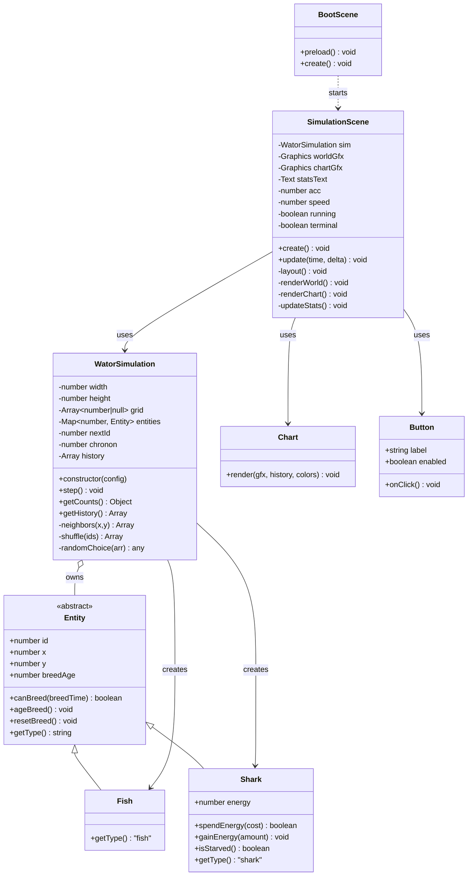
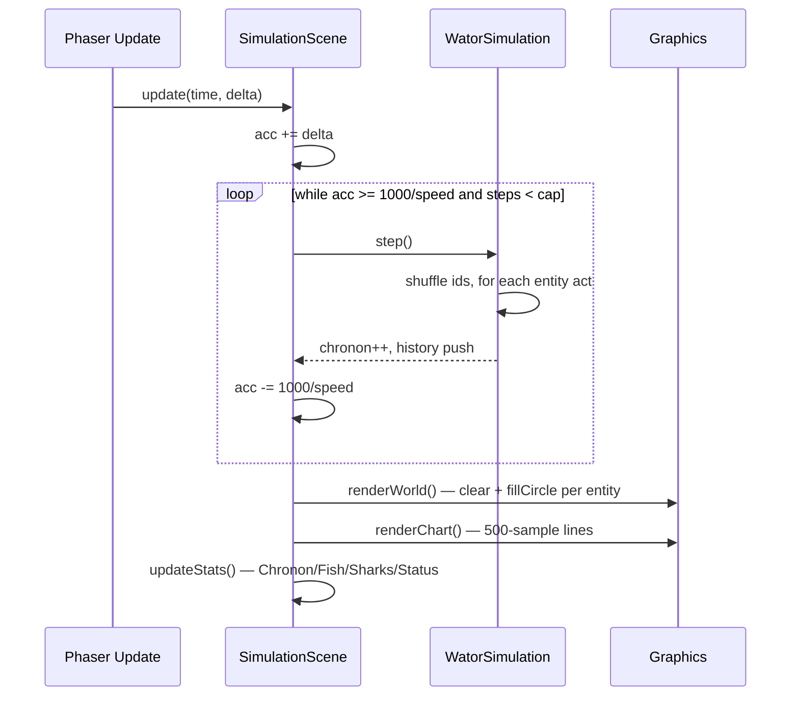
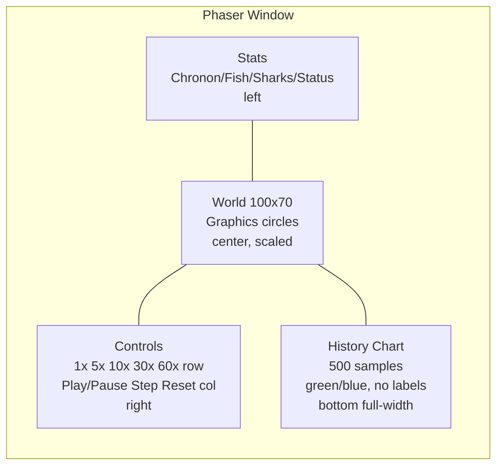

## Context

The repository is greenfield: only `prd-v001.md` (57 acceptance criteria), `README.md`, and `openspec/config.yaml` exist. The product is a browser-based Wa-Tor predator-prey cellular automaton emphasizing simulation correctness, rendered with Phaser 4.x owning the entire window, deployed as a static site from a repository subpath, and usable offline on a tablet after first load. Exploration established three refinements: OO entity hierarchy (`Fish`/`Shark extends Entity`), wide-only layout (no narrow reflow), and service-worker caching of the CDN Phaser script for offline.

Stakeholders: browser user (observes/controls simulation), programmer (changes constants/grid in code). Constraints: ES2020 modules, no build step, no backend, no DOM overlays, no tests, `Math.random()` only, Phaser 4.1.0 from `https://cdn.jsdelivr.net/npm/phaser@4.1.0/dist/phaser.min.js`, minimum tablet viewport `744×1133`, PWA best-effort but must survive offline after first load.

## Goals / Non-Goals

**Goals:**
- Correct Wa-Tor chronon semantics per AC 10-27 with auditable single-file orchestration and OO entities.
- Phaser-native full-window rendering with `Graphics` circles, immediate per-chronon updates, and wide layout (stats left, world center, controls right, chart bottom) that scales/centers on resize.
- Static, subpath-safe app shell with ES2020 modules, CDN Phaser, and offline-capable PWA (caches shell + CDN).
- Programmer-friendly constants and JSDoc coverage.

**Non-Goals:**
- Narrow/tablet reflow, grid-dimension UI, seeded RNG, automated tests, TypeScript/React, backend, keyboard shortcuts, world editing/painting/drag/zoom/inspection, debug console API, sprite art, grid lines, movement interpolation, chart titles/labels (all per PRD Non-Goals).

## Decisions

### Decision 1: OO entity hierarchy with anemic entities, orchestrator owns rules

**Choice:** Abstract `Entity` base with `Fish extends Entity` and `Shark extends Entity` (adds `energy`). Entities expose small helpers (`canBreed(breedTime)`, `ageBreed()`, `resetBreed()`, `spendEnergy(cost)`, `gainEnergy(amount)`, `isStarved()`). `WatorSimulation` owns the flat `grid: (number|null)[]`, `Map<number, Entity> entities`, `nextId`, `chronon`, and `history`, and implements all chronon rules in `step()`.

**Alternatives considered:**
- Plain records `{id,type,x,y,breedAge,energy?}` — simpler but violates the OO requirement and forces `type === 'shark'` checks.
- Rich entities with `act(grid, rng, config)` — polymorphic but duplicates toroidal neighbor logic and hides the critical shuffle/skip ordering, harder to verify without tests.

**Rationale:** Keeps AC 11-26 in one auditable place (correctness > cleverness), satisfies "good use of classes" via `instanceof` and encapsulated `breedAge`/`energy`, and keeps engine framework-independent (AC 4).

### Decision 2: Flat grid + Map with ID indirection

**Choice:** `grid[idx] = entityId | null` where `idx = y*W + x`, `W=100, H=70`. `entities` is the source of truth. On move/breed/eat, update both `grid` and `entity.x/y` atomically. `bornThisChronon: Set<number>` enforces AC 12.

**Alternatives:** 2D array `grid[y][x]` — more readable but less cache-friendly and requires nested wrapping; storing object references in grid — risks stale references after eat.

### Decision 3: Chronon execution order and breed/energy timing

**Choice:** `step()` snapshots `[...entities.keys()]` at start, shuffles via `Math.random()`, iterates. For each `id`: skip if `!entities.has(id)` (eaten, AC 13) or `bornThisChronon.has(id)` (AC 12). Fish: find orthogonal empty neighbors (N/E/S/W with `(x+dx+W)%W`, `(y+dy+H)%H`), move to random empty if any, breed if `canBreed(fishBreedTime)` and moved (spawn at old pos, `resetBreed()`, add to `bornThisChronon`), else `resetBreed()` if breed-ready but blocked (AC 16) or `ageBreed()` if not ready and blocked (AC 17). Shark: `spendEnergy(1)` first (AC 18), if `isStarved()` remove immediately with no move/eat (AC 19), else prefer random adjacent fish (eat, `gainEnergy(3)`, AC 20-21) else random empty (AC 22), then breed check mirroring fish but newborn `energy = initialSharkEnergy` (AC 24), with AC 25-26 for blocked cases. `breedAge` increments via `ageBreed()` at end of turn when not breeding; `canBreed()` checks `breedAge >= breedTime` at decision point.

**Alternatives:** Increment `breedAge` at start of turn — equivalent if consistent, but end-of-turn increment matches "survived N chronons" intuition and keeps `resetBreed()` semantics clean.

### Decision 4: Phaser owns window, Graphics only, wide-only layout

**Choice:** `BootScene` preloads and transitions to `SimulationScene`. `SimulationScene` creates one `Graphics` for world, one for chart, `Text` for stats, and interactive hit-areas for buttons. Layout: stats left, world center, controls right (speeds in one horizontal row, actions each own row), chart full-width bottom. On `scale.on('resize')` recompute `cellSize = min(availW/W, availH/H)`, `offsetX/Y` to center, without changing `W/H` (AC 8,9). No sprites, no grid lines, no animation (AC 28,29,50).

**Alternatives:** DOM overlays for controls — violates AC 5. Per-cell sprites — violates AC 50 and hurts 60x perf. Responsive breakpoint — removed per wide-only decision, simplifies layout to one path.

### Decision 5: Timing via Scene.update accumulator

**Choice:** `update(time, delta)` accumulates `delta`, steps `while (acc >= 1000/speed) { sim.step(); acc -= 1000/speed; }`, caps steps per frame to avoid spiral when tab was hidden/throttled. No catch-up compensation (AC 49). Speed changes apply next update when running; when paused, speed change does not resume (AC 34,35).

### Decision 6: PWA caches CDN for tablet offline

**Choice:** `sw.js` `install` does `cache.addAll` including `https://cdn.jsdelivr.net/npm/phaser@4.1.0/dist/phaser.min.js` (cross-origin, `no-cors` opaque response) plus same-origin shell (`./`, `./index.html`, `./src/main.js`, etc.). `fetch` handler is cache-first, network fallback. `manifest.webmanifest` uses relative `start_url: "."`, `display: "standalone"`, icons with circles. All URLs relative for subpath deploy (`/sdd_openspec_wator/muse_spark_1.2/`).

**Alternatives:** Cache only same-origin — fails tablet offline requirement. Bundle Phaser locally — violates CDN requirement (AC 3).

### Decision 7: Config and JSDoc

**Choice:** `src/config.js` exports constants for grid, densities, breed times, energies, speeds, colors. Every class has class-level JSDoc; every static/public method >8 lines has method JSDoc (AC 54,55).

## Risks / Trade-offs

- **Chronon ordering bugs (breed/energy/newborn/eaten)** → Mitigation: single `step()` with explicit pseudocode in design, manual verification checklist, `bornThisChronon` set and `entities.has` guard.
- **CDN offline on first load** → Mitigation: AC 57 allows network dependency until cached; document first-load requirement; verify `cache.add` for cross-origin opaque response in manual test.
- **No automated tests** → Mitigation: manual checklist (fish breeds after 3 moves, shark starves after 5, extinction messages, 500-sample chart).
- **Graphics perf at 60x (60 steps × 7000 draws)** → Mitigation: one `Graphics` per layer, `clear()` + batched `fillCircle()`, cap steps per frame, skip chart redraw if not needed.
- **Subpath deploy breaks absolute URLs** → Mitigation: relative URLs everywhere, `import` with `./`, manifest `start_url: "."`.
- **Cross-origin CDN caching may fail** → Mitigation: spike during implementation, fallback to network-first for CDN if opaque caching blocked, document limitation.
- **JSDoc burden** → Mitigation: template in tasks, enforce during implementation.

## Migration Plan

Greenfield — no migration. Deploy as static site (e.g., GitHub Pages subpath). Rollback is revert to empty repo. Service worker versioning via cache name bump.

## Open Questions

- Chart Y-scale: max of visible 500 samples vs fixed max? Decision: dynamic max of current window (simplest, no PRD guidance).
- `Entity` abstract enforcement: JS has no true abstract — use base class that throws if instantiated directly, documented in JSDoc.
- Breed timer increment point confirmed as end-of-turn `ageBreed()` — capture in spec.

## Architecture

### Class Diagram



### Sequence: Frame Update



### Layout (Wide Only)



### File Structure

```
index.html
src/
  main.js
  config.js
  simulation/
    Entity.js
    Fish.js
    Shark.js
    WatorSimulation.js
  scenes/
    BootScene.js
    SimulationScene.js
  ui/
    Chart.js
    Button.js
sw.js
manifest.webmanifest
assets/
  icon-192.png
  icon-512.png
```
