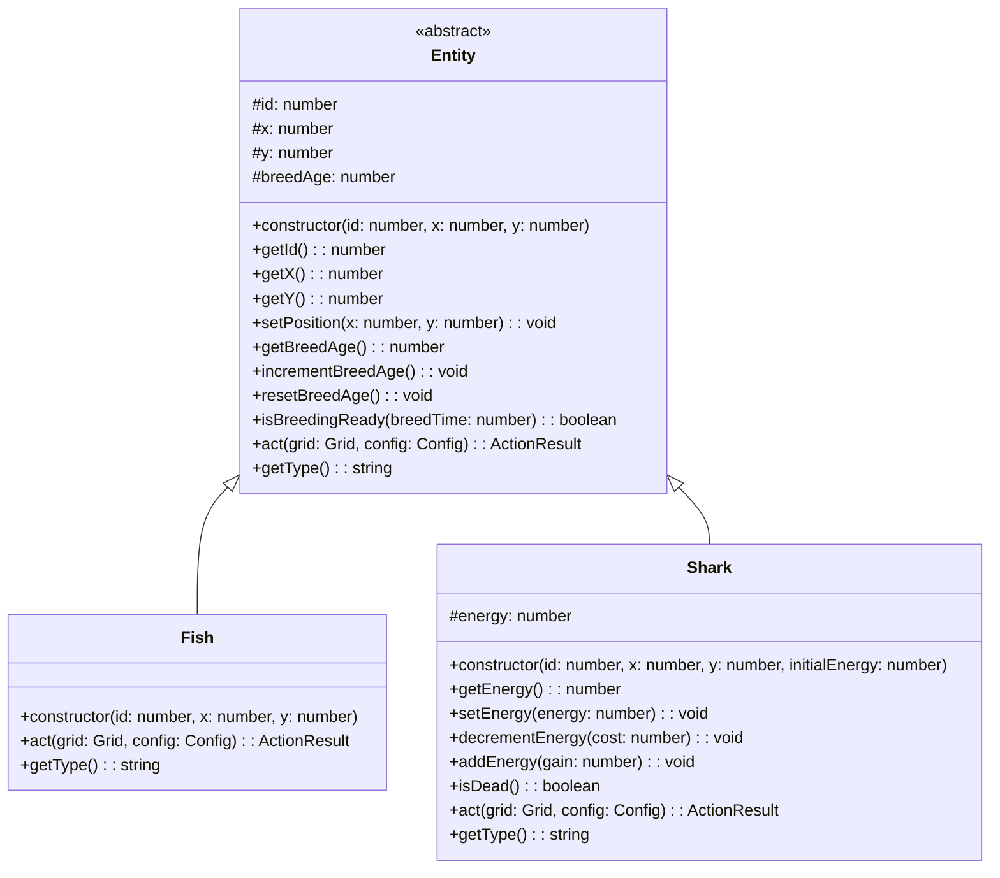
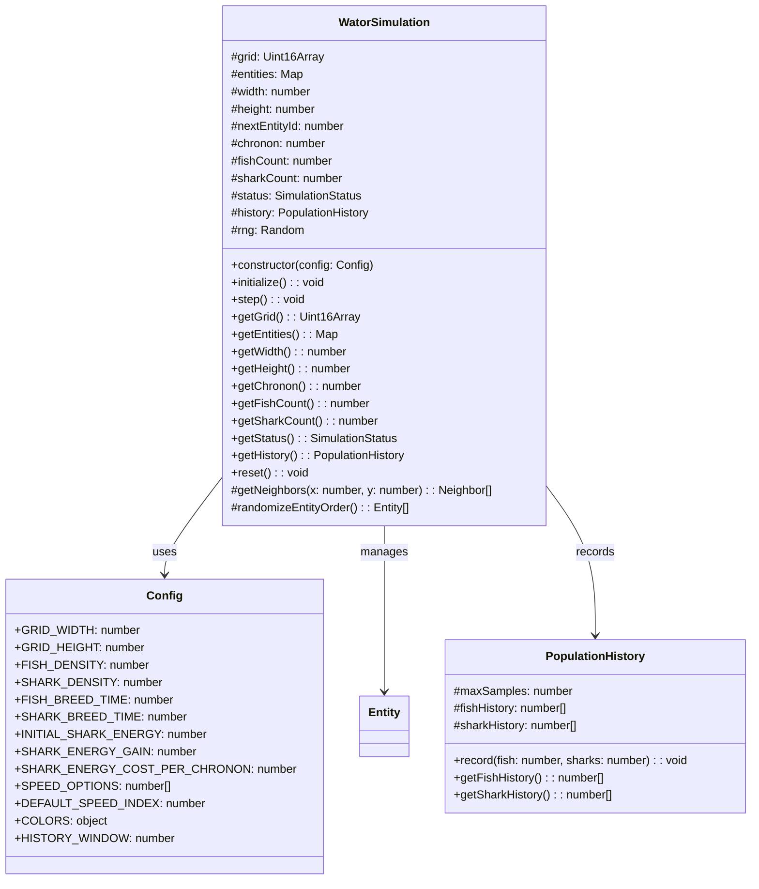
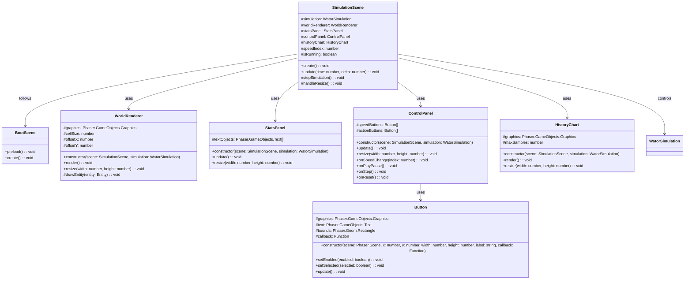

## Context

This design document describes the implementation of a browser-based Wa-Tor predator-prey cellular automaton simulation. The simulation consists of a framework-independent engine and a Phaser 4.x-based UI. The project follows the spec-driven workflow with the following artifacts already created:
- Proposal: `proposal.md` (done)
- Specs: `specs/wator-simulation-engine/spec.md` (done)
- Specs for entity model, config, and Phaser UI (directories exist but specs not yet written)

## Goals / Non-Goals

**Goals:**
- Create a clean object-oriented entity model with Entity base class and Fish/Shark subclasses
- Implement a framework-independent simulation engine (WatorSimulation) with toroidal grid management
- Build Phaser 4.x UI with BootScene and SimulationScene
- Create UI components: WorldRenderer, StatsPanel, ControlPanel, HistoryChart
- Centralize all configuration constants in a config module
- Implement PWA support with service worker and manifest
- Use static ES2020 modules with no build step

**Non-Goals:**
- No TypeScript, React, or build tooling
- No automated tests
- No seeded random number support
- No HTML/DOM controls layered over Phaser
- No keyboard shortcuts
- No world editing, painting, dragging, zooming, or cell inspection
- No debug console API or hidden runtime debug hooks
- No creature sprite art, grid lines, movement interpolation, or title/label text on the history chart

## Decisions

### 1. Entity Class Hierarchy

**Decision:** Use a class-based hierarchy with `Entity` as the abstract base class, and `Fish` and `Shark` as concrete subclasses.

**Rationale:** The PRD explicitly states "entity records means objects that are instances of classes that extend from a common entity class, e.g. Shark and Fish may be classes extending Entity." This provides:
- Clear separation of concerns: shared behavior in base class, type-specific behavior in subclasses
- Easy extensibility for future entity types
- Polymorphic handling in the simulation engine (grid stores Entity references)
- JSDoc documentation on each class as required

**Alternatives considered:**
- Plain objects with type discriminators: rejected because PRD requires classes
- Composition over inheritance: rejected because the entity types share significant behavior (position, breed timer, movement logic)

### 2. Simulation Engine Architecture

**Decision:** The `WatorSimulation` class manages:
- A flat grid array (Uint16Array or similar) storing entity IDs or 0 for empty
- A Map of entity ID → Entity instance for O(1) lookup
- Chronon stepping with randomized entity action order
- Population counting and history recording
- Extinction detection

**Rationale:** 
- Flat array provides cache-friendly grid access and simple toroidal indexing
- Map provides O(1) entity lookup by ID
- Randomized action order per chronon matches Wa-Tor specification
- Rolling history window of 500 chronons as specified

### 3. Phaser UI Architecture

**Decision:** Two-scene architecture:
- `BootScene`: Loads assets, creates PWA registration, transitions to SimulationScene
- `SimulationScene`: Main game loop, handles rendering, input, and simulation stepping

UI Components (as separate classes, not scenes):
- `WorldRenderer`: Draws the grid using Phaser Graphics
- `StatsPanel`: Shows Chronon, Fish, Sharks, Status on the left
- `ControlPanel`: Shows speed buttons (1x, 5x, 10x, 30x, 60x) and action buttons (Play/Pause, Step, Reset) on the right
- `HistoryChart`: Draws population history at bottom using Phaser Graphics

**Rationale:**
- Separation of concerns: each UI component has single responsibility
- Phaser-native rendering (no DOM overlays) as required
- Responsive layout: stats left, world center, controls right, chart bottom
- Graphics-based drawing (no Sprites) as specified

### 4. Configuration Module

**Decision:** Single `config.js` exporting all constants as a frozen object.

**Rationale:**
- Centralized constants easy for programmers to modify
- No user-facing controls for these values (per non-goals)
- Frozen object prevents accidental mutation

### 5. PWA Support

**Decision:** Minimal PWA with:
- `manifest.webmanifest` with icons, name, display mode
- `sw.js` service worker caching app shell and same-origin assets
- Phaser loaded from CDN (not cached by SW due to cross-origin)

**Rationale:** 
- Lightweight best-effort offline support as specified
- CDN Phaser cannot be reliably cached by service worker

## Risks / Trade-offs

| Risk | Mitigation |
|------|------------|
| Phaser CDN loading limits guaranteed offline behavior | Acceptable per PRD; SW caches app shell only |
| No automated tests increases reliance on manual verification | Careful implementation following specs; manual browser testing |
| Fixed UI constants require code edits for experimentation | Acceptable per non-goals; config.js centralizes all constants |
| Phaser-native UI requires custom button/layout/chart handling | Implement reusable UI component classes |
| Math.random() prevents reproducible runs | Acceptable per non-goals |
| No catch-up behavior for browser throttling | Acceptable per PRD |

## Migration Plan

1. Create design.md (this document)
2. Create tasks.md with implementation tasks
3. Implement specs for wator-entity-model, wator-config, wator-phaser-ui
4. Implement code:
   - src/config.js
   - src/simulation/Entity.js, Fish.js, Shark.js
   - src/simulation/WatorSimulation.js
   - src/scenes/BootScene.js, SimulationScene.js
   - src/ui/WorldRenderer.js, StatsPanel.js, ControlPanel.js, HistoryChart.js
   - src/main.js
   - index.html
   - sw.js
   - manifest.webmanifest
5. Test in browser
6. Archive change

## Open Questions

- Exact pixel sizes, fonts, spacing for Phaser-native UI (not defined in spec)
- Manual verification checklist (not defined in spec)
- Whether to use Uint16Array or plain Array for grid (performance vs simplicity)

## Class Diagrams

### Entity Model Class Hierarchy

### Simulation Engine Classes

### Phaser UI Classes

## Requirements Traceability

| Requirement | Design Element |
|-------------|----------------|
| Toroidal grid initialization | WatorSimulation constructor, flat grid array with modular arithmetic |
| Random initial population | WatorSimulation.initialize() with config densities |
| Chronon step execution | WatorSimulation.step() with randomized entity order |
| Fish movement and breeding | Fish.act() implementation |
| Shark movement, eating, energy, breeding | Shark.act() implementation |
| Extinction detection | WatorSimulation.step() updates status |
| Population history recording | PopulationHistory class, 500 sample window |
| Reset functionality | WatorSimulation.reset() |
| Phaser UI rendering | WorldRenderer, StatsPanel, ControlPanel, HistoryChart |
| Configuration constants | Config module (config.js) |
| PWA support | sw.js, manifest.webmanifest |