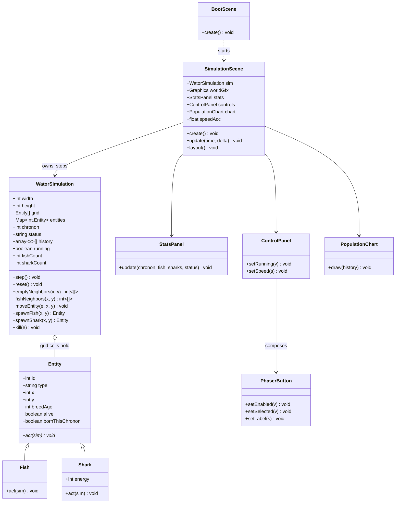
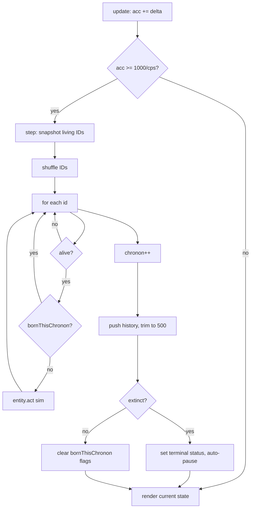

## Context

Greenfield static web app. The requirements are fully specified in `prd-v001.md` and captured as numbered requirements across five capability specs (`wator-simulation`, `simulation-app`, `ui-controls`, `population-chart`, `pwa`). The hard architectural constraint is `wator-simulation` R1–R12: the engine must be framework-independent (no Phaser APIs), while `simulation-app` R3 requires the entire window to be Phaser-native with no DOM overlay. `src/ui/PhaserButton.js` already exists and is reused for all buttons. See proposal.md for motivation.

## Goals / Non-Goals

**Goals:**
- A clean seam: a pure-JS `WatorSimulation` engine that Phaser never touches, and a thin Phaser presentation layer that only reads engine state and calls `step()`/`reset()`.
- An object-oriented entity model (`Entity` → `Fish`, `Shark`) where each subclass owns its chronon behavior, per the project's OOP direction.
- All model parameters as constants in one config module (`wator-simulation` R12).
- A layout that reflows across wide and narrow viewports while preserving the 100:70 world aspect ratio (`simulation-app` R6).

**Non-Goals:**
- No user-facing controls for grid size, densities, breed times, or energy values (PRD Non-Goals).
- No seeded RNG, no tests, no build step, no TypeScript, no backend.
- No movement animation, no grid lines, no chart labels, no sprite art.

## Decisions

### D1. Two-layer architecture with a pure engine
The engine (`src/simulation/`) has zero Phaser imports. `SimulationScene` owns one `WatorSimulation` instance, calls `step()` on a schedule, and reads state (`grid`, `chronon`, `status`, `history`, counts) to draw. This satisfies `wator-simulation` R1–R12 and `simulation-app` R3/R4.
- *Alternative considered:* put the simulation inside the Phaser scene. Rejected — it couples the rules to the framework and violates the PRD's core constraint (AC 4).

### D2. Entity classes own their behavior; the engine provides primitives
`Fish.act(sim)` and `Shark.act(sim)` implement the movement/breeding/energy rules (`wator-simulation` R3–R7). The engine exposes grid queries and mutation primitives so entities never touch the grid array directly:
- `sim.emptyNeighbors(x, y)` / `sim.fishNeighbors(x, y)` — orthogonal, toroidal (`wator-simulation` R1, R3, R5, R6)
- `sim.moveEntity(entity, x, y)` — updates grid + position
- `sim.spawnFish(x, y)` / `sim.spawnShark(x, y)` — creates a record, marks it `bornThisChronon` (`wator-simulation` R2.2, R7.2)
- `sim.kill(entity)` — removes from grid + alive set (`wator-simulation` R4.2, R5.1)

- *Alternative considered:* a single `step()` with `if (type === 'fish')` branches. Rejected — the PRD's fish and shark rule sets map cleanly onto two methods, and the OOP direction favors behavior on the entity.

### D3. Randomized-sequential stepping
Each chronon: snapshot living entity IDs, shuffle, and act in order, skipping entities that are dead or born this chronon (`wator-simulation` R2). This is the classic Wa-Tor approach: simple, correct, and order-fair in expectation.
- *Alternative considered:* simultaneous (double-buffered) update. Rejected — the PRD's "skip if eaten before your turn" (R2.3) and "newborns wait" (R2.2) rules only make sense under sequential acting.

### D4. State: flat grid array + entity records
A flat `Entity|null` array of length `width * height` is the source of truth for occupancy; a `Map<id, Entity>` tracks living entities for the chronon snapshot and counts (`wator-simulation` R8). Entity records carry `id`, `type`, `x`, `y`, `breedAge`, `alive`, `bornThisChronon`, and `energy` for sharks.
- *Alternative considered:* store entities only in a list and scan for neighbors. Rejected — O(1) cell lookup is needed for every neighbor query.

### D5. Breed timer semantics
`breedAge` increments every chronon an entity acts; it resets to 0 whenever the entity is breeding-ready, whether or not it moved (`wator-simulation` R3.3/R3.4, R7.3/R7.4). Breeding-ready means `breedAge >= breedTime`. This is the consistent reading of the PRD's paired "reset if ready / age if not" rules.

### D6. Extinction + history at end of chronon
After all entities act, the engine increments the chronon, pushes a `{fish, sharks}` sample and trims to 500 (`wator-simulation` R10), then evaluates extinction and sets the terminal status (`wator-simulation` R9). The initial population is recorded as the first history sample (R10.3).

### D7. Speed scheduling via a time accumulator
`SimulationScene.update(time, delta)` accumulates `delta` and steps while `acc >= 1000 / chrononsPerSecond` (`simulation-app` R5). A per-frame step cap (one second's worth) bounds work after a throttled tab returns, in the spirit of R5.2 (no special catch-up).
- *Alternative considered:* a Phaser `time.addEvent` per chronon. Rejected — an accumulator handles speed changes mid-run without rescheduling timers.

### D8. Layout: computed regions, not fixed pixels
On resize, the scene computes regions from the canvas size: wide → left stats / center world / right controls / bottom chart; narrow (below a width threshold, e.g. 900px) → world on top, stats and controls stacked below, chart at the bottom (`simulation-app` R6). Cell size = `min(worldRegionW / gridW, worldRegionH / gridH)`, world centered — so grid constant changes and resizes both "just work" (R6.3, R6.4).

### D9. Rendering: one Graphics object, redrawn per frame
A single `Graphics` object redraws the water background and all entity circles each frame (`simulation-app` R4). At 100×70 with a few hundred entities this is cheap and avoids per-cell sprite management.

### D10. PWA: cache-first for same-origin, network for CDN
`sw.js` precaches the app shell (`index.html`, modules, manifest, icons) and caches same-origin GETs; the CDN Phaser script is best-effort (`pwa` R2, R3). `manifest.webmanifest` references the existing `assets/icon-192.png` and `assets/icon-512.png` (`pwa` R1).

## Class Diagram

## Chronon Flow

## Risks / Trade-offs

- [Phaser CDN load failure breaks the app] → `pwa` R3 accepts network-dependent first load; the service worker caches the shell so repeat visits work offline once Phaser has loaded once.
- [No automated tests means rule bugs surface only in the browser] → the engine is pure and deterministic given a seed, so it can be exercised manually or with a throwaway script; the randomized-sequential rules are kept in two small `act` methods to make them easy to audit.
- [Per-frame full redraw could get slow at high speeds] → 100×70 with a few hundred circles is well within `Graphics` budget; if needed, the redraw can be gated to "state changed since last draw."
- [Narrow reflow is underspecified in the PRD] → D8 picks a sensible stack (world top, stats/controls below); exact breakpoints are tunable constants, not spec-level behavior.
- [Speed accumulator can burst after a throttled tab] → per-frame step cap bounds the burst (D7), consistent with `simulation-app` R5.2.

## Open Questions

- Exact narrow-viewport breakpoint (px) and the precise stacked layout order — tunable in `config.js`, does not change specs.
- Whether the history chart's y-axis auto-scales to the max population in the window or uses a fixed scale — visual detail, does not change specs.
